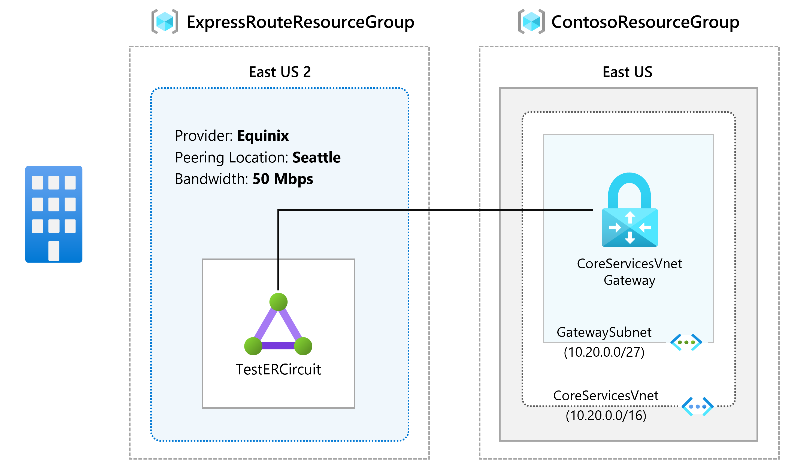
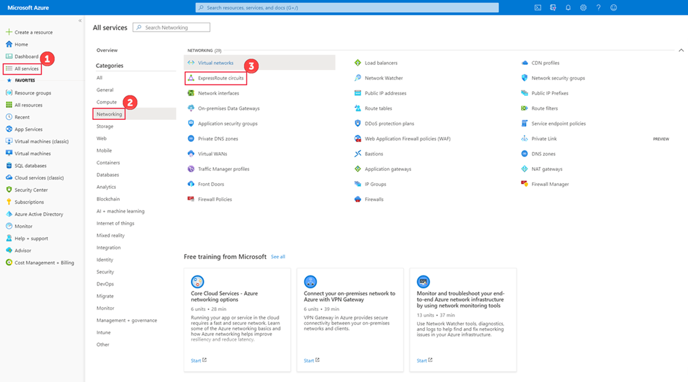
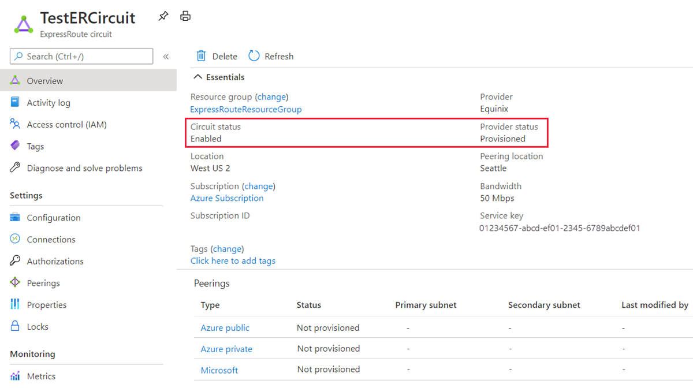

---
Exercise:
  title: "M03 – Lerneinheit\_5: Bereitstellen einer ExpressRoute-Verbindung"
  module: Module 03 - Design and implement Azure ExpressRoute
---
# M03 – Lerneinheit 5: Bereitstellen einer ExpressRoute-Verbindung

## Übungsszenario

In dieser Übung erstellen Sie eine ExpressRoute-Leitung mithilfe des Azure-Portals und des Azure Resource Manager-Bereitstellungsmodells.

**Hinweis:** Eine **[interaktive Labsimulation](https://mslabs.cloudguides.com/guides/AZ-700%20Lab%20Simulation%20-%20Provision%20an%20ExpressRoute%20circuit)** ist verfügbar, mit der Sie dieses Lab in Ihrem eigenen Tempo durcharbeiten können. Möglicherweise liegen geringfügige Unterschiede zwischen der interaktiven Simulation und dem gehosteten Lab vor, aber die dargestellten Kernkonzepte und Ideen sind identisch.

### Geschätzte Dauer: 15 Minuten



In dieser Übung führen Sie die folgenden Schritte aus:

+ Aufgabe 1: Erstellen und Bereitstellen einer ExpressRoute-Leitung
+ Aufgabe 2: Abrufen des Dienstschlüssels
+ Aufgabe 3: Aufheben der Bereitstellung einer ExpressRoute-Leitung
+ Aufgabe 4: Bereinigen der Ressourcen

## Aufgabe 1: Erstellen und Bereitstellen einer ExpressRoute-Leitung

1. Navigieren Sie in einem Browser zum [Azure-Portal](https://portal.azure.com/) , und melden Sie sich mit Ihrem Azure-Konto an.

   > [!Important]
   >
   > Ihre ExpressRoute-Verbindung wird von dem Moment an berechnet, in dem ein Dienstschlüssel ausgegeben wird. Stellen Sie sicher, dass Sie diesen Vorgang ausführen, sobald der Konnektivitätsanbieter dazu bereit ist, die Verbindung bereitzustellen.

1. Wählen Sie im Menü des Azure-Portals die Option **+ Ressource erstellen** aus. Wählen Sie **Netzwerk** und dann **ExpressRoute** aus, wie in der folgenden Abbildung dargestellt. Wenn ExpressRoute nicht in der Liste angezeigt wird, verwenden Sie **Marketplace durchsuchen**, um danach zu suchen:

   

1. Geben Sie auf der Seite **Create ExpressRoute** (ExpressRoute erstellen) für **Ressourcengruppe**, **Region** und **Name** der Verbindung folgende Werte an: ExpressRouteResourceGroup, East US 2, TestERCircuit. Wählen Sie anschließend **Weiter: Konfiguration &gt;** aus.

1. Achten Sie beim Ausfüllen der Werte auf dieser Seite darauf, dass Sie für dieses Beispiel die richtige SKU-Ebene (**Standard**), das Abrechnungsmodell für die Datenmessung (**Taktung**), den Provider (**Equinix**), den Peeringstandort (**Seattle**) und die Bandbreite (**50Mbps**) angeben.

1. Klicken Sie auf **Überprüfen + erstellen**.

1. Vergewissern Sie sich, dass die ExpressRoute-Konfiguration erfolgreich überprüft wurde, und wählen Sie dann **Erstellen** aus.


+ Der Porttyp bestimmt, ob Sie eine Verbindung mit einem Dienstanbieter oder direkt mit dem globalen Netzwerk von Microsoft an einem Peeringstandort herstellen.
+ „Neue erstellen oder aus klassischem Modell importieren“ bestimmt, ob eine neue Leitung erstellt wird oder ob eine klassische Leitung zu Azure Resource Manager migriert wird.
+ Anbieter ist der Internetdienstanbieter, von dem Sie den Dienst anfordern.
+ Der Peeringort ist der physische Standort, an dem Ihr Peering mit Microsoft stattfindet.

> [!Important]
>
> Der Peeringstandort entspricht dem [physischen Standort](https://docs.microsoft.com/en-us/azure/expressroute/expressroute-locations), an dem Ihr Peering mit Microsoft stattfindet. Dieser ist nicht mit der Eigenschaft „Standort“ verknüpft, die sich auf den geografischen Standort des Azure-Netzwerkressourcenanbieters befindet. Obgleich sie nicht miteinander in Zusammenhang stehen, sollten Sie einen Netzwerkressourcenanbieter in geografischer Nähe des Peeringstandorts der Verbindung wählen.

+ **SKU** bestimmt, ob ein ExpressRoute Local-, ExpressRoute Standard- oder ExpressRoute Premium-Add-On aktiviert wird. Sie können **Local** für die Local-SKU, **Standard** für die Standard-SKU oder **Premium** für das Premium-Add-On angeben. Sie können die SKU ändern, um das Premium-Add-On zu aktivieren.

> [!Important]
>
> Es ist nicht möglich, die SKU von Standard/Premium in Local zu ändern.

+ **Abrechnungsmodell** bestimmt den Abrechnungstyp. Sie können **Taktung** für einen Volumentarif und **Unbegrenzt** für einen Tarif mit Datenflatrate auswählen. Sie können den Abrechnungstyp von **Taktung** in **Unbegrenzt** ändern.

> [!Important]
>
> Sie können den Typ nicht von „Unbegrenzt“ in „Taktung“ ändern.

+ **Klassische Vorgänge zulassen** ermöglicht, klassische virtuelle Netzwerke mit der Verbindung zu verknüpfen.

## Aufgabe 2: Abrufen des Dienstschlüssels

1. Sie können alle Leitungen anzeigen, die Sie erstellt haben, indem Sie **Alle Dienste &gt; Netzwerk &gt; ExpressRoute-Leitungen** auswählen.

   

1. Alle im Abonnement erstellten ExpressRoute-Leitungen werden hier angezeigt.

   

1. Auf der Seite für die Leitung werden die Eigenschaften der Leitung angezeigt. Der Dienstschlüssel wird im Feld „Dienstschlüssel“ angezeigt. Ihr Dienstanbieter benötigt den Dienstschlüssel, um die Bereitstellung abzuschließen. Der Dienstschlüssel ist für Ihre Verbindung spezifisch. **Sie müssen den Dienstschlüssel zur Bereitstellung an Ihren Konnektivitätsanbieter senden.**

   

1. Auf dieser Seite bietet der **Anbieterstatus** Informationen zum aktuellen Zustand der Bereitstellung auf der Dienstanbieterseite. **Verbindungsstatus** gibt den Zustand auf der Microsoft-Seite an.

1. Wenn Sie eine neue ExpressRoute-Verbindung erstellen, weist die Verbindung folgenden Zustand auf:

   + Anbieterstatus: Nicht bereitgestellt
   + Schaltkreisstatus: Aktiviert

   + Die Verbindung wechselt in den folgenden Zustand, wenn sie vom Konnektivitätsanbieter aktuell für Sie aktiviert wird:
     + Anbieterstatus: Wird bereitgestellt
     + Schaltkreisstatus: Aktiviert
   + Damit Sie eine ExpressRoute-Verbindung verwenden können, muss sie sich im folgenden Zustand befinden:
     + Anbieterstatus: Bereitgestellt
     + Schaltkreisstatus: Aktiviert
   + Sie sollten den Bereitstellungs- und Verbindungsstatus in regelmäßigen Abständen überprüfen.



Glückwunsch! Sie haben eine ExpressRoute-Leitung erstellt und den Dienstschlüssel gefunden, den Sie benötigen, um die Bereitstellung der Leitung abzuschließen.

## Aufgabe 3: Aufheben der Bereitstellung einer ExpressRoute-Leitung

Wenn der Bereitstellungsstatus des ExpressRoute-Leitungsdienstanbieters **Bereitstellung** oder **Bereitgestellt** lautet, arbeiten Sie mit Ihrem Dienstanbieter zusammen, um die Leitungsbereitstellung auf Anbieterseite aufzuheben. Microsoft kann weiterhin Ressourcen reservieren und Ihnen Kosten in Rechnung stellen, bis der Dienstanbieter die Bereitstellung der Leitung beendet und Microsoft benachrichtigt.

> [!Note]
>
> Sie müssen die Verknüpfung aller virtuellen Netzwerke mit der ExpressRoute-Verbindung vor dem Aufheben der Bereitstellung aufheben. Falls dieser Vorgang nicht erfolgreich ist, überprüfen Sie, ob noch virtuelle Netzwerke mit der Verbindung verknüpft sind.
>
> Wenn der Dienstanbieter die Bereitstellung der Verbindung aufgehoben hat (Bereitstellungsstatus des Dienstanbieters lautet „Not provisioned“ (Nicht bereitgestellt)), können Sie die Verbindung löschen. Damit wird die Abrechnung für die Verbindung beendet.

## Aufgabe 4: Bereinigen der Ressourcen

Sie können Ihre ExpressRoute-Verbindung löschen. Wählen Sie hierzu das Symbol **Löschen**. Sorgen Sie dafür, dass der Bereitstellungsstatus Nicht bereitgestellt lautet, bevor Sie fortfahren.


   >**Hinweis**: Denken Sie daran, alle neu erstellten Azure-Ressourcen zu entfernen, die Sie nicht mehr verwenden. Durch das Entfernen nicht verwendeter Ressourcen wird sichergestellt, dass keine unerwarteten Gebühren anfallen.

1. Öffnen Sie im Azure-Portal im Bereich **Cloud Shell** die **PowerShell**-Sitzung.

1. Löschen Sie alle Ressourcengruppen, die Sie während der praktischen Übungen in diesem Modul erstellt haben, indem Sie den folgenden Befehl ausführen:

   ```powershell
   Remove-AzResourceGroup -Name 'ContosoResourceGroup' -Force -AsJob
   Remove-AzResourceGroup -Name 'ExpressRouteResourceGroup' -Force -AsJob
   ```

   >**Hinweis**: Der Befehl wird (wie über den Parameter „-AsJob“ festgelegt) asynchron ausgeführt. Dies bedeutet, dass Sie zwar direkt im Anschluss einen weiteren PowerShell-Befehl in derselben PowerShell-Sitzung ausführen können, es jedoch einige Minuten dauert, bis die Ressourcengruppen tatsächlich entfernt werden.
