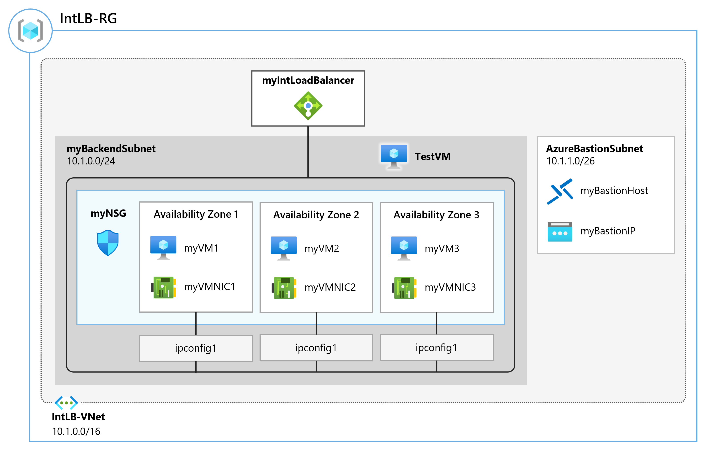

---
Exercise:
  title: "M04 – Lerninhalt\_4: Erstellen und Konfigurieren eines Azure-Lastenausgleichs"
  module: Module 04 - Load balancing non-HTTP(S) traffic in Azure
---


# M04 – Lerninhalt 4: Erstellen und Konfigurieren eines Azure-Lastenausgleichs

In dieser Übung erstellen Sie einen internen Lastenausgleich für die fiktive Organisation Contoso Ltd.

### Geschätzte Dauer: 60 Minuten (einschließlich ca. 45 Minuten Wartezeit für die Bereitstellung)

Die Schritte zum Erstellen eines internen Lastenausgleichs sind denen, die Sie bereits in diesem Modul kennengelernt haben, um einen öffentlichen Lastenausgleich zu erstellen, sehr ähnlich. Der Hauptunterschied besteht darin, dass bei einem öffentlichen Lastenausgleich über eine öffentliche IP-Adresse auf das Front-End zugegriffen wird und Sie die Konnektivität von einem Host aus testen, der sich außerhalb Ihres virtuellen Netzwerks befindet, während bei einem internen Lastenausgleich das Front-End eine private IP-Adresse in Ihrem virtuellen Netzwerk ist, und Sie die Konnektivität von einem Host innerhalb desselben Netzwerks aus testen.



### Stellenqualifikationen

In dieser Übung führen Sie die folgenden Schritte aus:

+ Aufgabe 1: Erstellen des virtuellen Netzwerks
+ Aufgabe 2: Erstellen von Back-End-Servern
+ Aufgabe 3: Erstellen des Lastenausgleichs
+ Aufgabe 4: Erstellen von Lastenausgleichsressourcen
+ Aufgabe 5: Testen des Lastenausgleichs

## Aufgabe 1: Erstellen des virtuellen Netzwerks

In diesem Abschnitt erstellen Sie ein virtuelles Netzwerk und ein Subnetz.

1. Melden Sie sich beim Azure-Portal an.

2. Navigieren Sie auf der Homepage des Azure-Portals zur Suchleiste „Globale Suche“, suchen Sie nach **Virtuelle Netzwerke**, und wählen Sie virtuelle Netzwerke unter „Dienste“ aus.  

3. Wählen Sie auf der Seite „Virtuelle Netzwerke“ die Option **Erstellen** aus.  

4. Verwenden Sie auf der Registerkarte **Grundlagen** die Informationen aus der folgenden Tabelle, um das virtuelle Netzwerk zu erstellen.

   | **Einstellung**    | **Wert**                                  |
   | -------------- | ------------------------------------------ |
   | Abonnement   | Wählen Sie Ihr Abonnement aus.                   |
   | Ressourcengruppe | Wählen Sie **Neu erstellen** Name: **IntLB-RG** aus. |
   | Name           | **IntLB-VNet**                             |
   | Region         | **(USA) USA, Osten**                           |

5. Wählen Sie **Weiter** aus (dies führt Sie zur Registerkarte „Sicherheit“).

6. Wählen Sie unter **Azure Bastion** die Option **Azure Bastion aktivieren** aus, und geben Sie dann die Informationen aus der folgenden Tabelle ein.

    | **Einstellung**                   | **Wert**                                                    |
    | ----------------------------- | ------------------------------------------------------------ |
    | Hostname                     | **myBastionHost**                                            |
    | Öffentliche IP-Adresse             | Wählen Sie **Öffentliche IP-Adresse erstellen** aus – Name: **myBastionIP** |

7. Wählen Sie **Weiter** aus (dies führt Sie zur Registerkarte „IP-Adressen“).

8. Ersetzen Sie auf der Registerkarte **IP-Adressen** im Feld **IPv4-Adressraum** den vorausgefüllten IPv4-Adressraum durch: **10.1.0.0/16**.

9. Löschen Sie unter **Subnetze** auf der Registerkarte **IP-Adressen** das Subnetz **Standard**.

10. Wählen Sie auf der Registerkarte **IP-Adressen** die Option **+ Subnetz hinzufügen** aus.

11. Geben Sie im Bereich **Subnetz** den Subnetznamen **myBackendSubnet** und die folgende Startadresse ein: **10.1.0.0/24**. Wählen Sie **Hinzufügen** aus.

12. Wählen Sie erneut **+ Subnetz hinzufügen** aus, und geben Sie den Subnetznamen **myFrontEndSubnet** und die folgende Startadresse ein: **10.1.2.0/24**. Wählen Sie **Hinzufügen** aus.

13. Vergewissern Sie sich, dass **AzureBastionSubnet** vorhanden ist, sofern erforderlich.

14. Klicken Sie auf **Überprüfen + erstellen**.

15. Klicken Sie auf **Erstellen**.

## Aufgabe 2: Erstellen von Back-End-Servern

In diesem Abschnitt erstellen Sie drei VMs, die sich in derselben Verfügbarkeitsgruppe für den Back-End-Pool des Lastenausgleichs befinden, fügen die VMs dem Back-End-Pool hinzu und installieren dann IIS auf den drei VMs, um den Lastenausgleich zu testen.

1. Wählen Sie im Azure-Portal das Cloud Shell-Symbol (oben rechts). Konfigurieren Sie die Shell bei Bedarf.  
    + Wählen Sie **PowerShell** aus.
    + Wählen Sie **Kein Speicherkonto erforderlich** und Ihr **Abonnement** aus und klicken Sie dann auf **Anwenden**.
    + Warten Sie, bis das Terminal erstellt wurde und eine Eingabeaufforderung angezeigt wird. 

2. Wählen Sie in der Symbolleiste des Cloud Shell-Fensters das Symbol **Dateien hochladen/herunterladen** aus, wählen Sie im Dropdownmenü die Option **Hochladen** aus und laden Sie die folgenden Dateien azuredeploy.json und azuredeploy.parameters.json in das Cloud Shell-Stammverzeichnis hoch.

    > **Hinweis:** Wenn Sie in Ihrem eigenen Abonnement arbeiten, sind die [Vorlagendateien](https://github.com/MicrosoftLearning/AZ-700-Designing-and-Implementing-Microsoft-Azure-Networking-Solutions/tree/master/Allfiles/Exercises) im GitHub-Lab-Repository verfügbar.

4. Stellen Sie die folgenden ARM-Vorlagen bereit, um die für diese Übung erforderlichen VMs zu erstellen:

   >**Hinweis**: Sie werden aufgefordert, ein Administratorkennwort anzugeben.

   ```powershell
   $RGName = "IntLB-RG"
   
   New-AzResourceGroupDeployment -ResourceGroupName $RGName -TemplateFile azuredeploy.json -TemplateParameterFile azuredeploy.parameters.json
   ```

Es kann 5 bis 10 Minuten dauern, bis diese drei virtuellen Computer erstellt werden. Sie müssen nicht warten, bis dieser Auftrag abgeschlossen ist, sondern können bereits mit der nächsten Aufgabe fortfahren.

## Aufgabe 3: Erstellen des Lastenausgleichs

In diesem Abschnitt erstellen Sie einen internen Lastenausgleich der Standard-SKU. Wir erstellen in der Übung anstelle eines Lastenausgleichs der Basic-SKU einen Lastenausgleich der Standard-SKU, weil für spätere Übungen eine Standard-SKU-Version des Lastenausgleichs erforderlich ist.

1. Wählen Sie auf der Startseite des Azure-Portals **Ressource erstellen** aus.

1. Geben Sie im Suchfeld oben auf der Seite **Lastenausgleich** ein, und drücken Sie dann die **EINGABETASTE**. (**Hinweis:** Wählen Sie kein Element aus der Liste aus.)

1. Suchen Sie auf der Ergebnisseite nach **Load Balancer** (denjenigen mit „Microsoft“ und „Azure-Dienst“ unter dem Namen), und wählen Sie ihn aus.

1. Klicken Sie auf **Erstellen**.

1. Verwenden Sie auf der Registerkarte **Grundlagen** die Informationen aus der folgenden Tabelle, um den Lastenausgleich zu erstellen.

   | **Einstellung**           | **Wert**                |
   | --------------------- | ------------------------ |
   | Abonnement          | Wählen Sie Ihr Abonnement aus. |
   | Resource group        | **IntLB-RG**             |
   | Name                  | **myIntLoadBalancer**    |
   | Region                | **(USA) USA, Osten**         |
   | SKU                   | **Standard**             |
   | Typ                  | **Intern**             |
   | Tarif                  | **Regional**             |

1. Wählen Sie **Weiter: Front-End-IP-Konfigurationen** aus.
   
1. Wählen Sie „Front-End-IP hinzufügen“ aus

1. Geben Sie auf dem Blatt **Front-End-IP-Adresse hinzufügen** die Informationen aus der folgenden Tabelle ein, und wählen Sie **Speichern** aus.

   | **Einstellung**     | **Wert**                |
   | --------------- | ------------------------ |
   | Name            | **LoadBalancerFrontEnd** |
   | Virtuelles Netzwerk | **IntLB-VNet**           |
   | Subnet          | **myFrontEndSubnet**     |
   | Zuweisung      | **Dynamisch**              |

1. Klicken Sie auf **Überprüfen + erstellen**.

1. Klicken Sie auf **Erstellen**.

## Aufgabe 4: Erstellen von Lastenausgleichsressourcen

In diesem Abschnitt konfigurieren Sie Lastenausgleichseinstellungen für einen Back-End-Adresspool und erstellen dann einen Integritätstest sowie eine Lastenausgleichsregel.

### Erstellen eines Back-End-Pools und Hinzufügen von virtuellen Computern zum Back-End-Pool

Der Back-End-Adresspool enthält die IP-Adressen der virtuellen NICs, die mit dem Lastenausgleich verbunden sind.

1. Wählen Sie auf der Startseite des Azure-Portals **Alle Ressourcen** und dann **myIntLoadBalancer** aus der Ressourcenliste aus.

1. Wählen Sie unter **Einstellungen** die Option **Back-End-Pools** und dann **Hinzufügen** aus.

1. Geben Sie auf der Seite **Back-End-Pool hinzufügen** die Informationen aus der folgenden Tabelle ein.

   | **Einstellung**     | **Wert**            |
   | --------------- | -------------------- |
   | Name            | **myBackendPool**    |
   | Virtuelles Netzwerk | **IntLB-VNet**       |

1. Wählen Sie unter **Virtuelle Computer** die Option **Speichern** aus.

1. Aktivieren Sie die Kontrollkästchen für alle drei VMs (**myVM1**, **myVM2** und **myVM3**), und wählen Sie dann **Hinzufügen** aus.

1. Wählen Sie **Speichern**.
   

### Erstellen eines Integritätstests

Der Status Ihrer App wird vom Lastenausgleich mithilfe eines Integritätstests überwacht. Abhängig von der Reaktion auf Integritätsüberprüfungen werden der Load Balancer-Instanz durch den Integritätstest virtuelle Computer hinzugefügt oder daraus entfernt. Hier erstellen Sie wie folgt einen Integritätstest zur Überwachung der Integrität der virtuellen Computer.

1. Wählen Sie unter **Einstellungen** die Option **Integritätstests** und dann **Hinzufügen** aus.

1. Geben Sie auf der Seite **Integritätstest hinzufügen** die Informationen aus der folgenden Tabelle ein.

   | **Einstellung**         | **Wert**         |
   | ------------------- | ----------------- |
   | Name                | **myHealthProbe** |
   | Protocol            | **HTTP**          |
   | Port                | **80**            |
   | Pfad                | **/**             |
   | Intervall            | **15**            |

1. Wählen Sie **Hinzufügen** aus.
   

### Erstellen einer Load Balancer-Regel

Mithilfe einer Load Balancer-Regel wird definiert, wie Datenverkehr auf die virtuellen Computer verteilt werden soll. Sie definieren die Front-End-IP-Konfiguration für den eingehenden Datenverkehr und den Back-End-IP-Pool für den Empfang des Datenverkehrs. Quell- und Zielport werden in der Regel definiert. Hier erstellen Sie eine Lastenausgleichsregel.

1. Wählen Sie unter **Einstellungen** die Option **Lastenausgleichsregeln** und dann **Hinzufügen** aus.

1. Geben Sie auf der Seite **Lastenausgleichsregel hinzufügen** die Informationen aus der folgenden Tabelle ein.

   | **Einstellung**            | **Wert**                |
   | ---------------------- | ------------------------ |
   | Name                   | **myHTTPRule**           |
   | IP-Version             | **IPv4**                 |
   | Front-End-IP-Adresse    | **LoadBalancerFrontEnd** |
   | Back-End-Pool           | **myBackendPool**        |
   | Protokoll               | **TCP**                  |
   | Port                   | **80**                   |
   | Back-End-Port           | **80**                   |
   | Integritätstest           | **myHealthProbe**        |
   | Sitzungspersistenz    | **None**                 |
   | Leerlaufzeitüberschreitung (Minuten) | **15**                   |
   | Unverankerte IP            | **Deaktiviert**             |

1. Wählen Sie **Speichern**.
   

## Aufgabe 5: Testen des Lastenausgleichs

In diesem Abschnitt erstellen Sie eine Test-VM und testen dann den Lastenausgleich.

### Erstellen einer Test-VM

1. Wählen Sie auf der Startseite des Azure-Portals **Ressource erstellen**, dann **virtuell** und anschließend **Virtueller Computer** aus (wenn dieser Ressourcentyp nicht auf der Seite aufgeführt ist, verwenden Sie das Suchfeld oben auf der Seite, um danach zu suchen und ihn auszuwählen).

1. Verwenden Sie auf der Seite **Virtuellen Computer erstellen** auf der Registerkarte **Grundlagen** die Informationen aus der folgenden Tabelle, um den ersten virtuellen Computer zu erstellen.

   | **Einstellung**          | **Wert**                                    |
   | -------------------- | -------------------------------------------- |
   | Abonnement         | Wählen Sie Ihr Abonnement aus.                     |
   | Resource group       | **IntLB-RG**                                 |
   | Name des virtuellen Computers | **myTestVM**                                 |
   | Region               | **(USA) USA, Osten**                             |
   | Verfügbarkeitsoptionen | **Keine Infrastrukturredundanz erforderlich**    |
   | Image                | **Windows Server 2019 Datacenter, Gen 2**   |
   | Size                 | **Standard_DS2_v3 – 2 vCPU, 8 GiB Arbeitsspeicher**   |
   | Username             | **TestUser**                                 |
   | Kennwort             | **Bereitstellen eines sicheren Kennworts**                |
   | Kennwort bestätigen     | **Bereitstellen eines sicheren Kennworts**                |

1. Wählen Sie **Weiter: Datenträger** und dann **Weiter: Netzwerk** aus.

1. Verwenden Sie auf der Registerkarte **Netzwerk** die Informationen aus der folgenden Tabelle, um Netzwerkeinstellungen zu konfigurieren.

   | **Einstellung**                                                  | **Wert**                     |
   | ------------------------------------------------------------ | ----------------------------- |
   | Virtuelles Netzwerk                                              | **IntLB-VNet**                |
   | Subnet                                                       | **myBackendSubnet**           |
   | Öffentliche IP-Adresse                                                    | Ändern Sie sie in **Keine**.            |
   | NIC-Netzwerksicherheitsgruppe                                   | **Erweitert**                  |
   | Konfigurieren von Netzwerksicherheitsgruppen                             | Wählen Sie die vorhandene Netzwerksicherheitsgruppe (**myNSG**) aus. |
   | Optionen für den Lastenausgleich                                       | **Keine**                      |

1. Klicken Sie auf **Überprüfen + erstellen**.

1. Klicken Sie auf **Erstellen**.

1. Warten Sie, bis dieser letzte virtuelle Computer bereitgestellt wurde, bevor Sie mit der nächsten Aufgabe fortfahren.

### Verbinden mit der Test-VM zum Testen des Lastenausgleichs

1. Wählen Sie auf der Startseite des Azure-Portals **Alle Ressourcen** und dann **myIntLoadBalancer** aus der Ressourcenliste aus.

1. Notieren Sie sich auf der Seite **Übersicht** die **Private IP-Adresse**, oder kopieren Sie sie in die Zwischenablage. Hinweis: Möglicherweise müssen Sie **Mehr anzeigen** auswählen, um das Feld **Private IP-Adresse** anzuzeigen.

1. Wählen Sie **Start** und dann auf der Startseite des Azure-Portals **Alle Ressourcen** aus, und wählen Sie dann auf dem virtuellen Computer, den Sie gerade erstellt haben, **myTestVM** aus.

1. Wählen Sie auf der Seite **Übersicht** die Option **Verbinden** und dann **Bastion** aus.

1. Klicken Sie auf **Bastion verwenden**.

1. Geben Sie in das Feld **Benutzername** **TestUser** und in das Feld **Kennwort** das von Ihnen erstellte Kennwort ein, und wählen Sie dann **Verbinden** aus. Wenn der Popup-Blocker das neue Fenster verhindert, erlauben Sie die Seite im Popup-Blocker, und wählen Sie erneut **Verbinden** aus.

1. Das Fenster **myTestVM** wird auf einer anderen Browserregisterkarte geöffnet.

1. Wenn der Bereich **Netzwerke** angezeigt wird, wählen Sie **Ja** aus.

1. Wählen Sie in der Taskleiste das **Internet Explorer**-Symbol aus, um den Webbrowser zu öffnen.

1. Wählen Sie im Dialogfeld **Internet Explorer 11 einrichten** die Option **OK** aus.

1. Geben (oder fügen Sie) die **Private IP-Adresse** (z. B. 10.1.0.4) aus dem vorherigen Schritt in die Adressleiste des Browsers ein, und drücken Sie die EINGABETASTE.

1. Die Standard-Webstartseite des IIS-Webservers wird im Browserfenster angezeigt. Einer der drei virtuellen Computer im Back-End-Pool antwortet.
    

1. Wenn Sie im Browser mehrmals die Schaltfläche „Aktualisieren“ auswählen, stellen Sie fest, dass die Antwort nach dem Zufallsprinzip von den verschiedenen VMs im Back-End-Pool des internen Lastenausgleichs gesendet wird.
    

## Bereinigen von Ressourcen

   >**Hinweis**: Denken Sie daran, alle neu erstellten Azure-Ressourcen zu entfernen, die Sie nicht mehr verwenden. Durch das Entfernen nicht verwendeter Ressourcen wird sichergestellt, dass keine unerwarteten Gebühren anfallen.

1. Öffnen Sie im Azure-Portal im Bereich **Cloud Shell** die **PowerShell**-Sitzung.

1. Löschen Sie alle Ressourcengruppen, die Sie während der praktischen Übungen in diesem Modul erstellt haben, indem Sie den folgenden Befehl ausführen:

   ```powershell
   Remove-AzResourceGroup -Name 'IntLB-RG' -Force -AsJob
   ```

   >**Hinweis**: Der Befehl wird (wie über den Parameter „-AsJob“ festgelegt) asynchron ausgeführt. Dies bedeutet, dass Sie zwar direkt im Anschluss einen weiteren PowerShell-Befehl in derselben PowerShell-Sitzung ausführen können, es jedoch einige Minuten dauert, bis die Ressourcengruppen tatsächlich entfernt werden.

## Erweitern Ihrer Lernerfahrung mit Copilot

Copilot kann Sie beim Erlernen der Verwendung von Azure-Skripttools unterstützen. Copilot kann Sie auch in Bereichen unterstützen, die nicht im Lab behandelt werden oder in denen Sie weitere Informationen benötigen. Öffnen Sie einen Edge-Browser, und wählen Sie „Copilot“ (rechts oben) aus, oder navigieren Sie zu *copilot.microsoft.com*. Nehmen Sie sich einige Minuten Zeit, um diese Prompts auszuprobieren.
+ Wie unterscheiden sich die öffentlichen und privaten Azure Load Balancer? Geben Sie für jeden Typ ein Beispielszenario an.
+ Stellen Sie eine Tabelle bereit, in der die Azure Load Balancer Basis- und Standard-SKUs verglichen werden.
+ Wie entscheidet der Azure Load Balancer über die Verarbeitung eingehender Anfragen?


## Weiterlernen im eigenen Tempo
+ [Einführung in Azure Load Balancer](https://learn.microsoft.com/training/modules/intro-to-azure-load-balancer/) In diesem Modul wird erläutert, was Azure Load Balancer ist, wie er funktioniert und wann Sie Load Balancer als Lösung verwenden sollten, um die Anforderungen Ihrer Organisation zu erfüllen.
+ [Fehlerbehebung bei der eingehenden Netzwerkkonnektivität für Azure Load Balancer](https://learn.microsoft.com/en-us/training/modules/troubleshoot-inbound-connectivity-azure-load-balancer/). In diesem Modul identifizieren und beheben Sie häufige Probleme mit der eingehenden Konnektivität von Azure Load Balancer.

## Wichtige Erkenntnisse

Herzlichen Glückwunsch zum erfolgreichen Abschluss des Labs. Hier sind die wichtigsten Erkenntnisse für dieses Lab. 
+ Lastenausgleich bezieht sich auf die effiziente Verteilung des eingehenden Netzwerkverkehrs auf eine Gruppe von Back-End-Servern oder -Ressourcen.
+ Azure Load Balancer verteilt eingehende Datenströme vom Frontend des Load Balancers auf Backend-Pool-Instanzen. Diese Ströme werden entsprechend der konfigurierten Lastausgleichsregeln und der Gesundheitsproben verteilt. Bei den Back-End-Pool-Instanzen kann es sich um virtuelle Azure-Maschinen (VMs) oder Skalierungsgruppen für virtuelle Computer handeln.
+ Azure bietet sowohl öffentliche als auch private Load Balancer. Öffentliche Load Balancer sind ideal für Anwendungen, die ins Internet gehen, für ausgehende Verbindungen und für Webanwendungen. Private Load Balancer sind besser für interne Anwendungen, Back-End-Dienste und hybride Szenarien geeignet.


