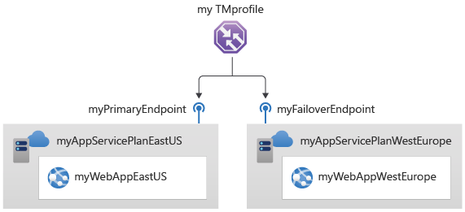

---
Exercise:
  title: "M04 – Lerneinheit\_6: Erstellen eines Traffic Manager-Profils mithilfe des Azure-Portals"
  module: Module 04 - Load balancing non-HTTP(S) traffic in Azure
---

# M04 – Lerneinheit 6: Erstellen eines Traffic Manager-Profils mithilfe des Azure-Portals

In dieser Übung erstellen Sie ein Traffic Manager-Profil, um Hochverfügbarkeit für die Webanwendung der fiktiven Organisation Contoso Ltd bereitzustellen. 

**Hinweis:** Eine **[interaktive Labsimulation](https://mslabs.cloudguides.com/guides/AZ-700%20Lab%20Simulation%20-%20Create%20a%20Traffic%20Manager%20profile%20using%20the%20Azure%20portal)** ist verfügbar, mit der Sie dieses Lab in Ihrem eigenen Tempo durcharbeiten können. Möglicherweise liegen geringfügige Unterschiede zwischen der interaktiven Simulation und dem gehosteten Lab vor, aber die dargestellten Kernkonzepte und Ideen sind identisch.

#### Geschätzte Dauer: 35 Minuten

Sie erstellen zwei Instanzen einer Webanwendung, die in zwei verschiedenen Regionen bereitgestellt werden („USA, Osten“ und „Europa, Westen“). Die Region „USA, Osten“ fungiert als primärer Endpunkt für Traffic Manager, und die Region „Europa, Westen“ fungiert als Failoverendpunkt.

Sie erstellen dann ein Traffic Manager-Profil basierend auf der Endpunktpriorität. Das Profil leitet den Benutzerdatenverkehr an den primären Standort, an dem die Webanwendung ausgeführt wird. Traffic Manager überwacht kontinuierlich die Webanwendung. Wenn der primäre Standort in „USA, Osten“ nicht verfügbar ist, wird ein automatisches Failover auf den Sicherungsstandort in „Europa, Westen“ ermöglicht.

Das folgende Diagramm veranschaulicht ungefähr die Umgebung, die Sie in dieser Übung bereitstellen.

    

 In dieser Übung führen Sie die folgenden Schritte aus:

+ Aufgabe 1: Erstellen der Web-Apps
+ Aufgabe 2: Erstellen eines Traffic Manager-Profils
+ Aufgabe 3: Hinzufügen von Traffic Manager-Endpunkten
+ Aufgabe 4: Testen des Traffic Manager-Profils
+ Aufgabe 5: Bereinigen von Ressourcen


## Aufgabe 1: Erstellen der Web-Apps

In diesem Abschnitt erstellen Sie zwei Instanzen einer Webanwendung, die in den beiden unterschiedlichen Azure-Regionen bereitgestellt werden.

1. Wählen Sie auf der Startseite des Azure-Portals **Ressource erstellen** und dann **Web-App** aus (Wenn dieser Ressourcentyp nicht auf der Seite aufgeführt ist, verwenden Sie das Suchfeld oben auf der Seite, um danach zu suchen und ihn auszuwählen.).

1. Verwenden Sie auf der Seite **Web-App erstellen** auf der Registerkarte **Grundlagen** die Informationen aus der folgenden Tabelle, um die erste Webanwendung zu erstellen.

   | **Einstellung**      | **Wert**                                                    |
   | ---------------- | ------------------------------------------------------------ |
   | Subscription     | Wählen Sie Ihr Abonnement aus.                                     |
   | Ressourcengruppe   | Wählen Sie **Neu erstellen** Name: **Contoso-RG-TM1** aus.             |
   | Name             | **ContosoWebAppEastUSxx** (wobei xx Ihre Initialen sind, um den Namen eindeutig zu machen) |
   | Veröffentlichen          | **Code**                                                     |
   | Laufzeitstapel    | **ASP.NET V4.8**                                             |
   | Betriebssystem | **Windows**                                                  |
   | Region           | **USA, Osten**                                                  |
   | Windows-Plan     | Wählen Sie **Neu erstellen** Name: **ContosoAppServicePlanEastUS** aus. |
   | Pricing Plan (Tarif)     | **Standard S1, ACU gesamt: 100, 1,75 GB Arbeitsspeicher**               |


1. Wählen Sie die Registerkarte **Überwachung** aus.

1. Wählen Sie auf der Registerkarte **Überwachung** die Option **Nein** für **Application Insights aktivieren** aus.

1. Klicken Sie auf **Überprüfen + erstellen**.

   

1. Wählen Sie **Erstellen** aus. Wenn die Bereitstellung der Web-App erfolgreich war, wird eine Standardwebsite erstellt.

1. Wiederholen Sie die obigen Schritte 1 bis 6, um eine zweite Web-App zu erstellen. Verwenden Sie mit Ausnahme der Informationen in der folgenden Tabelle die selben Einstellungen wie zuvor. 

   | **Einstellung**    | **Wert**                                                    |
   | -------------- | ------------------------------------------------------------ |
   | Resource group | Wählen Sie **Neu erstellen** Name: **Contoso-RG-TM2** aus.             |
   | Name           | **ContosoWebAppWestEuropexx** (wobei xx Ihre Initialen sind, um den Namen eindeutig zu machen)  |
   | Region         | **Europa, Westen**                                              |
   | Windows-Plan   | Wählen Sie **Neu erstellen** Name: **ContosoAppServicePlanWestEurope** aus. |


1. Wählen Sie auf der Azure-Startseite **Alle Dienste** und dann im linken Navigationsmenü **Web** aus, und wählen Sie dann **App Services** aus.

1. Die beiden neuen Web-Apps sollten jetzt aufgelistet werden.

   

 

## Aufgabe 2: Erstellen eines Traffic Manager-Profils

Jetzt erstellen Sie ein Traffic Manager-Profil, das Benutzerdatenverkehr basierend auf der Endpunktpriorität weiterleitet.

1. Wählen Sie auf der Startseite des Azure-Portals **Ressource erstellen** aus.

1. Geben Sie im Suchfeld oben auf der Seite **Traffic Manager-Profil** ein, und wählen Sie es dann in der Popupliste aus.

   

1. Wählen Sie **Erstellen** aus.

1. Verwenden Sie auf der Seite **Traffic Manager-Profil erstellen** die Informationen in der folgenden Tabelle, um das Traffic Manager-Profil zu erstellen.

   | **Einstellung**             | **Wert**                |
   | ----------------------- | ------------------------ |
   | Name                    | **Contoso-TMProfilexx** (wobei xx Ihre Initialen sind, um den Namen eindeutig zu machen) |
   | Routingmethode          | **Priority**             |
   | Subscription            | Wählen Sie Ihr Abonnement aus. |
   | Resource group          | **Contoso-RG-TM1**       |
   | Ressourcengruppenstandort | **USA, Osten**              |


1. Wählen Sie **Erstellen** aus.

 

## Aufgabe 3: Hinzufügen von Traffic Manager-Endpunkten

In diesem Abschnitt fügen Sie die Website in „USA, Osten“ als primären Endpunkt hinzu, um den gesamten Benutzerdatenverkehr weiterzuleiten. Anschließend fügen Sie die Website in „Europa, Westen“ als Failoverendpunkt hinzu. Wenn der primäre Endpunkt nicht mehr verfügbar ist, wird der Datenverkehr automatisch an den Failoverendpunkt weitergeleitet.

1. Wählen Sie auf der Startseite des Azure-Portals **Alle Ressourcen** und dann in der Ressourcenliste **Contoso-TMProfile** aus.

1. Wählen Sie unter **Einstellungen** die Option **Endpunkte** aus, und klicken Sie dann auf **Hinzufügen**.

   

1. Geben Sie auf der Seite **Endpunkt hinzufügen** die Informationen aus der folgenden Tabelle ein.

   | **Einstellung**          | **Wert**                         |
   | -------------------- | --------------------------------- |
   | type                 | **Azure-Endpunkt**                |
   | Name                 | **myPrimaryEndpoint**             |
   | Zielressourcentyp | **App Service**                   |
   | Zielressource      | **ContosoWebAppEastUS (USA, Osten)** |
   | Priorität             | **1**                             |


1. Wählen Sie **Hinzufügen**.

1. Wiederholen Sie die obigen Schritte 2 bis 4, um den Failoverendpunkt zu erstellen. Verwenden Sie mit Ausnahme der Informationen in der folgenden Tabelle die selben Einstellungen wie zuvor. 

   | **Einstellung**     | **Wert**                                 |
   | --------------- | ----------------------------------------- |
   | Name            | **myFailoverEndpoint**                    |
   | Zielressource | **ContosoWebAppWestEurope (Europa, Westen)** |
   | Priorität        | **2**                                     |


1. Das Festlegen einer Priorität von 2 bedeutet, dass Datenverkehr an diesen Failoverendpunkt weitergeleitet wird, wenn der konfigurierte primäre Endpunkt fehlerhaft wird.

1. Wählen Sie unter **Einstellungen** die Option **Konfiguration**, aktualisieren Sie die Überwachungseinstellungen **Protokoll** auf „HTTPS“ und **Port** auf „443“, und wählen Sie **Speichern** aus.

1. Die beiden neuen Endpunkte werden im Traffic Manager-Profil angezeigt. Beachten Sie, dass sich der **Überwachungsstatus** nach einigen Minuten in **Online** ändern sollte.

   

 

## Aufgabe 4: Testen des Traffic Manager-Profils

In diesem Abschnitt überprüfen Sie den DNS-Namen Ihres Traffic Manager-Profils und konfigurieren dann den primären Endpunkt so, dass er nicht verfügbar ist. Anschließend überprüfen Sie, ob die Web-App noch verfügbar ist, um zu testen, ob das Traffic Manager-Profil erfolgreich Datenverkehr an den Failoverendpunkt sendet.

1. Wählen Sie auf der Seite **Contoso-TMProfile** die Option **Übersicht** aus.

1. Kopieren Sie auf dem Bildschirm **Übersicht** den **DNS-Name**-Eintrag in die Zwischenablage (oder notieren Sie ihn an anderer Stelle).

   

1. Öffnen Sie eine Webbrowser-Registerkarte, fügen Sie den **DNS-Name**-Eintrag (contoso-tmprofile.trafficmanager.net) in die Adressleiste ein (oder geben Sie ihn ein), und drücken Sie die EINGABETASTE.

1. Die Standardwebsite der Web-App sollte angezeigt werden. Wenn Sie die Meldung **404 Website nicht gefunden** erhalten, **deaktivieren Sie das Profil** auf der Traffic Manager-Profilübersichtsseite **Contoso-TMProfilexxm**, und **aktivieren Sie das Profil**. Aktualisieren Sie dann die Webseite.

   

1. Derzeit wird der gesamte Datenverkehr an den primären Endpunkt gesendet, da Sie seine **Priorität** auf **1** festgelegt haben.

1. Um zu testen, ob der Failoverendpunkt ordnungsgemäß funktioniert, müssen Sie den primären Standort deaktivieren.

1. Wählen Sie auf der Seite **Contoso-TMProfile** auf dem Übersichtsbildschirm **myPrimaryEndpoint** aus.

1. Wählen Sie auf der Seite **myPrimaryEndpoint** unter **Status** die Einstellung **Deaktiviert** und anschließend **Speichern** aus.

   

1. Schließen Sie die Seite **myPrimaryEndpoint** (wählen Sie oben rechts auf der Seite das **X** aus).

1. Auf der Seite **Contoso-TMProfile** sollte der **Überwachungsstatus** für **myPrimaryEndpoint** jetzt **Deaktiviert** lauten.

1. Öffnen Sie eine neue Webbrowsersitzung, fügen Sie den **DNS-Name**-Eintrag (contoso-tmprofile.trafficmanager.net) in die Adressleiste ein (oder geben Sie ihn ein), und drücken Sie die EINGABETASTE.

1. Vergewissern Sie sich, dass die Web-App weiterhin reagiert. Da der primäre Endpunkt nicht verfügbar war, wurde der Datenverkehr stattdessen an den Failoverendpunkt weitergeleitet, um die Funktion der Website aufrechtzuerhalten.

 
 ## Aufgabe 5: Bereinigen von Ressourcen

   >**Hinweis**: Denken Sie daran, alle neu erstellten Azure-Ressourcen zu entfernen, die Sie nicht mehr verwenden. Durch das Entfernen nicht verwendeter Ressourcen wird sichergestellt, dass keine unerwarteten Kosten anfallen.

1. Öffnen Sie im Azure-Portal im Bereich **Cloud Shell** die **PowerShell**-Sitzung.

1. Löschen Sie alle Ressourcengruppen, die Sie während der praktischen Übungen in diesem Modul erstellt haben, indem Sie den folgenden Befehl ausführen:

   ```powershell

   Remove-AzResourceGroup -Name 'Contoso-RG-TM1' -Force -AsJob
   Remove-AzResourceGroup -Name 'Contoso-RG-TM2' -Force -AsJob

   ```

    >**Hinweis**: Der Befehl wird (wie über den Parameter „-AsJob“ festgelegt) asynchron ausgeführt. Dies bedeutet, dass Sie zwar direkt im Anschluss einen weiteren PowerShell-Befehl in derselben PowerShell-Sitzung ausführen können, es jedoch einige Minuten dauert, bis die Ressourcengruppen tatsächlich entfernt werden.
 

