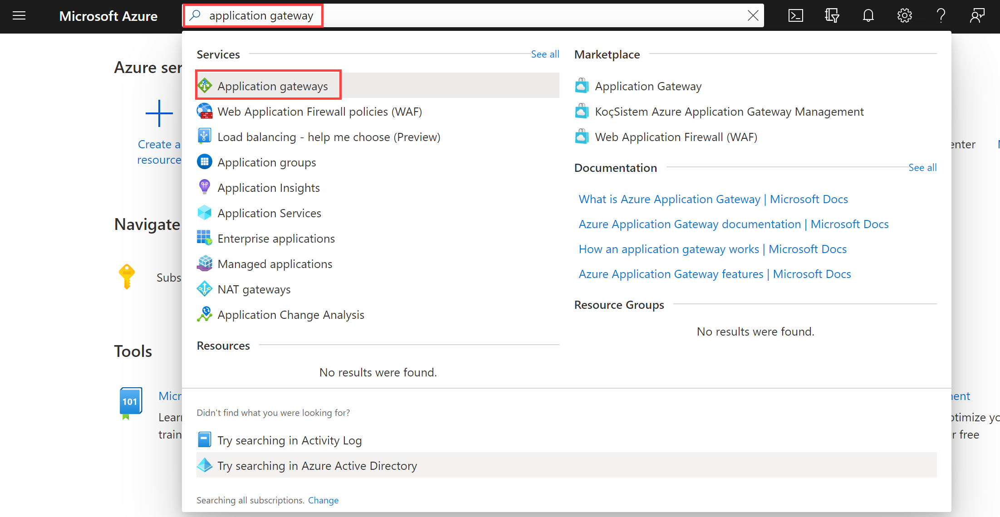

---
Exercise:
  title: "M05 – Lerneinheit\_4: Bereitstellen eines Azure Application Gateway"
  module: Module 05 - Load balancing HTTP(S) traffic in Azure
---

# M05 – Lerneinheit 4: Bereitstellen eines Azure Application Gateway

## Übungsszenario

In dieser Übung verwenden Sie das Azure-Portal, um ein Anwendungsgateway zu erstellen. Anschließend testen Sie es, um sicherzustellen, dass es ordnungsgemäß funktioniert.


>**Hinweis:** Eine **[interaktive Labsimulation](https://mslabs.cloudguides.com/guides/AZ-700%20Lab%20Simulation%20-%20Deploy%20Azure%20Application%20Gateway)** ist verfügbar, mit der Sie dieses Lab in Ihrem eigenen Tempo durcharbeiten können. Möglicherweise liegen geringfügige Unterschiede zwischen der interaktiven Simulation und dem gehosteten Lab vor, aber die dargestellten Kernkonzepte und Ideen sind identisch.

### Geschätzte Dauer: 25 Minuten

Das Anwendungsgateway leitet den Webdatenverkehr Ihrer Anwendungen an bestimmte Ressourcen in einem Back-End-Pool weiter. Sie weisen den Ports Listener zu, erstellen Regeln und fügen Ressourcen zu einem Back-End-Pool hinzu. Der Einfachheit halber wird in diesem Artikel ein einfaches Setup mit einer öffentlichen Front-End-IP-Adresse, einem grundlegenden Listener zum Hosten einer einzelnen Website auf diesem Anwendungsgateway, einer Routingregel für grundlegende Anforderungen und zwei virtuellen Computern im Back-End-Pool verwendet.

Für die Kommunikation in Azure zwischen den von Ihnen erstellten Ressourcen ist ein virtuelles Netzwerk erforderlich. Sie können ein neues virtuelles Netzwerk erstellen oder ein bereits vorhandenes virtuelles Netzwerk auswählen. In diesem Beispiel erstellen Sie ein neues virtuelles Netzwerk, während Sie das Anwendungsgateway erstellen. Application Gateway-Instanzen werden in separaten Subnetzen erstellt. In diesem Beispiel erstellen Sie zwei Subnetze: eins für das Anwendungsgateway und eins für die Back-End-Server.

In dieser Übung führen Sie die folgenden Schritte aus:

+ Aufgabe 1: Erstellen einer Application Gateway-Instanz
+ Aufgabe 2: Erstellen von virtuellen Computern
+ Aufgabe 3: Hinzufügen von Back-End-Servern zum Back-End-Pool
+ Aufgabe 4: Testen der Application Gateway-Instanz

## Aufgabe 1: Erstellen einer Application Gateway-Instanz

1. Melden Sie sich mit Ihrem Azure-Konto beim [Azure-Portal](https://portal.azure.com/) an.

1. Geben Sie auf einer beliebigen Seite im Azure-Portal unter **Ressourcen, Dienste und Dokumente durchsuchen (G+/)** „application gateway“ ein, und wählen Sie dann aus den Ergebnissen **Anwendungsgateways** aus.
    

1. Wählen Sie auf der Seite „Anwendungsgateways“ die Option **+ Erstellen** aus.

1. Geben Sie auf der Registerkarte **Grundlagen** unter „Anwendungsgateway erstellen“ die folgenden Informationen ein, oder wählen Sie sie aus:

   | **Einstellung**         | **Wert**                                    |
   | ------------------- | -------------------------------------------- |
   | Subscription        | Wählen Sie Ihr Abonnement aus.                    |
   | Resource group      | Wählen Sie Neu erstellenContosoResourceGroup aus.       |
   | Application Gateway | ContosoAppGateway                            |
   | Region              | Wählen Sie **USA, Osten** aus.                           |
   | Virtual Network     | Wählen Sie **Neu erstellen** aus.                        |

1. Geben Sie unter „Virtuelles Netzwerk erstellen“ folgende Informationen ein, oder wählen Sie sie aus:

   | **Einstellung**       | **Wert**                          |
   | ----------------- | ---------------------------------- |
   | Name              | ContosoVNet                        |
   | **ADRESSRAUM** |                                    |
   | Adressbereich     | 10.0.0.0/16                        |
   | **SUBNETZE**       |                                    |
   | Subnetzname       | Ändern Sie **Standard** in **AGSubnet**. |
   | Adressbereich     | 10.0.0.0/24                        |
   | Subnetzname       | BackendSubnet                      |
   | Adressbereich     | 10.0.1.0/24                        |


>**Hinweis**: Wenn die Benutzeroberfläche nicht die Möglichkeit hat, zusätzliche Subnetze hinzuzufügen, führen Sie die Schritte aus, und fügen Sie das Back-End-Subnetz nach dem Erstellen des Gateways hinzu. 

1. Wählen Sie **OK** aus, um zur Registerkarte „Grundlagen“ unter „Anwendungsgateway erstellen“ zurückzukehren.

1. Übernehmen Sie die Standardwerte für die anderen Einstellungen, und wählen Sie anschließend **Weiter: Front-Ends** aus.

1. Vergewissern Sie sich auf der Registerkarte **Front-Ends**, dass der **Typ der Front-End-IP-Adresse** auf **Öffentlich** festgelegt ist.

1. Wählen Sie unter **Öffentliche IP-Adresse** die Option **Neu hinzufügen** aus, geben Sie AGPublicIPAddress als Namen der öffentlichen IP-Adresse ein, und wählen Sie dann auf **OK** aus.

1. Klicken Sie auf **Weiter: Back-Ends**.

1. Wählen Sie auf der Registerkarte **Back-Ends** die Option **Back-End-Pool hinzufügen** aus.

1. Geben Sie im Fenster **Back-End-Pool hinzufügen**, das geöffnet wird, die folgenden Werte ein, um einen leeren Back-End-Pool zu erstellen:

    | **Einstellung**                      | **Wert**   |
    | -------------------------------- | ----------- |
    | Name                             | BackendPool |
    | Hinzufügen eines Back-End-Pools ohne Ziele | Ja         |

1. Wählen Sie im Fenster **Back-End-Pool hinzufügen** die Option **Hinzufügen** aus, um die Konfiguration des Back-End-Pools zu speichern und zur Registerkarte **Back-Ends** zurückzukehren.

1. Wählen Sie auf der Registerkarte **Back-Ends** die Option **Weiter: Konfiguration** aus.

1. Auf der Registerkarte **Konfiguration** verbinden Sie das Front-End und den von Ihnen erstellten Back-End-Pool mithilfe einer Routingregel.

1. Wählen Sie in der Spalte **Routingregeln** die Option **Routingregel hinzufügen** aus.

1. Geben Sie im Feld **Regelname** den Namen **RoutingRule** ein.

1. Geben Sie auf der Registerkarte **Listener** die folgenden Informationen ein, oder wählen Sie sie aus:

    | **Einstellung**   | **Wert**         |
    | ------------- | ----------------- |
    | Name des Listeners | Listener          |
    | Priorität      | **100**           |
    | Front-End-IP   | Wählen Sie **Öffentlich (10.0.0.0/24)**. |

1. Übernehmen Sie die Standardwerte für die anderen Einstellungen auf der Registerkarte **Listener**.

    

1. Wählen Sie die Registerkarte **Back-End-Ziele** aus, um den Rest der Routingregel zu konfigurieren.

1. Geben Sie auf der Registerkarte **Back-End-Ziele** die folgenden Informationen ein, oder wählen Sie sie aus:

    | **Einstellung**      | **Wert**      |
    | -------------    | -------------- |
    | Zieltyp      | Back-End-Pool   |
    | Back-End-Einstellungen | **Neu hinzufügen** |

1. Geben Sie unter **Back-End-Einstellung hinzufügen** die folgenden Informationen ein, oder wählen Sie sie aus:

    | **Einstellung**          | **Wert**   |
    | ------------------   | ----------- |
    | Name der Back-End-Einstellung | HTTPSetting |
    | Back-End-Port         | 80          |

1. Übernehmen Sie die Standardwerte für die anderen Einstellungen im Fenster **Back-End-Einstellung hinzufügen**, und wählen Sie dann **Hinzufügen** aus, um zu **Routingregel hinzufügen** zurückzukehren.

1. Wählen Sie **Hinzufügen** aus, um die Routingregel zu speichern und zur Registerkarte **Konfiguration** zurückzukehren.

1. Klicken Sie auf **Weiter: Tags** und dann auf **Weiter: Überprüfen + erstellen**.

1. Überprüfen Sie die Einstellungen auf der **Registerkarte Überprüfen und erstellen**.

1. Wählen Sie **Erstellen** aus, um das virtuelle Netzwerk, die öffentliche IP-Adresse und das Anwendungsgateway zu erstellen.

Die Erstellung des Anwendungsgateways in Azure kann einige Minuten in Anspruch nehmen. Warten Sie, bis die Bereitstellung erfolgreich abgeschlossen ist, bevor Sie mit dem nächsten Abschnitt fortfahren.

## Aufgabe 2: Erstellen von virtuellen Computern

1. Öffnen Sie im Azure-Portal im Bereich **Cloud Shell** die **PowerShell**-Sitzung.
 > **Hinweis:** Wenn Sie Cloud Shell zum ersten Mal öffnen, werden Sie möglicherweise aufgefordert, ein Speicherkonto zu erstellen. Klicken Sie auf **Speicher erstellen**.
1. Wählen Sie in der Symbolleiste des Cloud Shell-Bereichs das Symbol **Dateien hochladen/herunterladen**, wählen Sie im Dropdownmenü die Option **Hochladen** und laden Sie die folgenden Dateien **backend.json** und **backend.parameters.json** nacheinander aus dem Quellordner **F:\Allfiles\Exercises\M05** in das Cloud Shell-Basisverzeichnis hoch.

1. Stellen Sie die folgenden ARM-Vorlagen bereit, um die für diese Übung erforderlichen VMs zu erstellen:

>**Hinweis**: Sie werden aufgefordert, ein Administratorkennwort anzugeben.

   ```powershell
   $RGName = "ContosoResourceGroup"
   
   New-AzResourceGroupDeployment -ResourceGroupName $RGName -TemplateFile backend.json -TemplateParameterFile backend.parameters.json
   ```
  
1. Wenn die Bereitstellung abgeschlossen ist, wechseln Sie zur Startseite des Azure-Portals und wählen **Virtuelle Computer** aus.

1. Stellen Sie sicher, dass beide VMs erstellt wurden.

## Aufgabe 3: Hinzufügen von Back-End-Servern zum Back-End-Pool

1. Wählen Sie im Menü des Azure-Portals die Option **Alle Ressourcen** aus, oder suchen Sie nach allen Ressourcen, und wählen Sie diese Option dann aus. Wählen Sie dann **ContosoAppGateway** aus.

1. Wählen Sie unter **Einstellungen** die Option **Back-End-Pools**.

1. Wählen Sie **BackendPool** aus.

1. Wählen Sie auf der Seite „Back-End-Pool bearbeiten“ unter **Back-End-Ziele** unter **Zieltyp**die Option **Virtueller Computer** aus.

1. Wählen Sie unter **Ziel** die Option **Back-EndVM1** aus.

1. Wählen Sie unter **Zieltyp** die Option **Virtueller Computer** aus.

1. Wählen Sie unter **Ziel** die Option **Back-EndVM2** aus.

   

1. Wählen Sie **Speichern**.

Warten Sie, bis die Bereitstellung abgeschlossen ist, bevor Sie mit dem nächsten Schritt fortfahren.

## Aufgabe 4: Testen der Application Gateway-Instanz

IIS ist für die Erstellung des Anwendungsgateways zwar nicht erforderlich, wird in dieser Übung aber installiert, um die erfolgreiche Erstellung des Anwendungsgateways durch Azure zu überprüfen.

### Testen des Anwendungsgateways mit IIS

1. Suchen Sie auf der Seite **Übersicht** des Anwendungsgateways nach der öffentlichen IP-Adresse für das Anwendungsgateway.

   

1. Kopieren Sie die öffentliche IP-Adresse, und fügen Sie sie in die Adressleiste Ihres Browsers ein, um zu dieser IP-Adresse zu navigieren.

1. Überprüfen Sie die Antwort. Eine gültige Antwort bestätigt, dass das Anwendungsgateway erfolgreich erstellt wurde und eine Verbindung mit dem Back-End herstellen kann.

   

1. Aktualisieren Sie den Browser mehrmals. Daraufhin sollten Verbindungen mit „BackendVM1“ und „BackendVM2“ angezeigt werden.

Herzlichen Glückwunsch! Sie haben eine Azure Application Gateway-Instanz konfiguriert und getestet.
