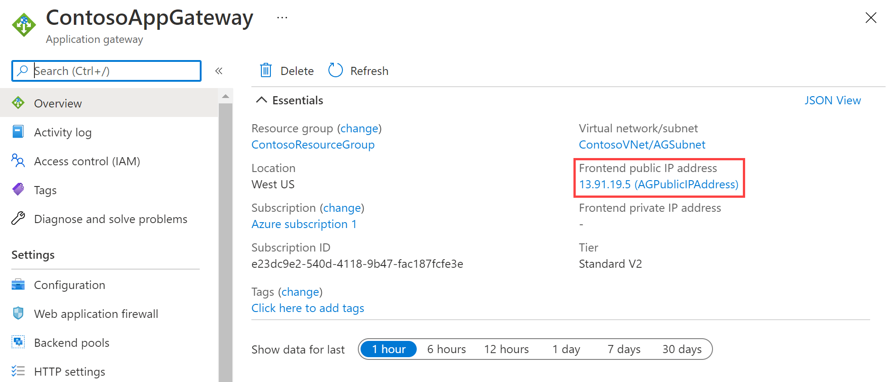

---
Exercise:
  title: "M05 – Lerneinheit\_4: Bereitstellen eines Azure Application Gateway"
  module: Module 05 - Load balancing HTTP(S) traffic in Azure
---

# M05 – Lerneinheit 4: Bereitstellen eines Azure Application Gateway

## Übungsszenario

In dieser Übung verwenden Sie das Azure-Portal, um ein Anwendungsgateway zu erstellen. Anschließend testen Sie es, um sicherzustellen, dass es ordnungsgemäß funktioniert.


   >**Hinweis:** Eine **[interaktive Labsimulation](https://mslabs.cloudguides.com/guides/AZ-700%20Lab%20Simulation%20-%20Deploy%20Azure%20Application%20Gateway)** ist verfügbar, mit der Sie dieses Lab in Ihrem eigenen Tempo durcharbeiten können. Möglicherweise liegen geringfügige Unterschiede zwischen der interaktiven Simulation und dem gehosteten Lab vor, aber die dargestellten Kernkonzepte und Ideen sind identisch.

### Geschätzte Dauer: 25 Minuten

Das Anwendungsgateway leitet den Webdatenverkehr Ihrer Anwendungen an bestimmte Ressourcen in einem Back-End-Pool weiter. Sie weisen den Ports Listener zu, erstellen Regeln und fügen Ressourcen zu einem Back-End-Pool hinzu. Der Einfachheit halber wird in diesem Artikel ein einfaches Setup mit einer öffentlichen Front-End-IP-Adresse, einem grundlegenden Listener zum Hosten einer einzelnen Website auf diesem Anwendungsgateway, einer Routingregel für grundlegende Anforderungen und zwei virtuellen Computern im Back-End-Pool verwendet.

Für die Kommunikation in Azure zwischen den von Ihnen erstellten Ressourcen ist ein virtuelles Netzwerk erforderlich. Sie können ein neues virtuelles Netzwerk erstellen oder ein bereits vorhandenes virtuelles Netzwerk auswählen. In diesem Beispiel erstellen Sie ein neues virtuelles Netzwerk, während Sie das Anwendungsgateway erstellen. Application Gateway-Instanzen werden in separaten Subnetzen erstellt. In diesem Beispiel erstellen Sie zwei Subnetze: eins für das Anwendungsgateway und eins für die Back-End-Server.

In dieser Übung führen Sie die folgenden Schritte aus:

+ Aufgabe 1: Erstellen einer Application Gateway-Instanz
+ Aufgabe 2: Erstellen von virtuellen Computern
+ Aufgabe 3: Hinzufügen von Back-End-Servern zum Back-End-Pool
+ Aufgabe 4: Testen der Application Gateway-Instanz

## Aufgabe 1: Erstellen einer Application Gateway-Instanz

1. Melden Sie sich mit Ihrem Azure-Konto beim [Azure-Portal](https://portal.azure.com/) an.

1. Geben Sie auf einer beliebigen Seite im Azure-Portal unter **Ressourcen, Dienste und Dokumente durchsuchen (G+/)** „application gateway“ ein, und wählen Sie dann aus den Ergebnissen **Anwendungsgateways** aus.
    

1. Wählen Sie auf der Seite „Anwendungsgateways“ die Option **+ Erstellen** aus.

1. Geben Sie auf der Registerkarte **Grundlagen** unter „Anwendungsgateway erstellen“ die folgenden Informationen ein, oder wählen Sie sie aus:

   | **Einstellung**         | **Wert**                                    |
   | ------------------- | -------------------------------------------- |
   | Subscription        | Wählen Sie Ihr Abonnement aus.                    |
   | Resource group      | Wählen Sie Neu erstellenContosoResourceGroup aus.       |
   | Application Gateway | ContosoAppGateway                            |
   | Region              | Wählen Sie **USA, Osten** aus.                           |
   | Virtual Network     | Wählen Sie **Neu erstellen** aus.                        |

1. Geben Sie unter „Virtuelles Netzwerk erstellen“ folgende Informationen ein, oder wählen Sie sie aus:

   | **Einstellung**       | **Wert**                          |
   | ----------------- | ---------------------------------- |
   | Name              | ContosoVNet                        |
   | **ADRESSRAUM** |                                    |
   | Adressbereich     | 10.0.0.0/16                        |
   | **SUBNETZE**       |                                    |
   | Subnetzname       | Ändern Sie **Standard** in **AGSubnet**. |
   | Adressbereich     | 10.0.0.0/24                        |


1. Wählen Sie **OK** aus, um zur Registerkarte „Grundlagen“ unter „Anwendungsgateway erstellen“ zurückzukehren.

1. Übernehmen Sie die Standardwerte für die anderen Einstellungen, und wählen Sie anschließend **Weiter: Front-Ends** aus.

1. Vergewissern Sie sich auf der Registerkarte **Front-Ends**, dass der **Typ der Front-End-IP-Adresse** auf **Öffentlich** festgelegt ist.

1. Wählen Sie unter **Öffentliche IP-Adresse** die Option **Neu hinzufügen** aus, geben Sie AGPublicIPAddress als Namen der öffentlichen IP-Adresse ein, und wählen Sie dann auf **OK** aus.

1. Klicken Sie auf **Weiter: Back-Ends**.

1. Wählen Sie auf der Registerkarte **Back-Ends** die Option **Back-End-Pool hinzufügen** aus.

1. Geben Sie im Fenster **Back-End-Pool hinzufügen**, das geöffnet wird, die folgenden Werte ein, um einen leeren Back-End-Pool zu erstellen:

    | **Einstellung**                      | **Wert**   |
    | -------------------------------- | ----------- |
    | Name                             | BackendPool |
    | Hinzufügen eines Back-End-Pools ohne Ziele | Ja         |

1. Wählen Sie im Fenster **Back-End-Pool hinzufügen** die Option **Hinzufügen** aus, um die Konfiguration des Back-End-Pools zu speichern und zur Registerkarte **Back-Ends** zurückzukehren.

1. Wählen Sie auf der Registerkarte **Back-Ends** die Option **Weiter: Konfiguration** aus.

1. Auf der Registerkarte **Konfiguration** verbinden Sie das Front-End und den von Ihnen erstellten Back-End-Pool mithilfe einer Routingregel.

1. Wählen Sie in der Spalte **Routingregeln** die Option **Routingregel hinzufügen** aus.

1. Geben Sie im Feld **Regelname** den Namen **RoutingRule** ein.

1. Geben Sie unter **Priorität**den Wert **100** ein. 

1. Geben Sie auf der Registerkarte **Listener** die folgenden Informationen ein, oder wählen Sie sie aus:

    | **Einstellung**   | **Wert**         |
    | ------------- | ----------------- |
    | Name des Listeners | Listener          |
    | Front-End-IP   | Wählen Sie **Public IPv4**. |

1. Übernehmen Sie die Standardwerte für die anderen Einstellungen auf der Registerkarte **Listener**.

    

1. Wählen Sie die Registerkarte **Back-End-Ziele** aus, um den Rest der Routingregel zu konfigurieren.

1. Geben Sie auf der Registerkarte **Back-End-Ziele** die folgenden Informationen ein, oder wählen Sie sie aus:

    | **Einstellung**      | **Wert**      |
    | -------------    | -------------- |
    | Zieltyp      | Back-End-Pool   |
    | Back-End-Einstellungen | **Neu hinzufügen** |

1. Geben Sie unter **Back-End-Einstellung hinzufügen** die folgenden Informationen ein, oder wählen Sie sie aus:

    | **Einstellung**          | **Wert**   |
    | ------------------   | ----------- |
    | Name der Back-End-Einstellung | HTTPSetting |
    | Back-End-Port         | 80          |

1. Übernehmen Sie die Standardwerte für die anderen Einstellungen im Fenster **Back-End-Einstellung hinzufügen**, und wählen Sie dann **Hinzufügen** aus, um zu **Routingregel hinzufügen** zurückzukehren.

1. Wählen Sie **Hinzufügen** aus, um die Routingregel zu speichern und zur Registerkarte **Konfiguration** zurückzukehren.

1. Klicken Sie auf **Weiter: Tags** und dann auf **Weiter: Überprüfen + erstellen**.

1. Überprüfen Sie die Einstellungen auf der **Registerkarte Überprüfen und erstellen**.

1. Wählen Sie **Erstellen** aus, um das virtuelle Netzwerk, die öffentliche IP-Adresse und das Anwendungsgateway zu erstellen.

1. Die Erstellung des Anwendungsgateways in Azure kann einige Minuten in Anspruch nehmen. Warten Sie, bis die Bereitstellung erfolgreich abgeschlossen ist.

### Hinzufügen eines Subnetzes für Back-End-Server

1. Suchen Sie nach **ContosoVNet** und wählen Sie es aus. Überprüfen Sie, ob das **AGSubnet** erstellt wurde. 

1. Um das **BackendSubnetz** zu erstellen, wählen Sie **Einstellungen** und dann **Subnetze**. Stellen Sie sicher, dass Sie das Subnetz **hinzufügen**, wenn Sie fertig sind.
   
   | **Einstellung**       | **Wert**                          |
   | ----------------- | ---------------------------------- |
   | Subnetzname       | BackendSubnet                      |
   | Adressbereich     | 10.0.1.0/24                        |

## Aufgabe 2: Erstellen von virtuellen Computern

1. Wählen Sie im Azure-Portal das Cloud Shell-Symbol (oben rechts). Konfigurieren Sie die Shell bei Bedarf.  
    + Wählen Sie **PowerShell** aus.
    + Wählen Sie **Kein Speicherkonto erforderlich** und Ihr **Abonnement** aus und klicken Sie dann auf **Anwenden**.
    + Warten Sie, bis das Terminal erstellt wurde und eine Eingabeaufforderung angezeigt wird.
      
1. Wählen Sie in der Symbolleiste des Cloud Shell-Bereichs **Dateien verwalten** und dann **Hochladen** aus. Laden Sie die folgenden Dateien hoch: **backend.json**, **backend.parameters.json** und **install-iis.ps1**.

    >**Hinweis:** Wenn Sie in Ihrem eigenen Abonnement arbeiten, sind die [Vorlagendateien](https://github.com/MicrosoftLearning/AZ-700-Designing-and-Implementing-Microsoft-Azure-Networking-Solutions/tree/master/Allfiles/Exercises) im GitHub-Lab-Repository verfügbar.

1. Stellen Sie die folgenden ARM-Vorlagen bereit, um die für diese Übung erforderlichen VMs zu erstellen:

   >**Hinweis**: Sie werden aufgefordert, ein Administratorkennwort anzugeben. 

   ```powershell
   $RGName = "ContosoResourceGroup"
   
   New-AzResourceGroupDeployment -ResourceGroupName $RGName -TemplateFile backend.json -TemplateParameterFile backend.parameters.json
   ```
   >**Hinweis**: Nehmen Sie sich Zeit, um die Datei **backend.json** zu überprüfen. Es werden zwei virtuelle Computer bereitgestellt. Dieser Vorgang nimmt einige Minuten in Anspruch. 

1. Der Befehl sollte erfolgreich abgeschlossen werden und **BackendVM1** und **BackendVM2** auflisten.

### IIS auf jedem virtuellen Computer installieren

1. Auf jedem Back-End-Server muss IIS installiert sein.

1. Fahren Sie an der PowerShell-Eingabeaufforderung fort, und verwenden Sie das bereitgestellte Skript, um IIS auf **BackendVM1** zu installieren.

   ```powershell
   Invoke-AzVMRunCommand -ResourceGroupName 'ContosoResourceGroup' -Name 'BackendVM1' -CommandId 'RunPowerShellScript' -ScriptPath 'install-iis.ps1'
   ```

   >**Hinweis**: Während Sie warten, überprüfen Sie das PowerShell-Skript. Beachten Sie, dass die IIS-Startseite so angepasst wird, dass der Name des virtuellen Computers bereitgestellt wird.

1. Führen Sie den Befehl erneut aus, diesmal für **BackendVM2**.

   ```powershell
   Invoke-AzVMRunCommand -ResourceGroupName 'ContosoResourceGroup' -Name 'BackendVM2' -CommandId 'RunPowerShellScript' -ScriptPath 'install-iis.ps1'
   ```
   >**Hinweis:** Die Ausführung jedes Befehls dauert einige Minuten.

## Aufgabe 3: Hinzufügen von Back-End-Servern zum Back-End-Pool

1. Wählen Sie im Menü des Azure-Portals die Option **Alle Ressourcen** aus, oder suchen Sie nach allen Ressourcen, und wählen Sie diese Option dann aus. Wählen Sie dann **ContosoAppGateway** aus.

1. Wählen Sie unter **Einstellungen** die Option **Back-End-Pools**.

1. Wählen Sie **BackendPool** aus.

1. Wählen Sie auf der Seite „Back-End-Pool bearbeiten“ unter **Back-End-Ziele** unter **Zieltyp**die Option **Virtueller Computer** aus.

1. Wählen Sie unter **Ziel** die Option **BackendVM1-nic.** aus.

1. Wählen Sie unter **Zieltyp** die Option **Virtueller Computer** aus.

1. Wählen Sie unter **Ziel** die Option **BackendVM2-nic.** aus.

   

1. Wählen Sie **Speichern**, und warten Sie, bis die Ziele hinzugefügt wurden. 

1. Überprüfen Sie, ob die Back-End-Server fehlerfrei sind. Wählen Sie **Überwachung** und dann **Back-End-Integrität** aus. Beide Ziele sollten fehlerfrei sein. 

   

## Aufgabe 4: Testen der Application Gateway-Instanz

IIS ist für die Erstellung des Anwendungsgateways zwar nicht erforderlich, wird in dieser Übung aber installiert, um die erfolgreiche Erstellung des Anwendungsgateways durch Azure zu überprüfen.

### Testen des Anwendungsgateways mit IIS

1. Suchen Sie auf der Seite **Übersicht** des Anwendungsgateways nach der öffentlichen IP-Adresse für das Anwendungsgateway.

   

1. Kopieren Sie die öffentliche IP-Adresse, und fügen Sie sie in die Adressleiste Ihres Browsers ein, um zu dieser IP-Adresse zu navigieren.

1. Überprüfen Sie die Antwort. Eine gültige Antwort bestätigt, dass das Anwendungsgateway erfolgreich erstellt wurde und eine Verbindung mit dem Back-End herstellen kann.

   

1. Aktualisieren Sie den Browser mehrmals. Daraufhin sollten Verbindungen mit „BackendVM1“ und „BackendVM2“ angezeigt werden.

## Bereinigen von Ressourcen

   >**Hinweis**: Denken Sie daran, alle neu erstellten Azure-Ressourcen zu entfernen, die Sie nicht mehr verwenden. Durch das Entfernen nicht verwendeter Ressourcen wird sichergestellt, dass keine unerwarteten Gebühren anfallen.

1. Öffnen Sie im Azure-Portal im Bereich **Cloud Shell** die **PowerShell**-Sitzung.

1. Löschen Sie alle Ressourcengruppen, die Sie während der praktischen Übungen in diesem Modul erstellt haben, indem Sie den folgenden Befehl ausführen:

   ```powershell
   Remove-AzResourceGroup -Name 'IntLB-RG' -Force -AsJob
   ```

>**Hinweis**: Der Befehl wird (wie über den Parameter „-AsJob“ festgelegt) asynchron ausgeführt. Dies bedeutet, dass Sie zwar direkt im Anschluss einen weiteren PowerShell-Befehl in derselben PowerShell-Sitzung ausführen können, es jedoch einige Minuten dauert, bis die Ressourcengruppen tatsächlich entfernt werden.

## Erweitern Ihrer Lernerfahrung mit Copilot

Copilot kann Sie beim Erlernen der Verwendung von Azure-Skripttools unterstützen. Copilot kann Sie auch in Bereichen unterstützen, die nicht im Lab behandelt werden oder in denen Sie weitere Informationen benötigen. Öffnen Sie einen Edge-Browser, und wählen Sie „Copilot“ (rechts oben) aus, oder navigieren Sie zu *copilot.microsoft.com*. Nehmen Sie sich einige Minuten Zeit, um diese Prompts auszuprobieren.
+ Wie leitet Azure Application Gateway Anforderungen weiter?
+ Welche Sicherheitsfunktionen bietet Azure Application Gateway?
+ Vergleichen Sie Azure Application Gateway mit dem Azure Load Balancer. Nennen Sie Beispiele für die Verwendung der einzelnen Produkte.


## Weiterlernen im eigenen Tempo

+ [Einführung in Azure Application Gateway](https://learn.microsoft.com/training/modules/intro-to-azure-application-gateway/). In diesem Modul wird erläutert, was Azure Application Gateway macht, wie es funktioniert und wann Sie Application Gateway als Lösung verwenden sollten, um die Anforderungen Ihrer Organisation zu erfüllen.
+ [Vornehmen eines Lastenausgleichs für Ihren Webdienstdatenverkehr mit Application Gateway](https://learn.microsoft.com/training/modules/load-balancing-https-traffic-azure/). In diesem Modul lernen Sie, wie Sie Application Gateway mit URL-Pfad-basiertem Routing erstellen und konfigurieren.
+ [Lastverteilung von HTTP(S)-Verkehr in Azure](https://learn.microsoft.com/training/modules/load-balancing-https-traffic-azure/). In diesem Modul lernen Sie, wie Sie Azure Application Gateway entwerfen und implementieren.

## Wichtige Erkenntnisse

Herzlichen Glückwunsch zum erfolgreichen Abschluss des Labs. Hier sind die wichtigsten Erkenntnisse für dieses Lab. 
+ Azure Application Gateway ist ein Lastenausgleich für Webdatenverkehr auf Schicht 7, mit dem Sie eingehenden Datenverkehr für Ihre Webanwendungen verwalten können.
+ Application Gateway kann Routingentscheidungen auf der Grundlage zusätzlicher Attribute einer HTTP-Anforderung treffen. Beispiele für solche Attribute wären etwa der URI-Pfad oder Hostheader.
+ Verwenden Sie Application Gateway für Anwendungen, die in einer einzigen Region gehostet werden und wenn Sie URL-basiertes Routing benötigen. 
