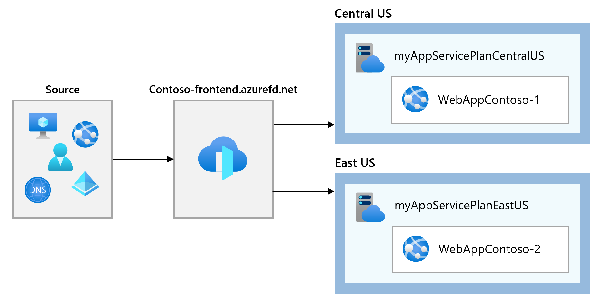
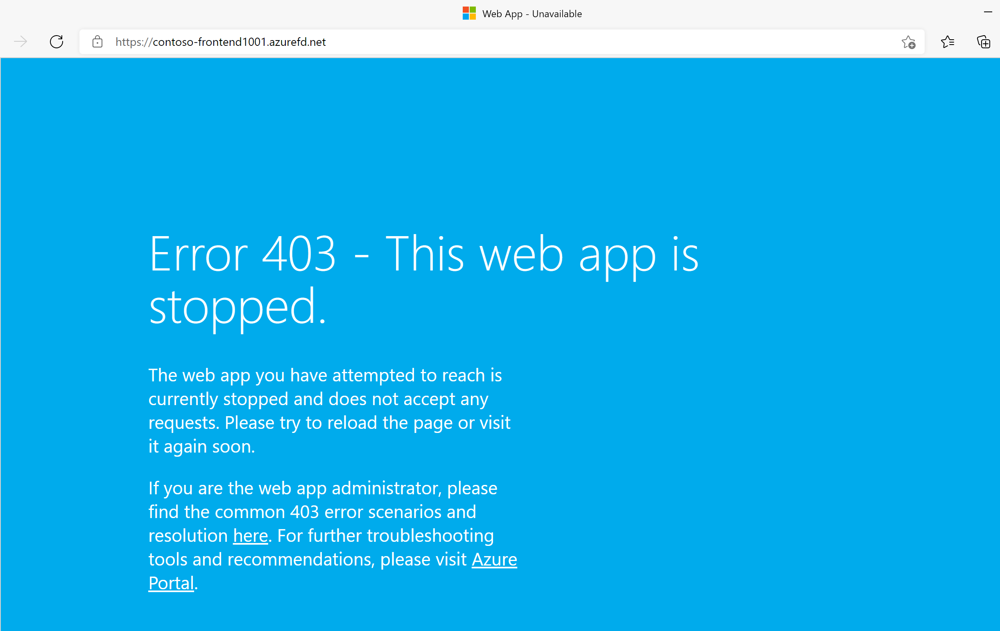

---
Exercise:
  title: "M05 – Lerneinheit\_6: Erstellen einer Front Door-Instanz für eine hochverfügbare Webanwendung mithilfe des Azure-Portals"
  module: Module 05 - Load balancing HTTP(S) traffic in Azure
---


# M05 – Lerneinheit 6: Erstellen einer Front Door-Instanz für eine hochverfügbare Webanwendung mithilfe des Azure-Portals

## Übungsszenario  

In dieser Übung richten Sie eine Azure Front Door-Konfiguration ein, die zwei Instanzen einer Webanwendung, die in verschiedenen Azure-Regionen ausgeführt wird, in einem Pool zusammenführt. Diese Konfiguration leitet Datenverkehr an den nächstgelegenen Standort weiter, an dem die Anwendung ausgeführt wird. Die Webanwendung wird von Azure Front Door ständig überwacht. Sie verwenden automatisches Failover auf den nächsten verfügbaren Standort, wenn der nächstgelegene Standort nicht verfügbar ist. Die folgende Abbildung zeigt die Netzwerkkonfiguration:



In dieser Übung führen Sie die folgenden Schritte aus:

+ Aufgabe 1: Erstellen von zwei Instanzen einer Web-App
+ Aufgabe 2: Erstellen einer Front Door-Instanz für Ihre Anwendung
+ Aufgabe 3: Anzeigen von Azure Front Door in Aktion


**Hinweis:** Eine **[interaktive Labsimulation](https://mslabs.cloudguides.com/guides/AZ-700%20Lab%20Simulation%20-%20Create%20a%20Front%20Door%20profile%20for%20a%20highly%20available%20web%20application)** ist verfügbar, mit der Sie dieses Lab in Ihrem eigenen Tempo durcharbeiten können. Möglicherweise liegen geringfügige Unterschiede zwischen der interaktiven Simulation und dem gehosteten Lab vor, aber die dargestellten Kernkonzepte und Ideen sind identisch.

### Geschätzte Dauer: 30 Minuten

## Aufgabe 1: Erstellen von zwei Instanzen einer Web-App

Für diese Übung sind zwei Instanzen einer Webanwendung erforderlich, die in verschiedenen Azure-Regionen ausgeführt werden. Beide Webanwendungsinstanzen werden im Aktiv/Aktiv-Modus ausgeführt, sodass jede von ihnen Datenverkehr annehmen kann. Diese Konfiguration unterscheidet sich von einer Aktiv/Standby-Konfiguration, bei der eine Instanz als Failover fungiert.

1. Melden Sie sich unter [https://portal.azure.com](https://portal.azure.com/) beim Azure-Portal an.

1. Geben Sie auf der Azure-Startseite über die globale Suche **WebApp** ein, und wählen Sie unter „Dienste“ **App Services** aus.

1. Wählen Sie **+ Erstellen** aus, um eine neue Web-App zu erstellen.

1. Geben Sie auf der Registerkarte **Grundlagen** auf der Seite „Web-App erstellen“ die folgenden Informationen ein, oder wählen Sie sie aus.

   | **Einstellung**      | **Wert**                                                    |
   | ---------------- | ------------------------------------------------------------ |
   | Subscription     | Wählen Sie Ihr Abonnement aus.                                    |
   | Resource group   | Wählen Sie die Ressourcengruppe „ContosoResourceGroup“ aus               |
   | Name             | Geben Sie unter Name einen eindeutigen Namen für Ihre Web-App ein. In diesem Beispiel wird WebAppContoso-1 verwendet. |
   | Veröffentlichen          | Wählen Sie **Code** aus.                                             |
   | Laufzeitstapel    | Wählen Sie **.NET 6 (LTS)** aus.                                     |
   | Betriebssystem | Wählen Sie **Windows** aus.                                          |
   | Region           | Wählen Sie **USA, Mitte** aus.                                       |
   | Windows-Plan     | Wählen Sie **Neu erstellen** aus, und geben Sie im Textfeld den Text myAppServicePlanCentralUS ein. |
   | Pricing Plan (Tarif)    | Wählen Sie **Standard S1, 100 ACU insgesamt, 1,75 GB Arbeitsspeicher** aus.        |

1. Wählen Sie **Überprüfen und erstellen** aus, überprüfen Sie die Zusammenfassung, und wählen Sie dann die Option **Erstellen** aus.
   ‎Es kann mehrere Minuten dauern, bis die Bereitstellung abgeschlossen ist.

1. Erstellen Sie eine zweite Web-App. Suchen Sie auf der Startseite des Azure-Portals nach **WebApp**.

1. Wählen Sie **+ Erstellen** aus, um eine neue Web-App zu erstellen.

1. Geben Sie auf der Registerkarte **Grundlagen** auf der Seite „Web-App erstellen“ die folgenden Informationen ein, oder wählen Sie sie aus.

   | **Einstellung**      | **Wert**                                                    |
   | ---------------- | ------------------------------------------------------------ |
   | Subscription     | Wählen Sie Ihr Abonnement aus.                                    |
   | Resource group   | Wählen Sie die Ressourcengruppe „ContosoResourceGroup“ aus               |
   | Name             | Geben Sie unter Name einen eindeutigen Namen für Ihre Web-App ein. In diesem Beispiel wird WebAppContoso-2 verwendet. |
   | Veröffentlichen          | Wählen Sie **Code** aus.                                             |
   | Laufzeitstapel    | Wählen Sie **.NET 6 (LTS)** aus.                                     |
   | Betriebssystem | Wählen Sie **Windows** aus.                                          |
   | Region           | Wählen Sie **USA, Osten** aus.                                          |
   | Windows-Plan     | Wählen Sie **Neu erstellen** aus, und geben Sie myAppServicePlanEastUS in das Textfeld ein. |
   | Pricing Plan (Tarif)     | Wählen Sie **Standard S1, 100 ACU insgesamt, 1,75 GB Arbeitsspeicher** aus.        |

1. Wählen Sie **Überprüfen und erstellen** aus, überprüfen Sie die Zusammenfassung, und wählen Sie dann die Option **Erstellen** aus.
   ‎Es kann mehrere Minuten dauern, bis die Bereitstellung abgeschlossen ist.

**Hinweis:** Wenn Sie einen Bereitstellungsfehler erhalten, lesen Sie die Benachrichtigung sorgfältig. Wenn der Fehler die Verfügbarkeit der Region aufgrund von Kontingenten betrifft, versuchen Sie, zu einer anderen Region zu wechseln. 

## Aufgabe 2: Erstellen einer Front Door-Instanz für Ihre Anwendung

Konfigurieren Sie Azure Front Door zum Weiterleiten des Benutzerdatenverkehrs basierend auf der geringsten Wartezeit zwischen den beiden Web-App-Servern. Fügen Sie zunächst einen Front-End-Host für Azure Front Door hinzu.

1. Suchen Sie auf einer beliebigen Azure-Portal-Seite unter **Ressourcen, Dienste und Dokumente durchsuchen (G+/)** nach Front Door- und CDN-Profilen, und wählen Sie dann **Front Door- und CDN-Profile** aus.

1. Wählen Sie **Front Door- und CDN-Profile erstellen** aus. Wählen Sie auf der Seite „Angebote vergleichen“ die Option **Schnell erstellen** aus. Wählen Sie dann **Zum Erstellen einer Front Door-Instanz fortfahren** aus.

1. Geben Sie auf der Registerkarte Grundlagen die folgenden Informationen an, oder wählen Sie sie aus.

   | **Einstellung**             | **Wert**                                    |
   | ----------------------- | -------------------------------------------- |
   | Subscription            | Wählen Sie Ihr Abonnement aus.                    |
   | Resource group          | Wählen Sie „ContosoResourceGroup“ aus.                  |
   | Ressourcengruppenstandort | Bestätigen Sie die Standardeinstellungen                       |
   | Name                    | Geben Sie einen eindeutigen Namen in diesem Abonnement ein, z. B. „FrontDoor(IhreInitialen)“   |
   | Tarif                    | Standard   |
   | Endpunktname           | FDendpoint   |
   | Ursprungstyp             | App Service|
   | Urspungs-Hostname        | Der Name der Web-App, die Sie zuvor bereitgestellt haben |

1. Klicken Sie auf **Überprüfen und erstellen** und dann auf **Erstellen**.

1. Warten Sie, bis die Ressource bereitgestellt wurde, und wählen Sie dann **Zur Ressource wechseln** aus.
1. Suchen Sie auf der Front Door-Ressource im Blatt „Übersicht“ die **Ursprungsgruppen**, und wählen Sie die erstellte Ursprungsgruppe aus.
1. Um die Ursprungsgruppe zu aktualisieren, wählen Sie in der Liste den Namen **default-origin-group** aus. Wählen Sie **Einen Ursprung hinzufügen** aus, und fügen Sie die zweite Web-App hinzu. Wählen Sie „Hinzufügen“ und anschließend „Aktualisieren“ aus.

## Aufgabe 3: Anzeigen von Azure Front Door in Aktion

Nachdem Sie eine Front Door-Instanz erstellt haben, dauert es einige Minuten, bis die Konfiguration global bereitgestellt ist. Greifen Sie nach Abschluss des Vorgangs auf den von Ihnen erstellten Front-End-Host zu.

1. Suchen Sie auf der Front Door-Ressource im Blatt „Übersicht“ den Endpunkt-Hostnamen, der für Ihren Endpunkt erstellt wird. Dies sollte „fdendpoint“ gefolgt von einem Bindestrich und einer zufälligen Zeichenfolge sein. Beispiel: **fdendpoint-fxa8c8hddhhgcrb9.z01.azurefd.net**. **Kopieren** Sie diesen FQDN.

1. Navigieren Sie auf einer neuen Browserregisterkarte zum FQDN des Front Door-Endpunkts. Die standardmäßige App Service-Seite wird angezeigt.
   

1. Führen Sie die folgenden Schritte aus, um das sofortige globale Failover in Aktion zu testen:

1. Wechseln Sie zum Azure-Portal, suchen Sie nach **App Services**, und wählen Sie diese Option aus.

1. Wählen Sie eine Ihrer Web-Apps aus, und wählen Sie dann **Beenden** und anschließend **Ja** zum Bestätigen aus.

   

1. Wechseln Sie zurück zu Ihrem Browser, und wählen Sie „Aktualisieren“ aus. Die gleiche Seite mit Informationen sollte angezeigt werden.

**Es kann zu einer Verzögerung kommen, während die Web-App beendet wird. Wenn in Ihrem Browser eine Fehlerseite angezeigt wird, aktualisieren Sie die Seite**.

1. Wechseln Sie zurück zum Azure-Portal, suchen Sie die andere Web-App, und beenden Sie sie.

1. Wechseln Sie zurück zu Ihrem Browser, und wählen Sie „Aktualisieren“ aus. Dieses Mal sollte eine Fehlermeldung angezeigt werden.

   

   Glückwunsch! Sie haben eine Azure Front Door-Instanz konfiguriert und getestet.

## Bereinigen von Ressourcen

>**Hinweis**: Denken Sie daran, alle neu erstellten Azure-Ressourcen zu entfernen, die Sie nicht mehr verwenden. Durch das Entfernen nicht verwendeter Ressourcen wird sichergestellt, dass keine unerwarteten Gebühren anfallen.

1. Öffnen Sie im Azure-Portal im Bereich **Cloud Shell** die **PowerShell**-Sitzung.

1. Löschen Sie alle Ressourcengruppen, die Sie während der praktischen Übungen in diesem Modul erstellt haben, indem Sie den folgenden Befehl ausführen:

   ```powershell

   Remove-AzResourceGroup -Name 'ContosoResourceGroup' -Force -AsJob

   ```

>**Hinweis**: Der Befehl wird (wie über den Parameter „-AsJob“ festgelegt) asynchron ausgeführt. Dies bedeutet, dass Sie zwar direkt im Anschluss einen weiteren PowerShell-Befehl in derselben PowerShell-Sitzung ausführen können, es jedoch einige Minuten dauert, bis die Ressourcengruppen tatsächlich entfernt werden.

## Erweitern Ihrer Lernerfahrung mit Copilot

Copilot kann Sie beim Erlernen der Verwendung von Azure-Skripttools unterstützen. Copilot kann Sie auch in Bereichen unterstützen, die nicht im Lab behandelt werden oder in denen Sie weitere Informationen benötigen. Öffnen Sie einen Edge-Browser, und wählen Sie „Copilot“ (rechts oben) aus, oder navigieren Sie zu *copilot.microsoft.com*. Nehmen Sie sich einige Minuten Zeit, um diese Prompts auszuprobieren.
+ Was sind die Unterschiede zwischen Azure Application Gateway und Azure Front Door? Geben Sie Beispiele an, in denen ich jedes Produkt verwenden würde.
+ Stellen Sie eine Checkliste bereit, die Sie beim Konfigurieren von Azure Front Door tun müssen.
+ Was ist ein Ursprung in Azure Front Door und wie unterscheidet er sich von einem Endpunkt?


## Weiterlernen im eigenen Tempo

+ [Einführung in Azure Front Door](https://learn.microsoft.com/training/modules/intro-to-azure-front-door/). In diesem Modul lernen Sie, wie Azure Front Door Ihre Anwendungen schützen kann.
+ [Führen Sie einen Lastenausgleich für Ihren Webdienst-Datenverkehr mit Front Door durch](https://learn.microsoft.com/training/modules/create-first-azure-front-door/). In diesem Modul erfahren Sie, wie Sie Azure Front Door erstellen und konfigurieren. 

## Wichtige Erkenntnisse

Herzlichen Glückwunsch zum erfolgreichen Abschluss des Labs. Hier sind die wichtigsten Erkenntnisse für dieses Lab. 
+ Azure Front Door ist ein cloudbasierter Dienst, der Ihre Anwendungen überall auf der ganzen Welt bereitstellt. 
+ Azure Front Door nutzt die Ebene 7 des Lastenausgleichs, um den Datenverkehr über mehrere Regionen und Endpunkte zu verteilen.
+ Azure Front Door unterstützt unterschiedliche Traffic-Routing-Methoden, um zu ermitteln, wie Ihr HTTP/HTTPS-Traffic verteilt wird. Die Routing-Methoden sind: Latenz, Priorität, gewichtet und Sitzungsaffinität. 
