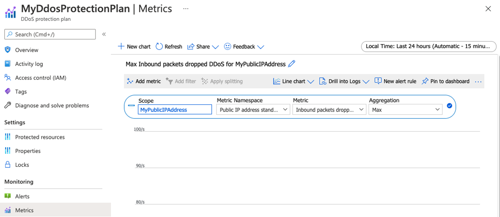

---
Exercise:
  title: "M06 – Lerneinheit\_4: Konfigurieren des DDoS-Schutzes in einem virtuellen Netzwerk mithilfe des Azure-Portals"
  module: Module 06 - Design and implement network security
---

# M06 – Lerneinheit 4: Konfigurieren des DDoS-Schutzes in einem virtuellen Netzwerk mithilfe des Azure-Portals

## Übungsszenario

Da Sie für das Netzwerksicherheitsteam von Contoso verantwortlich sind, führen Sie einen simulierten DDoS-Angriff auf das virtuelle Netzwerk aus. Die folgenden Schritte führen sie durch das Erstellen eines virtuellen Netzwerks, das Konfigurieren von DDoS Protection und das Erstellen eines Angriffs, den Sie mithilfe von Telemetriedaten und Metriken beobachten und überwachen können.


In dieser Übung führen Sie die folgenden Schritte aus:

+ Aufgabe 1: Erstellen einer Ressourcengruppe
+ Aufgabe 2: Erstellen eines DDoS-Schutzplans
+ Aufgabe 3: Aktivieren von DDoS Protection in einem neuen virtuellen Netzwerk
+ Aufgabe 4: Konfigurieren von DDoS-Telemetrie
+ Aufgabe 5: Konfigurieren von DDoS-Diagnoseprotokollen
+ Aufgabe 6: Konfigurieren von DDoS-Warnungen
+ Aufgabe 7: Testen mit Simulationspartnern


   >**Hinweis:** Eine **[interaktive Labsimulation](https://mslabs.cloudguides.com/guides/AZ-700%20Lab%20Simulation%20-%20Configure%20Azure%20DDoS%20Protection%20on%20a%20virtual%20network)** ist verfügbar, mit der Sie dieses Lab in Ihrem eigenen Tempo durcharbeiten können. Möglicherweise liegen geringfügige Unterschiede zwischen der interaktiven Simulation und dem gehosteten Lab vor, aber die dargestellten Kernkonzepte und Ideen sind identisch.

### Geschätzte Dauer: 40 Minuten

## Aufgabe 1: Erstellen einer Ressourcengruppe

1. Melden Sie sich beim Azure-Konto an.

1. Klicken Sie auf der Homepage des Azure-Portals auf **Ressourcengruppen**.

1. Klicken Sie auf **Erstellen**.

1. Geben Sie auf der Registerkarte **Grundlagen** unter ** Ressourcengruppe** die Angabe **MyResourceGroup** ein.

1. Wählen Sie unter **Region** „USA, Osten“ aus.

1. Klicken Sie auf **Überprüfen + erstellen**.

1. Klicken Sie auf **Erstellen**.

## Aufgabe 2: Erstellen eines DDoS-Schutzplans

1. Geben Sie auf der Startseite des Azure-Portals in das Suchfeld **DDoS** ein, und wählen Sie **DDoS-Schutzplan** aus, wenn diese Option angezeigt wird.

1. Wählen Sie **+ Erstellen** aus.

1. Wählen Sie auf der Registerkarte **Grundlagen** in der Liste **Ressourcengruppe** die Ressourcengruppe aus, die Sie soeben erstellt haben.

1. Geben Sie im Feld **Instanzname** den Namen **MyDdoSProtectionPlan** ein, und wählen Sie dann **Überprüfen + erstellen** aus.

1. Klicken Sie auf **Erstellen**.

## Aufgabe 3: Aktivieren von DDoS Protection in einem neuen virtuellen Netzwerk

Hier aktivieren Sie DDoS in einem neuen virtuellen Netzwerk und nicht in einem vorhandenen. Daher müssen Sie zuerst das neue virtuelle Netzwerk erstellen und dann DDoS-Schutz für das Netzwerk aktivieren, indem Sie den zuvor erstellten Plan verwenden.

1. Wählen Sie auf der Startseite des Azure-Portals **Ressource erstellen** aus, geben Sie dann im Suchfeld **Virtuelles Netzwerk** ein, und wählen Sie dann **Virtuelles Netzwerk** aus, wenn diese Option angezeigt wird.

1. Wählen Sie auf der Seite **Virtuelles Netzwerk** die Option **Erstellen** aus.

1. Wählen Sie auf der Registerkarte **Grundlagen** die Ressourcengruppe aus, die Sie zuvor erstellt haben.

1. Geben Sie im Feld **Name** den Namen **MyVirtualNetwork** ein, und wählen Sie dann die Registerkarte **Sicherheit** aus.

1. Wählen Sie auf der Registerkarte **Sicherheit** neben **DDoS-Netzwerkschutz** die Option **Aktivieren** aus.

1. Wählen Sie in der Dropdownliste **DDoS-Schutzplan** die Option **MyDdosProtectionPlan** aus.

   

1. Klicken Sie auf **Überprüfen + erstellen**.

1. Klicken Sie auf **Erstellen**.

## Aufgabe 4: Konfigurieren von DDoS-Telemetrie

Sie erstellen eine öffentliche IP-Adresse und richten dann in den nächsten Schritten Telemetriedaten ein.

1. Wählen Sie auf der Homepage des Azure-Portals **Ressource erstellen** aus, geben Sie im Suchfeld **öffentliche IP** ein, und wählen Sie dann **Öffentliche IP-Adresse** aus, wenn diese Option angezeigt wird.

1. Wählen Sie auf der Seite **Öffentliche IP-Adresse** die Option **Erstellen** aus.

1. Wählen Sie auf der Seite **Öffentliche IP-Adresse erstellen** unter **SKU** die Option **Standard** aus.

1. Geben Sie im Feld **Name** den Namen **MyPublicIPAddress** ein.

1. Wählen Sie unter **IP-Adresszuweisung** die Option **Statisch** aus.

1. Geben Sie unter **DNS-Namensbezeichnung** den Namen **mypublicdnsxx** ein (wobei Sie „xx“ durch Ihre Initialen ersetzen, damit der Name eindeutig ist).

1. Klicken Sie auf **Erstellen**.

1. Um die Telemetrie einzurichten, navigieren Sie zur Azure-Startseite und wählen Sie **Alle Ressourcen** aus.

1. Wählen Sie in der Liste Ihrer Ressourcen **MyDdosProtectionPlan** aus.

1. Wählen Sie unter **Überwachung** die Option **Metriken** aus.

1. Aktivieren Sie das Kontrollkästchen **Bereich** und dann das Kontrollkästchen neben **MyPublicIPAddress**.

    

1. Wählen Sie **Übernehmen**.

1. Wählen Sie im Feld **Metriken** die Option **Als DDoS eingehende gelöschte Pakete** aus.

1. Wählen Sie im Feld **Aggregation** die Option **Max.** aus.

    

## Aufgabe 5: Konfigurieren von DDoS-Diagnoseprotokollen

1. Wählen Sie auf der Azure-Startseite die Option **Alle Ressourcen** aus.

1. Wählen Sie in der Liste Ihrer Ressourcen **MyPublicIPAddress** aus.

1. Wählen Sie unter **Überwachung** die Option **Diagnoseeinstellungen** aus.

1. Klicken Sie auf **Diagnoseeinstellung hinzufügen**.

1. Geben Sie auf der Seite **Diagnoseeinstellung** im Feld **Name der Diagnoseeinstellung** den Namen **MyDiagnosticSetting** ein.

1. Aktivieren Sie unter **Kategoriedetails** die drei Kontrollkästchen für **Protokoll** und das Kontrollkästchen **AllMetrics**.

1. Aktivieren Sie unter **Zieldetails** das Kontrollkästchen **An Log Analytics-Arbeitsbereich senden**. Hier können Sie einen bereits vorhandenen Log Analytics-Arbeitsbereich auswählen. Da Sie jedoch noch kein Ziel für die Diagnoseprotokolle eingerichtet haben, geben Sie einfach die Einstellungen ein, verwerfen sie aber im nächsten Schritt dieser Übung.

   

1. Normalerweise würden Sie jetzt **Speichern** auswählen, um die Diagnoseeinstellungen zu speichern. Beachten Sie, dass diese Option weiterhin abgeblendet ist, da die Einstellungskonfiguration noch nicht abgeschlossen werden kann.

1. Wählen Sie **Verwerfen** und dann **Ja** aus.

## Aufgabe 6: Konfigurieren von DDoS-Warnungen

In diesem Schritt erstellen Sie einen virtuellen Computer, weisen ihm eine öffentliche IP-Adresse zu und konfigurieren dann DDoS-Warnungen.

### Erstellen des virtuellen Computers

1. Wählen Sie auf der Startseite des Azure-Portals **Ressource erstellen** aus, geben Sie dann im Suchfeld **Virtueller Computer** ein, und wählen Sie dann **Virtueller Computer** aus, wenn diese Option angezeigt wird.

1. Wählen Sie auf der Seite **Virtueller Computer** die Option **Erstellen** aus.

1. Erstellen Sie auf der Registerkarte **Grundlagen** mithilfe der Informationen in der folgenden Tabelle eine neue VM.

   | **Einstellung**           | **Wert**                                                    |
   | --------------------- | ------------------------------------------------------------ |
   | Abonnement          | Wählen Sie Ihr Abonnement aus.                                     |
   | Resource group        | **MyResourceGroup**                                          |
   | Name des virtuellen Computers  | **MyVirtualMachine**                                         |
   | Region                | Ihre Region                                                  |
   | Verfügbarkeitsoptionen  | **Keine Infrastrukturredundanz erforderlich**                   |
   | Image                 | **Ubuntu Server 20.04 LTS – Gen 2** (Öffnen Sie bei Bedarf den Link „VM-Generation konfigurieren“) |
   | Größe                  | Wählen Sie **Alle Größen anzeigen**, wählen Sie dann **B1ls** in der Liste aus, und wählen Sie **Auswählen****(Standard_B1ls – 1 vcpu, 0.5 GiB Arbeitsspeicher** |
   | Authentication type   | **Öffentlicher SSH-Schlüssel**                                           |
   | Username              | **azureuser**                                                |
   | Quelle für öffentlichen SSH-Schlüssel | **Generieren eines neuen Schlüsselpaars**                                    |
   | Schlüsselpaarname         | **myvirtualmachine-ssh-key**                                 |
   | Öffentliche Eingangsports  | Wählen Sie Keine aus.                                                  |

1. Klicken Sie auf **Überprüfen + erstellen**.

1. Klicken Sie auf **Erstellen**.

1. Wählen Sie im Dialogfeld **Neues Schlüsselpaar generieren** die Option **Privaten Schlüssel herunterladen und Ressource erstellen** aus.

1. Speichern Sie den privaten Schlüssel.

1. Klicken Sie nach Abschluss der Bereitstellung auf **Zu Ressource wechseln**.

### Zuweisen der öffentlichen IP-Adresse

1. Wählen Sie auf der Seite **Übersicht** des neuen virtuellen Computers unter **Einstellungen** die Option **Netzwerk** aus.

1. Wählen Sie neben **Netzwerkschnittstelle** die Option **myvirtualmachine-nic** aus. Der Name des „nic“ kann unterschiedlich sein.

1. Wählen Sie unter **Einstellungen** die Option **IP-Konfigurationen** aus.

1. Wählen Sie **ipconfig1** aus.

1. Wählen Sie in der Liste **Öffentliche IP-Adresse** die Option **MyPublicIPAddress** aus.

1. Wählen Sie **Speichern**.

   

### Konfigurieren von DDoS-Warnungen

1. Wählen Sie auf der Azure-Startseite die Option **Alle Ressourcen** aus.

1. Wählen Sie in der Liste Ihrer Ressourcen **MyPublicIPAddress** aus.

1. Wählen Sie unter **Überwachung** die Option **Warnungen** aus.

1. Wählen Sie **Warnungsregel erstellen** aus.

1. Wählen Sie auf der Seite **Warnungsregel erstellen** unter **Bereich** die Option **Ressource bearbeiten** aus.

1. Wählen Sie **Unter DDoS-Angriff oder nicht** als Signalname.

1. Suchen Sie unter „Warnungslogik“ die Einstellung **Operator** und wählen Sie **Größer oder gleich** aus.

1. Geben Sie unter **Schwellenwert** den Wert **1** ein (diese Angabe bedeutet, dass ein Angriff stattfindet).

1. Navigieren Sie zur Registerkarte „Details“ und wählen Sie **Name der Warnungsregel**, geben Sie **MyDdosAlert** ein.

    

1. Wählen Sie **Warnungsregel erstellen** aus.

## Aufgabe 7: Testen mit Simulationspartnern

1. Überprüfung der [Azure DDoS-Simulationstestrichtlinie](https://learn.microsoft.com/azure/ddos-protection/test-through-simulations#azure-ddos-simulation-testing-policy)

1. Konfigurieren Sie einen DDoS-Testangriff mithilfe eines genehmigten Testpartners. Wenn Sie BreakingPoint Cloud zum Testen verwenden, verwenden Sie die Einstellungen im Screenshot unten (Sie müssen möglicherweise die Testgröße von 100.000 PPS mit dem Testkonto auswählen), aber geben Sie die IP-Adresse Ihrer eigenen **MyPublicIPAddress**-Ressource im Feld **Ziel-IP-Adresse** an (z. B. **51.140.137.219**) 

1. Wählen Sie auf der Startseite des Azure-Portals **Alle Ressourcen** aus.

1. Wählen Sie in der Ressourcenliste Ihre **MyPublicIPAddress**-Ressource und dann unter **Überwachung** die Option **Metriken** aus.

1. Wählen Sie im Feld **Metrik** die Option **DDoS-Angriff** aus der Liste aus.

1. Jetzt können Sie den DDoS-Angriff sehen, wie er passiert ist. Beachten Sie, dass es zehn Minuten dauern kann, bis die Ergebnisse angezeigt werden.

   

## Bereinigen von Ressourcen

   >**Hinweis**: Denken Sie daran, alle neu erstellten Azure-Ressourcen zu entfernen, die Sie nicht mehr verwenden. Durch das Entfernen nicht verwendeter Ressourcen wird sichergestellt, dass keine unerwarteten Gebühren anfallen.

1. Öffnen Sie im Azure-Portal im Bereich **Cloud Shell** die **PowerShell**-Sitzung.

1. Löschen Sie alle Ressourcengruppen, die Sie während der praktischen Übungen in diesem Modul erstellt haben, indem Sie den folgenden Befehl ausführen:

   ```powershell
   Remove-AzResourceGroup -Name 'MyResourceGroup' -Force -AsJob
   ```

   >**Hinweis**: Der Befehl wird (wie über den Parameter „-AsJob“ festgelegt) asynchron ausgeführt. Dies bedeutet, dass Sie zwar direkt im Anschluss einen weiteren PowerShell-Befehl in derselben PowerShell-Sitzung ausführen können, es jedoch einige Minuten dauert, bis die Ressourcengruppen tatsächlich entfernt werden.

## Erweitern Ihrer Lernerfahrung mit Copilot

Copilot kann Sie beim Erlernen der Verwendung von Azure-Skripttools unterstützen. Copilot kann Sie auch in Bereichen unterstützen, die nicht im Lab behandelt werden oder in denen Sie weitere Informationen benötigen. Öffnen Sie einen Edge-Browser, und wählen Sie „Copilot“ (rechts oben) aus, oder navigieren Sie zu *copilot.microsoft.com*. Nehmen Sie sich einige Minuten Zeit, um diese Prompts auszuprobieren.
+ Was sind DDoS-Angriffe? Wie werden DDoS-Angriffe kategorisiert und gibt es Gegenstrategien?
+ Stellen Sie eine Tabelle bereit, die die beiden verschiedenen Azure DDoS Protection-Stufen zusammenfasst.
+ Welche Azure-Ressourcen können durch DDoS Protection geschützt werden?


## Weiterlernen im eigenen Tempo

+ [Einführung in Azure DDoS Protection](https://learn.microsoft.com/training/modules/introduction-azure-ddos-protection/). In diesem Modul bewerten Sie Azure DDoS Protection, seine Funktionen und Architekturoptionen.
+ [Entwerfen und Implementieren von Netzwerksicherheit](https://learn.microsoft.com/training/modules/design-implement-network-security-monitoring/). In diesem Modul erfahren Sie mehr über Azure DDoS Protection und stellen diese bereit.

  
## Wichtige Erkenntnisse

Herzlichen Glückwunsch zum erfolgreichen Abschluss des Labs. Hier sind die wichtigsten Erkenntnisse für dieses Lab. 
+ Ein DDoS-Angriff ist ein schädlicher Versuch, die Ressourcen einer Anwendung zu überlasten und die Anwendung für berechtigte Benutzende nicht mehr verfügbar zu machen. 
+ Azure DDoS Protection wehrt DDoS-Angriffe ab. Er wird automatisch optimiert, um Ihre spezifischen Azure-Ressourcen in einem virtuellen Netzwerk zu schützen. 
+ Zu den Funktionen von Azure DDoS Proectection gehören: ständige Überwachung des Datenverkehrs, adaptive Optimierung in Echtzeit sowie Telemetrie und Warnungen.  
+ Azure DDoS Protection unterstützt zwei Tariftypen, DDoS-IP-Schutz und DDoS-Netzwerkschutz.
