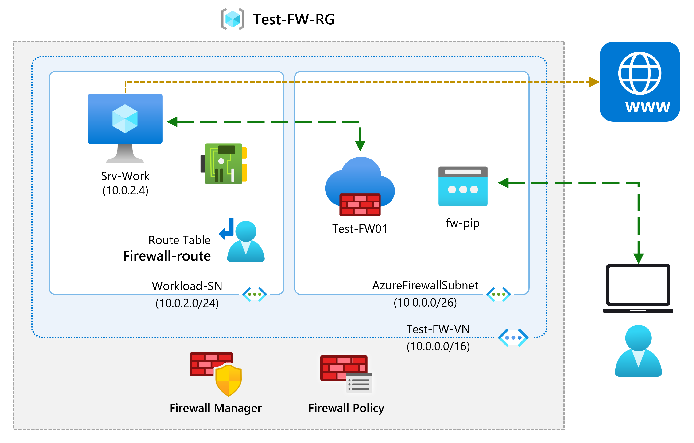
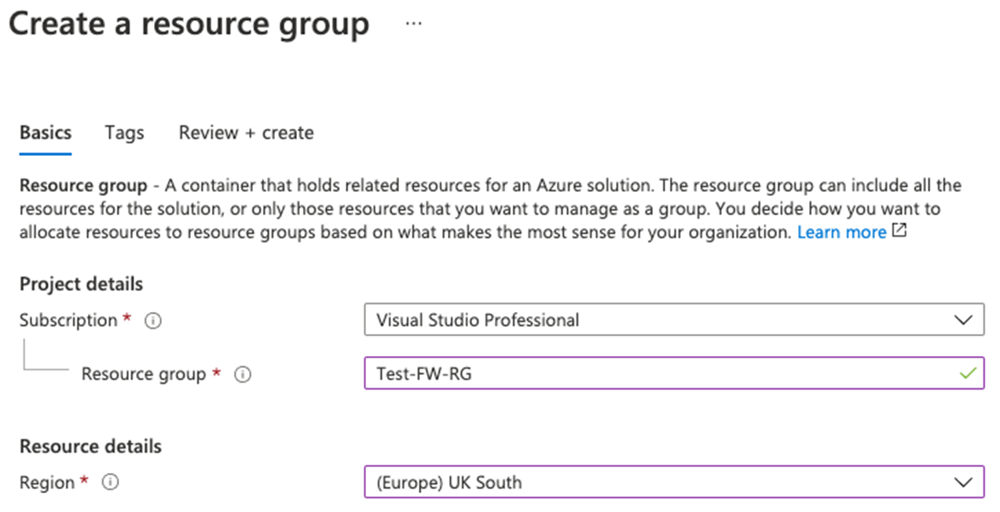
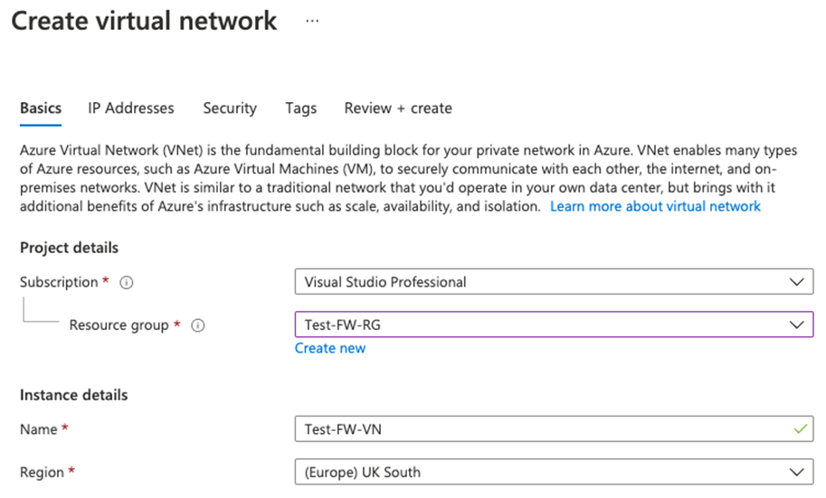
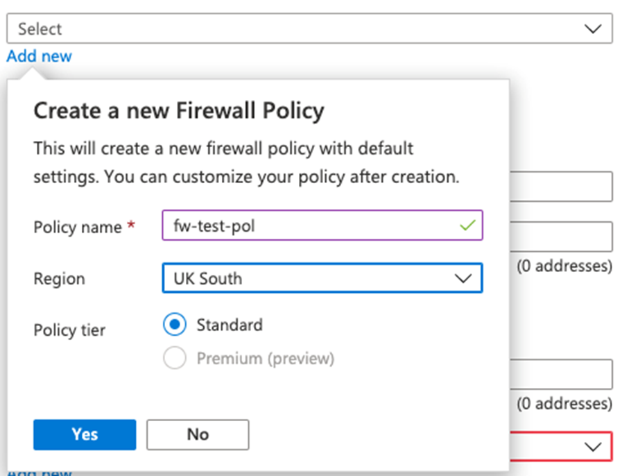
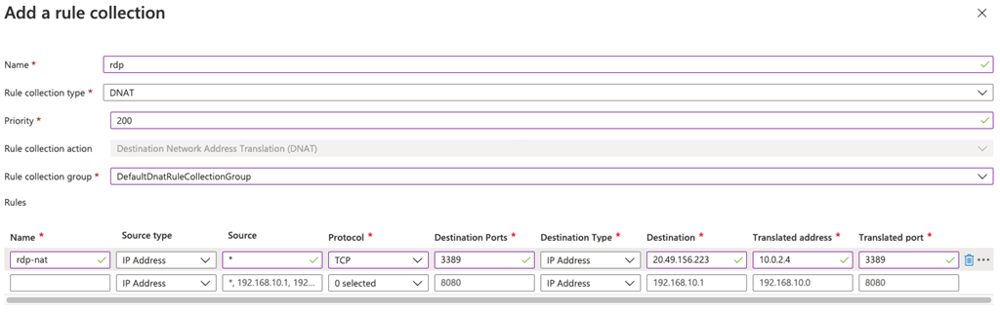
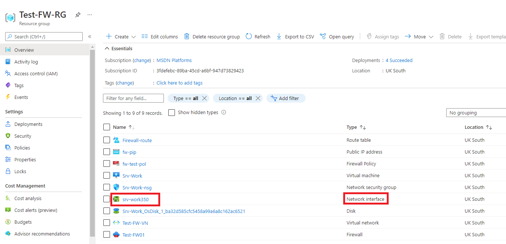

---
Exercise:
  title: "M06 – Lerneinheit\_7: Bereitstellen und Konfigurieren der Azure Firewall über das Azure-Portal"
  module: 'Module 06 - Design and implement network security '
---

# M06 – Lerneinheit 7: Bereitstellen und Konfigurieren der Azure Firewall über das Azure-Portal

## Übungsszenario

Als Teil des Netzwerksicherheitsteams von Contoso besteht Ihre nächste Aufgabe darin, Firewallregeln zum Zulassen/Verweigern des Zugriffs auf bestimmte Websites zu erstellen. Die folgenden Schritte führen Sie durch das Erstellen einer Ressourcengruppe, eines virtuellen Netzwerks und von Subnetzen sowie eines virtuellen Computers als vorbereitende Aufgaben für die Umgebung, das Bereitstellen einer Firewall und einer Firewallrichtlinie, das Konfigurieren von Standardrouten und Anwendungs-, Netzwerk- und DNAT-Regeln und schließlich das Testen der Firewall.



### Stellenqualifikationen

In dieser Übung führen Sie die folgenden Schritte aus:

+ Aufgabe 1: Erstellen einer Ressourcengruppe
+ Aufgabe 2: Erstellen eines virtuellen Netzwerks und von Subnetzen
+ Aufgabe 3: Erstellen eines virtuellen Computers
+ Aufgabe 4: Bereitstellen der Firewall und der Firewallrichtlinie
+ Aufgabe 5: Erstellen einer Standardroute
+ Aufgabe 6: Konfigurieren einer Anwendungsregel
+ Aufgabe 7: Konfigurieren einer Netzwerkregel
+ Aufgabe 8: Konfigurieren einer NAT-Zielregel (DNAT)
+ Aufgabe 9: Ändern der primären und sekundären DNS-Adresse für die Netzwerkschnittstelle des Servers
+ Aufgabe 10: Testen der Firewall

### Interaktive Labsimulationen

>**Hinweis**: Die zuvor bereitgestellten Laborsimulationen wurden eingestellt.

### Geschätzte Dauer: 60 Minuten.

## Aufgabe 1: Erstellen einer Ressourcengruppe

In dieser Aufgabe erstellen Sie eine neue Ressourcengruppe.

1. Melden Sie sich beim Azure-Konto an.

1. Klicken Sie auf der Homepage des Azure-Portals auf **Ressourcengruppen**.

1. Klicken Sie auf **Erstellen**.

1. Geben Sie auf der Registerkarte **Grundlagen** unter ** Ressourcengruppe** die Angabe **Test-FW-RG** ein.

1. Wählen Sie unter **Region** Ihre Region aus der Liste aus.

   

1. Klicken Sie auf **Überprüfen + erstellen**.

1. Klicken Sie auf **Erstellen**.

## Aufgabe 2: Erstellen eines virtuellen Netzwerks und von Subnetzen

In dieser Aufgabe erstellen Sie ein einzelnes virtuelles Netzwerk mit zwei Subnetzen.

1. Geben Sie auf der Startseite des Azure-Portals in das Suchfeld **Virtuelles Netzwerk** ein, und wählen Sie **Virtuelles Netzwerk**, wenn diese Option angezeigt wird.

1. Klicken Sie auf **Erstellen**.

1. Wählen Sie die Zuvor erstellte Ressourcengruppe **Test-FW-RG** aus.

1. Geben Sie im Feld **Name** den Namen **Test-FW-VN** ein.

   

1. Klicken Sie auf **Weiter: IP-Adressen**. Geben Sie den IPv4-Adressraum „10.0.0.0/16“ ein, falls nicht bereits vorhanden.

1. Wählen Sie unter **Subnetzname** das Wort **Standard** aus.

1. Ändern Sie im Dialogfeld **Subnetz bearbeiten** den Namen in **AzureFirewallSubnet**.

1. Ändern Sie den **Adressbereich des Subnetzes** in **10.0.1.0/26**.

1. Wählen Sie **Speichern**.

1. Wählen Sie **Subnetz hinzufügen** aus, um ein weiteres Subnetz zu erstellen, das den Workloadserver hosten soll, den Sie in Kürze erstellen.

    

1. Ändern Sie im Dialogfeld **Subnetz bearbeiten** den Namen in **Workload-SN**.

1. Ändern Sie den **Subnetzadressbereich** in **10.0.2.0/24**.

1. Wählen Sie **Hinzufügen** aus.

1. Klicken Sie auf **Überprüfen + erstellen**.

1. Klicken Sie auf **Erstellen**.

## Aufgabe 3: Erstellen eines virtuellen Computers

In dieser Aufgabe erstellen Sie den virtuellen Workloadcomputer und platzieren ihn im zuvor erstellten Subnetz „Workload-SN“.

1. Wählen Sie im Azure-Portal das Cloud Shell-Symbol (oben rechts). Konfigurieren Sie die Shell bei Bedarf.  
    + Wählen Sie **PowerShell** aus.
    + Wählen Sie **Kein Speicherkonto erforderlich** und Ihr **Abonnement** aus und klicken Sie dann auf **Anwenden**.
    + Warten Sie, bis das Terminal erstellt wurde und eine Eingabeaufforderung angezeigt wird. 

1. Wählen Sie in der Symbolleiste des Cloud Shell-Fensters das Symbol **Dateien verwalten** aus, wählen Sie im Dropdownmenü die Option **Hochladen** und laden Sie die folgenden Dateien **firewall.json** und **firewall.parameters.json** in das Cloud Shell-Home-Verzeichnis hoch.

    > **Hinweis:** Wenn Sie in Ihrem eigenen Abonnement arbeiten, sind die [Vorlagendateien](https://github.com/MicrosoftLearning/AZ-700-Designing-and-Implementing-Microsoft-Azure-Networking-Solutions/tree/master/Allfiles/Exercises) im GitHub-Lab-Repository verfügbar.

1. Stellen Sie die folgenden ARM-Vorlagen bereit, um die für diese Übung erforderliche VM zu erstellen:

   >**Hinweis**: Sie werden aufgefordert, ein Administratorkennwort anzugeben.

   ```powershell
   $RGName = "Test-FW-RG"
   
   New-AzResourceGroupDeployment -ResourceGroupName $RGName -TemplateFile firewall.json -TemplateParameterFile firewall.parameters.json
   ```
  
1. Wenn die Bereitstellung abgeschlossen ist, wechseln Sie zur Startseite des Azure-Portals und wählen **Virtuelle Computer** aus.

1. Überprüfen Sie, ob der virtuelle Computer erstellt wurde.

1. Notieren Sie sich auf der Seite **Übersicht** von **Srv-Work** rechts auf der Seite unter **Netzwerk** die **Private IP-Adresse** für diese VM (z. B. **10.0.2.4**).

## Aufgabe 4: Bereitstellen der Firewall und der Firewallrichtlinie

In dieser Aufgabe stellen Sie die Firewall im virtuellen Netzwerk mit einer konfigurierten Firewallrichtlinie bereit.

1. Wählen Sie auf der Homepage des Azure-Portals **Ressource erstellen** aus, geben Sie dann im Suchfeld **Firewall** ein, und wählen Sie **Firewall** aus, wenn diese Option angezeigt wird.

1. Wählen Sie auf der Seite **Firewall** die Option **Erstellen** aus.

1. Erstellen Sie auf der Registerkarte **Grundlagen** mithilfe der Informationen in der folgenden Tabelle eine Firewall.

   | **Einstellung**          | **Wert**                                                    |
   | -------------------- | ------------------------------------------------------------ |
   | Abonnement         | Wählen Sie Ihr Abonnement aus.                                     |
   | Resource group       | **Test-FW-RG**                                               |
   | Firewallname        | **Test-FW01**                                                |
   | Region               | Ihre Region                                                  |
   | Firewall-SKU        | **Standard**                                                 |
   | Firewallverwaltung  | **Firewallrichtlinie zum Verwalten dieser Firewall verwenden**            |
   | Firewallrichtlinie      | Wählen Sie **Neue hinzufügen** aus.<br />Name: **fw-test-pol**<br />Region: **Ihre Region** |

   

   | Virtuelles Netzwerk auswählen | **Vorhandenes verwenden**                         |
   | ------------------------ | ---------------------------------------- |
   | Virtuelles Netzwerk          | **Test-FW-VN**                           |
   | Öffentliche IP-Adresse        | Wählen Sie **Neue hinzufügen** aus.<br />Name: **fw-pip** |

   

1. Wir verwenden den Firewall Manager nicht, deaktivieren Sie daher das Kontrollkästchen für **Aktivieren der Firewallverwaltungs-NIC**. 

1. Überprüfen Sie Ihre Einstellungen. 

   

1. Fahren Sie mit **Überprüfen + erstellen** und dann mit **Erstellen** fort.

1. Warten Sie, bis die Bereitstellung der Firewall abgeschlossen ist.

1. Wenn die Bereitstellung der Firewall abgeschlossen ist, wählen Sie **Zu Ressource wechseln** aus.

1. Notieren Sie sich auf der Seite **Übersicht** von **Test-FW01** rechts auf der Seite die **private IP-Adresse** dieser Firewall (z. B. **10.0.1.4**).

1. Wählen Sie im Menü auf der linken Seite unter **Einstellungen** die Option **Konfiguration der öffentlichen IP-Adresse** aus.

1. Notieren Sie sich die Adresse unter **IP-Adresse** für die Konfiguration der öffentlichen IP-Adresse **fw-pip** (z. B. **20.90.136.51**).

## Aufgabe 5: Erstellen einer Standardroute

In dieser Aufgabe konfigurieren Sie die ausgehende Standardroute für das Subnetz „Workload-SN“ so, dass sie die Firewall durchläuft.

1. Wählen Sie auf der Homepage des Azure-Portals **Ressource erstellen** aus, geben Sie dann im Suchfeld **Route** ein, und wählen Sie **Routentabelle** aus, wenn diese Option angezeigt wird.

1. Wählen Sie auf der Seite **Routingtabelle** die Option **Erstellen** aus.

1. Erstellen Sie auf der Registerkarte **Grundlagen** mithilfe der Informationen in der folgenden Tabelle eine neue Routentabelle.

   | **Einstellung**              | **Wert**                |
   | ------------------------ | ------------------------ |
   | Abonnement             | Wählen Sie Ihr Abonnement aus. |
   | Resource group           | **Test-FW-RG**           |
   | Region                   | Ihre Region              |
   | Name                     | **Firewall-route**       |
   | Gatewayrouten verteilen | **Ja**                  |

1. Klicken Sie auf **Überprüfen + erstellen**.

1. Klicken Sie auf **Erstellen**.

   

1. Klicken Sie nach Abschluss der Bereitstellung auf **Zu Ressource wechseln**.

1. Wählen Sie auf der Seite **Firewall-route** unter **Einstellungen** die Option **Subnetze** und dann **Zuordnen** aus.

1. Wählen Sie unter **Virtuelles Netzwerk** die Option **Test-FW-VN** aus.

1. Wählen Sie unter **Subnetz** die Option **Workload-SN** aus. Stellen Sie sicher, dass Sie nur das Subnetz Workload-SN für diese Route auswählen. Andernfalls funktioniert die Firewall nicht korrekt.

1. Klickan Sie auf **OK**.

1. Wählen Sie unter **Einstellungen** die Option **Routen** und dann **Hinzufügen** aus.

1. Geben Sie unter **Routenname** den Namen **fw-dg** ein.

1. Geben Sie unter **Adresspräfix** **0.0.0.0/0** ein.

1. Wählen Sie unter **Typ des nächsten Hops** die Option **Virtuelles Gerät** aus.

1. Geben Sie unter **Adresse des nächsten Hops** die private IP-Adresse für die Firewall ein, die Sie sich zuvor notiert haben (z. B. **10.0.1.4**).

1. Wählen Sie **Hinzufügen** aus.

    

## Aufgabe 6: Konfigurieren einer Anwendungsregel

In dieser Aufgabe fügen Sie eine Anwendungsregel hinzu, die ausgehenden Zugriff auf <www.google.com> ermöglicht.

1. Wählen Sie auf der Startseite des Azure-Portals **Alle Ressourcen** aus.

1. Wählen Sie in der Liste der Ressourcen Ihre Firewallrichtlinie **fw-test-pol** aus.

1. Wählen Sie unter **Regeln** die Option **Anwendungsregeln**.

1. Wählen Sie **Regelsammlung hinzufügen** aus.

1. Erstellen Sie auf der Seite **Regelsammlung hinzufügen** mithilfe der Informationen in der folgenden Tabelle eine neue Anwendungsregel.

   | **Einstellung**            | **Wert**                                 |
   | ---------------------- | ----------------------------------------- |
   | Name                   | **App-Coll01**                            |
   | Regelsammlungstyp   | **Anwendung**                           |
   | Priorität               | **200**                                   |
   | Regelsammlungsaktion | **Zulassen**                                 |
   | Regelsammlungsgruppe  | **DefaultApplicationRuleCollectionGroup** |
   | **Abschnitt „Regeln“**      |                                           |
   | Name                   | **Allow-Google**                          |
   | Quellentyp            | **IP-Adresse**                            |
   | `Source`                 | **10.0.2.0/24**                           |
   | Protokoll               | **http,https**                            |
   | Zieltyp       | **FQDN**                                  |
   | Destination            | **<www.google.com>**                        |

   

1. Wählen Sie **Hinzufügen** aus.

## Aufgabe 7: Konfigurieren einer Netzwerkregel

In dieser Aufgabe fügen Sie eine Netzwerkregel hinzu, die ausgehenden Zugriff auf zwei IP-Adressen an Port 53 (DNS) zulässt.

1. Wählen Sie auf der Seite **fw-test-pol** unter **Regeln** die Option **Netzwerkregeln**.

1. Wählen Sie **Regelsammlung hinzufügen** aus.

1. Erstellen Sie auf der Seite **Regelsammlung hinzufügen** mithilfe der Informationen in der folgenden Tabelle eine neue Netzwerkregel.

   | **Einstellung**            | **Wert**                                                    |
   | ---------------------- | ------------------------------------------------------------ |
   | Name                   | **Net-Coll01**                                               |
   | Regelsammlungstyp   | **Netzwerk**                                                  |
   | Priorität               | **200**                                                      |
   | Regelsammlungsaktion | **Zulassen**                                                    |
   | Regelsammlungsgruppe  | **DefaultNetworkRuleCollectionGroup**                        |
   | **Abschnitt „Regeln“**      |                                                              |
   | Name                   | **Allow-DNS**                                                |
   | Quellentyp            | **IP-Adresse**                                               |
   | `Source`                 | **10.0.2.0/24**                                              |
   | Protokoll               | **UDP**                                                      |
   | Zielports      | **53**                                                       |
   | Zieltyp       | **IP-Adresse**                                               |
   | Destination            | **209.244.0.3, 209.244.0.4**<br />Dies sind öffentliche DNS-Server, die von CenturyLink betrieben werden. |

    

1. Wählen Sie **Hinzufügen** aus.

## Aufgabe 8: Konfigurieren einer NAT-Zielregel (DNAT)

In dieser Aufgabe fügen Sie eine DNAT-Regel hinzu, mit der Sie einen Remotedesktop über die Firewall mit der VM „Srv-Work“ verbinden können.

1. Wählen Sie auf der Seite **fw-test-pol** unter **Regeln** die Option **DNAT-Regeln** aus.

1. Wählen Sie **Regelsammlung hinzufügen** aus.

1. Erstellen Sie auf der Seite **Regelsammlung hinzufügen** mithilfe der Informationen in der folgenden Tabelle eine neue DNAT-Regel.

   | **Einstellung**           | **Wert**                                                    |
   | --------------------- | ------------------------------------------------------------ |
   | Name                  | **rdp**                                                      |
   | Regelsammlungstyp  | **DNAT**                                                     |
   | Priority              | **200**                                                      |
   | Regelsammlungsgruppe | **DefaultDnatRuleCollectionGroup**                           |
   | **Abschnitt „Regeln“**     |                                                              |
   | Name                  | **rdp-nat**                                                  |
   | Quellentyp           | **IP-Adresse**                                               |
   | Quelle                | *                                                            |
   | Protokoll              | **TCP**                                                      |
   | Zielports     | **3389**                                                     |
   | Zieltyp      | **IP-Adresse**                                               |
   | Destination           | Geben Sie die öffentliche IP-Adresse der Firewall von **fw-pip** ein, die Sie sich zuvor notiert haben.<br />**beispielsweise 20.90.136.51** |
   | Übersetzte Adresse    | Geben Sie die private IP-Adresse von **Srv-Work** ein, die Sie sich zuvor notiert haben.<br />**beispielsweise 10.0.2.4** |
   | Übersetzter Port       | **3389**                                                     |

  

1. Wählen Sie **Hinzufügen** aus.

## Aufgabe 9: Ändern der primären und sekundären DNS-Adresse für die Netzwerkschnittstelle des Servers

In dieser Übung konfigurieren Sie in dieser Aufgabe zu Testzwecken die primären und sekundären DNS-Adressen des Servers „Srv-Work“. Hierbei handelt es sich jedoch nicht um eine generelle Azure Firewall-Anforderung.

1. Klicken Sie auf der Homepage des Azure-Portals auf **Ressourcengruppen**.

1. Wählen Sie in der Liste der Ressourcengruppen Ihre Ressourcengruppe **Test-FW-RG** aus.

1. Wählen Sie in der Liste der Ressourcen in dieser Ressourcengruppe die Netzwerkschnittstelle für den virtuellen Computer **Srv-Work** aus (z. B. **srv-work350**).

   

1. Wählen Sie unter **Einstellungen** die Option **DNS-Server** aus.

1. Wählen Sie unter **DNS-Server** die Option **Benutzerdefiniert** aus.

1. Geben Sie **209.244.0.3** in das Textfeld **DNS-Server hinzufügen** und **209.244.0.4** in das nächste Textfeld ein.

1. Wählen Sie **Speichern**.

   

1. Starten Sie den virtuellen Computer **Srv-Work** neu.

## Aufgabe 10: Testen der Firewall

In dieser letzten Aufgabe testen Sie die Firewall, um sicherzustellen, dass die Regeln ordnungsgemäß konfiguriert sind und wie erwartet funktionieren. Mit dieser Konfiguration können Sie eine Remotedesktopverbindung mit dem virtuellen Computer“Srv-Work“ über die Firewall über die öffentliche IP-Adresse der Firewall herstellen.

1. Öffnen Sie **Remotedesktopverbindung** auf Ihrem PC.

1. Geben Sie im Feld **Computer** die öffentliche IP-Adresse der Firewall ein (z. B. **20.90.136.51**), gefolgt von **:3389** (z. B. **20.90.136.51:3389**).

1. Geben Sie im Feld **Benutzername** den Namen **TestUser** ein.

1. Wählen Sie **Verbinden** aus.

   

1. Melden Sie sich im Dialogfeld **Anmeldeinformationen eingeben** beim virtuellen Servercomputer **Srv-Work** an, indem Sie das Kennwort verwenden, das Sie bei der Bereitstellung angegeben haben.

1. Klickan Sie auf **OK**.

1. Wählen Sie in der Zertifikatmeldung **Ja** aus.

1. Navigieren Sie in Internet Explorer zu **<https://www.google.com>**.

1. Wählen Sie im Dialogfeld **Sicherheitswarnung** die Option **OK** aus.

1. Wählen Sie in den Internet Explorer-Sicherheitswarnungen, die möglicherweise angezeigt werden, **Schließen** aus.

1. Die Google-Homepage sollte nun angezeigt werden.

    

1. Navigieren Sie zu **<https://www.microsoft.com>**.

1. Sie sollten durch die Firewall blockiert werden.

    

## Bereinigen von Ressourcen

   >**Hinweis**: Denken Sie daran, alle neu erstellten Azure-Ressourcen zu entfernen, die Sie nicht mehr verwenden. Durch das Entfernen nicht verwendeter Ressourcen wird sichergestellt, dass keine unerwarteten Gebühren anfallen.

1. Öffnen Sie im Azure-Portal im Bereich **Cloud Shell** die **PowerShell**-Sitzung.

1. Löschen Sie alle Ressourcengruppen, die Sie während der praktischen Übungen in diesem Modul erstellt haben, indem Sie den folgenden Befehl ausführen:

   ```powershell
   Remove-AzResourceGroup -Name 'Test-FW-RG' -Force -AsJob
   ```

   >**Hinweis**: Der Befehl wird (wie über den Parameter „-AsJob“ festgelegt) asynchron ausgeführt. Dies bedeutet, dass Sie zwar direkt im Anschluss einen weiteren PowerShell-Befehl in derselben PowerShell-Sitzung ausführen können, es jedoch einige Minuten dauert, bis die Ressourcengruppen tatsächlich entfernt werden.

## Erweitern Ihrer Lernerfahrung mit Copilot

Copilot kann Sie beim Erlernen der Verwendung von Azure-Skripttools unterstützen. Copilot kann Sie auch in Bereichen unterstützen, die nicht im Lab behandelt werden oder in denen Sie weitere Informationen benötigen. Öffnen Sie einen Edge-Browser, und wählen Sie „Copilot“ (rechts oben) aus, oder navigieren Sie zu *copilot.microsoft.com*. Nehmen Sie sich einige Minuten Zeit, um diese Prompts auszuprobieren.
+ Bereitstellen von drei gängigen Anwendungsszenarien für Firewalls. 
+ Stellen Sie eine Tabelle bereit, in der die Funktionen der Azure Firewall SKUs verglichen werden.
+ Beschreiben Sie die drei Typen von Regeln, die Sie für eine Azure-Firewall erstellen können.

## Weiterlernen im eigenen Tempo

+ [Einführung in Azure Firewall](https://learn.microsoft.com/training/modules/introduction-azure-firewall/). In diesem Modul lernen Sie, wie Azure Firewall die virtuellen Netzwerkressourcen von Azure schützt, einschließlich Funktionen, Regeln und Bereitstellungsoptionen.
+ [Einführung in Azure Firewall Manager](https://learn.microsoft.com/training/modules/intro-to-azure-firewall-manager/). In diesem Modul lernen Sie, wie Azure Firewall Manager eine zentrale Sicherheitsrichtlinie und Routenverwaltung für cloudbasierte Sicherheitsperimeter bereitstellt.

## Wichtige Erkenntnisse

Herzlichen Glückwunsch zum erfolgreichen Abschluss des Labs. Hier sind die wichtigsten Erkenntnisse für dieses Lab. 
+ Eine Firewall ist ein Netzwerksicherheitsfeature, das zwischen einem vertrauenswürdigen und einem nicht vertrauenswürdigen Netzwerk wie dem Internet liegt. Die Firewall hat die Aufgabe, den Netzwerkverkehr zu analysieren und dann zuzulassen oder zu verweigern.
+ Azure Firewall ist ein cloudbasierter Firewalldienst. In den meisten Konfigurationen wird Azure Firewall innerhalb eines virtuellen Hub-Netzwerks bereitgestellt. Der Verkehr zu und von den virtuellen Spoke-Netzwerken und dem lokalen Netzwerk wird über die Firewall geleitet.
+ Firewall-Regeln überwachen den Netzwerkverkehr. Azure Firewall hat drei Typen von Regeln: Anwendung, Netzwerk und NAT. 
+ Azure Firewall wird in drei SKUs angeboten: Standard, Premium und Basic.
