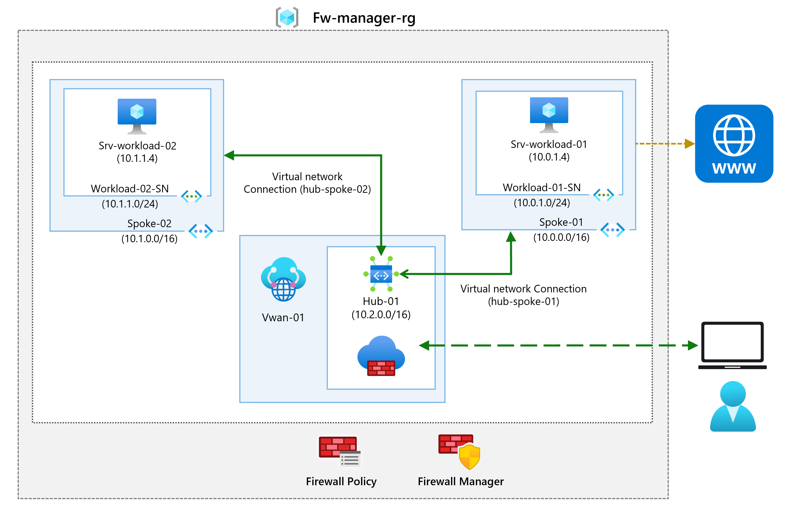

---
Exercise:
  title: "M06 – Lerneinheit\_9: Schützen Ihres virtuellen Hubs mit Azure Firewall Manager"
  module: Module 06 - Design and implement network security
---


# M06 – Lerneinheit 9: Schützen Ihres virtuellen Hubs mit Azure Firewall Manager

## Übungsszenario

In dieser Übung erstellen Sie das virtuelle Spoke-Netzwerk und einen geschützten virtuellen Hub. Anschließend verbinden Sie die virtuellen Hub-and-Spoke-Netzwerke und routen Datenverkehr an Ihren Hub. Im nächsten Schritt stellen Sie die Workloadserver bereit und erstellen dann eine Firewallrichtlinie und schützen Ihren Hub. Schließlich testen Sie die Firewall.



### Interaktive Labsimulationen

**Hinweis**: Die zuvor bereitgestellten Laborsimulationen wurden eingestellt.


## Erstellen einer Hub-Spoke-Architektur

In diesem Teil der Übung erstellen Sie die virtuellen Spoke-Netzwerke und Subnetze, in denen Sie die Workloadserver platzieren. Anschließend erstellen Sie den geschützten virtuellen Hub und verbinden die virtuellen Hub-and-Spoke-Netzwerke .

### Stellenqualifikationen

In dieser Übung führen Sie die folgenden Schritte aus:

+ Aufgabe 1: Erstellen von zwei virtuellen Spoke-Netzwerken und Subnetzen
+ Aufgabe 2: Erstellen des geschützten virtuellen Hubs
+ Aufgabe 3: Verbinden der virtuellen Hub-and-Spoke-Netzwerke
+ Aufgabe 4: Bereitstellen der Server
+ Aufgabe 5: Erstellen einer Firewallrichtlinie und Schützen Ihres Hubs
+ Aufgabe 6: Zuordnen der Firewallrichtlinie
+ Aufgabe 7: Weiterleiten von Datenverkehr an Ihren Hub
+ Aufgabe 8: Testen der Anwendungsregel
+ Aufgabe 9: Testen der Netzwerkregel
+ Aufgabe 10: Bereinigen von Ressourcen

### Geschätzte Dauer: 35 Minuten

## Aufgabe 1: Erstellen von zwei virtuellen Spoke-Netzwerken und Subnetzen

In dieser Aufgabe erstellen Sie die beiden virtuellen Spoke-Netzwerke, die jeweils ein Subnetz enthalten, das Ihre Workloadserver hostet.

1. Suchen Sie im Azure-Portal nach `Virtual Networks` und wählen Sie es aus.

1. Klicken Sie auf **Erstellen**.

1. Wählen Sie unter **Ressourcengruppe** die Option **Neu erstellen** aus, geben Sie `fw-manager-rg` als Namen ein, und wählen Sie dann **OK** aus.

1. Geben Sie unter **Name des virtuellen Netzwerks** `Spoke-01` ein.

1. Wählen Sie unter **Region** Ihre Region aus.

1. Wählen Sie **Weiter** aus. Überprüfen Sie die Registerkarte **Sicherheit**, nehmen Sie aber keine Änderungen vor. 

1. Wählen Sie **Weiter** aus, und gehen Sie zur Registerkarte **IP-Adressen**.

1. Wählen Sie **Adressraum löschen** und dann **IPv4-Adressraum hinzufügen** aus. 

1. Überprüfen Sie, ob der IP-Adressraum **10.0.0.0/16** lautet.

1. Wählen Sie **Subnetz hinzufügen** aus. 

1. Ändern Sie den **Subnetznamen** in `Workload-01-SN`.

1. Ändern Sie die **Startadresse** in `10.0.1.0`.

1. Wählen Sie **Hinzufügen**.

1. Klicken Sie auf **Überprüfen + erstellen**.

1. Klicken Sie auf **Erstellen**.

Wiederholen Sie die Schritte 1 bis 14 oben, um ein weiteres ähnliches virtuelles Netzwerk und Subnetz mit den folgenden Angaben zu erstellen. Sie müssen nicht warten, bis die Bereitstellung für das erste virtuelle Netzwerk abgeschlossen ist. 

+ Ressourcengruppe: **fw-manager-rg** (vorhandene auswählen)
+ Name des virtuellen Netzwerks: `Spoke-02`
+ Adressraum: **10.1.0.0/16** (löschen Sie alle anderen aufgelisteten Adressräume)
+ Subnetzname: `Workload-02-SN`
+ Startadresse des Subnetzes: `10.1.1.0`

## Aufgabe 2: Erstellen des geschützten virtuellen Hubs

In dieser Aufgabe erstellen Sie Ihren geschützten virtuellen Hub mithilfe von Firewall Manager.

1. Suchen Sie im Portal nach `firewall manager`, und wählen Sie dann **Netzwerksicherheit:Stichwort: Firewall Manager** aus.
   
1. Wählen Sie auf dem Blatt **Ressourcen schützen** die Option **Virtuelle Hubs** aus.

1. Wählen Sie **Neuen geschützten virtuellen Hub erstellen**.

1. Wählen Sie unter **Ressourcengruppe** die Ressourcengruppe **fw-manager-rg** aus.

1. Wählen Sie als **Region** Ihre Region aus.

1. Geben Sie unter **Name des geschützten virtuellen Hubs** den Namen `Hub-01` ein.

1. Geben Sie unter **Hubadressraum** den Adressraum `10.2.0.0/16` ein.

1. Stellen Sie sicher, dass **Neues vWAN** ausgewählt ist.

1. Geben Sie unter **Name des virtuellen WAN** den Namen `Vwan-01` ein.

1. Klicken Sie auf **Weiter: Azure Firewall** aus. Überprüfen Sie die Angaben, nehmen Sie jedoch keine Änderungen vor. 

1. Klicken Sie auf **Weiter: Sicherheitspartneranbieter**. Überprüfen Sie die Angaben, nehmen Sie jedoch keine Änderungen vor. 

1. Klicken Sie auf **Weiter: Überprüfen + erstellen**.

1. Klicken Sie auf **Erstellen**.

    > Hinweis: Der Vorgang der Bereitstellung kann bis zu 30 Minuten in Anspruch nehmen.

1. Warten Sie, bis die Bereitstellung abgeschlossen ist. 

1. Suchen Sie im Portal nach `firewall manager`, und wählen Sie dann **Netzwerksicherheit:Stichwort: Firewall Manager** aus.

1. Wählen Sie auf der Seite **Firewall Manager** die Option **Virtuelle Hubs** aus.

1. Wählen Sie **Hub-01** aus.

1. Wählen Sie **Azure Firewall** und dann **Konfiguration der öffentlichen IP-Adresse** aus.

1. Notieren Sie sich die öffentliche IP-Adresse (z. B. **172.191.79.203**), da Sie sie später verwenden.

## Aufgabe 3: Verbinden der virtuellen Hub-and-Spoke-Netzwerke

In dieser Aufgabe verbinden Sie die virtuellen Hub-and-Spoke-Netzwerke. Dies wird häufig als „Peering“ bezeichnet.

1. Suchen Sie im Portal nach dem virtuellen WAN `Vwan-01`, und wählen Sie es aus.

1. Wählen Sie unter **Konnektivität** die Option **Virtuelle Netzwerkverbindungen** aus.

1. Wählen Sie **Verbindung hinzufügen** aus.

1. Geben Sie unter **Verbindungsname** den Namen `hub-spoke-01` ein.

1. Wählen Sie unter **Hubs** die Option **Hub-01** aus.

1. Wählen Sie unter **Ressourcengruppe** die Ressourcengruppe **fw-manager-rg** aus.

1. Wählen Sie unter **Virtuelles Netzwerk** die Option **Spoke-01** aus.

1. Klicken Sie auf **Erstellen**.

1. Wiederholen Sie die oben genannten Schritte 4 bis 9, um eine weitere ähnliche Verbindung zu erstellen, verwenden Sie aber den Verbindungsnamen `hub-spoke-02`, um das virtuelle Netzwerk **Spoke-02** zu verbinden.

1. **Aktualisieren** Sie die Seite mit VNET-Verbindungen, und stellen Sie sicher, dass Sie über zwei virtuelle Netzwerke verfügen: Spoke-01 und Spoke-02.
   
## Aufgabe 4: Bereitstellen der Server

1. Wählen Sie im Azure-Portal das Cloud Shell-Symbol (oben rechts). Konfigurieren Sie die Shell bei Bedarf.  
    + Wählen Sie **PowerShell** aus.
    + Wählen Sie **Kein Speicherkonto erforderlich** und Ihr **Abonnement** aus und klicken Sie dann auf **Anwenden**.
    + Warten Sie, bis das Terminal erstellt wurde und eine Eingabeaufforderung angezeigt wird. 

1. Wählen Sie in der Symbolleiste des Cloud Shell-Fensters das Symbol **Dateien verwalten** aus, wählen Sie im Dropdownmenü die Option **Hochladen** und laden Sie die folgenden Dateien **FirewallManager.json** und **FirewallManager.parameters.json** in das Cloud Shell-Basisverzeichnis hoch.

    > **Hinweis:** Wenn Sie in Ihrem eigenen Abonnement arbeiten, sind die [Vorlagendateien](https://github.com/MicrosoftLearning/AZ-700-Designing-and-Implementing-Microsoft-Azure-Networking-Solutions/tree/master/Allfiles/Exercises) im GitHub-Lab-Repository verfügbar.

1. Stellen Sie die folgenden ARM-Vorlagen bereit, um die für diese Übung erforderliche VM zu erstellen:

   >**Hinweis**: Sie werden aufgefordert, ein Administratorkennwort anzugeben. **Sie benötigen dieses Kennwort in einem späteren Schritt.**

   ```powershell
   $RGName = "fw-manager-rg"
   
   New-AzResourceGroupDeployment -ResourceGroupName $RGName -TemplateFile FirewallManager.json -TemplateParameterFile FirewallManager.parameters.json
   ```
  
1. Wenn die Bereitstellung abgeschlossen ist, wechseln Sie zur Startseite des Azure-Portals und wählen **Virtuelle Computer** aus.

1. Notieren Sie sich auf der Seite **Übersicht** von **Srv-workload-01** im rechten Bereich unter dem Abschnitt **Netzwerk** die **Private IP-Adresse** (z. B. **10.0.1.4**).

1. Notieren Sie sich auf der Seite **Übersicht** von **Srv-workload-02** im rechten Bereich unter dem Abschnitt **Netzwerk** die **Private IP-Adresse** (z. B. **10.1.1.4**).

## Aufgabe 5: Erstellen einer Firewallrichtlinie und Schützen Ihres Hubs

In dieser Aufgabe erstellen Sie zuerst Ihre Firewallrichtlinie und schützen dann Ihren Hub. Die Firewallrichtlinie definiert Regelsammlungen für die Weiterleitung von Datenverkehr an mindestens einen geschützten virtuellen Hub.

1. Suchen Sie im Portal die Option `Firewall Policies`, und wählen Sie sie aus.

1. Klicken Sie auf **Erstellen**.

    | **Einstellung**    | **Wert** |
    | ---------- | --------------|
    | Ressourcengruppe | **fw-manager-rg** |
    | Name    | `Policy-01` |
    | Region     | Auswählen Ihrer Region |
    | Richtlinientarif | **Standard** |

1. Wählen Sie **Weiter: DNS-Einstellungen** aus. Überprüfen Sie die Angaben, nehmen Sie jedoch keine Änderungen vor. 

1. Klicken Sie auf **Weiter: TLS-Überprüfung**. Überprüfen Sie die Angaben, nehmen Sie jedoch keine Änderungen vor. 

**Hinzufügen einer Regelsammlung und einer Regel zum Zulassen der Microsoft-Domäne**

1. Klicken Sie auf **Weiter: Regeln**, und wählen Sie dann **Regelsammlung hinzufügen** aus.

   | **Einstellung** | **Wert** |
   | ---------- | --------------|
   | Name        |  `App-RC-01` |
   | Regelsammlungstyp | **Anwendung** |
   | Priorität    | `100` |
   | Regelsammlungsaktion | **Zulassen** |

1. Im Abschnitt **Regeln**:

   | **Einstellung** | **Wert** |
   | ---------- | --------------|
   | Name |  `Allow-msft` |
   | Quellentyp | **IP-Adresse** |
   | Quelle | `*` |
   | Protocol | `http,https` |
   | Zieltyp | **FQDN** |
   | Destination | `*.microsoft.com` |

**Fügen Sie eine Regelsammlung und Regel hinzu, um eine Remotedesktopverbindung mit der VM „Srv-workload-01“ zuzulassen.**

1. Wählen Sie **Regelsammlung hinzufügen** aus.

   | **Einstellung** | **Wert** |
   | ---------- | --------------|
   | Name        |  `dnat-rdp` |
   | Regelsammlungstyp | **DNAT** |
   | Priorität    | `100` |
   | Regelsammlungsaktion | **Zulassen** |

1. Im Abschnitt **Regeln**:

   | **Einstellung** | **Wert** |
   | ---------- | --------------|
   | Name |  `Allow-rdp` |
   | Quellentyp | **IP-Adresse** |
   | Quelle | `*` |
   | Protokoll | **TCP** |
   | Zielports | `3389` |
   | Ziel (Firewall-IP-Adresse) | Geben Sie die öffentliche IP-Adresse des virtuellen Firewallhubs ein. |
   | Übersetzter Typ | **IP-Adresse** |
   | Übersetzte Adresse oder übersetzter vollqualifizierter Domänenname (FQDN) | Geben Sie die private IP-Adresse der VM „Srv-workload-01“ ein. |
   | Übersetzter Port | `3389` |
   
**Fügen Sie eine Regelsammlung und eine Regel hinzu, um eine Remotedesktopverbindung mit der VM „Srv-workload-02“ zuzulassen.**

1. Wählen Sie **Regelsammlung hinzufügen** aus.

   | **Einstellung** | **Wert** |
   | ---------- | --------------|
   | Name        |  `vnet-rdp` |
   | Regelsammlungstyp | **Netzwerk** |
   | Priorität    | `100` |
   | Regelsammlungsaktion | **Zulassen** |

1. Im Abschnitt **Regeln**:

   | **Einstellung** | **Wert** |
   | ---------- | --------------|
   | Name |  `Allow-vnet` |
   | Quellentyp | **IP-Adresse** |
   | Quelle | `*` |
   | Protokoll | **TCP** |
   | Zielports | `3389` |
   | Ziel (Firewall-IP-Adresse) | Geben Sie die öffentliche IP-Adresse des virtuellen Firewallhubs ein. |
   | Übersetzter Typ | **IP-Adresse** |
   | Übersetzte Adresse oder übersetzter vollqualifizierter Domänenname (FQDN) | Geben Sie die private IP-Adresse der VM „Srv-workload-02“ ein. |
   | Übersetzter Port | `3389` |

1. Wählen Sie **Hinzufügen**.

1. Stellen Sie sicher, dass Sie über drei Regelsammlungen verfügen.

1. Klicken Sie auf **Überprüfen + erstellen**.

1. Klicken Sie auf **Erstellen**.

## Aufgabe 6: Zuordnen der Firewallrichtlinie

In dieser Aufgabe ordnen Sie die Firewallrichtlinie dem virtuellen Hub zu.

1. Suchen Sie im Portal die Option `Hub-01`, und wählen Sie sie aus.

1. Wählen Sie auf dem Blatt **Einstellungen** **Sicherheitsanbieter** aus.

1. Aktivieren Sie das Kontrollkästchen für **Richtlinie hinzufügen**.

1. Wählen Sie **Policy-01** und dann **Speichern** aus.

1. Aktivieren Sie das Kontrollkästchen für **Hub-01**.

1. Wählen Sie **Hinzufügen**.

1. Wählen Sie nach der Zuordnung der Richtlinie **Aktualisieren** aus. Die Zuordnung sollte angezeigt werden.

## Aufgabe 7: Weiterleiten von Datenverkehr an Ihren Hub

In dieser Aufgabe stellen Sie sicher, dass Netzwerkdatenverkehr durch Ihre Firewall weitergeleitet wird.

1. Suchen Sie im Portal die Option **Vwan-01**, und wählen Sie sie aus.

1. Wählen Sie auf dem Blatt **Konnektivität** **Hubs** und dann **Hub-01** aus.
   
1. Wählen Sie auf dem Blatt **Sicherheit** **Azure Firewall und Firewall Manager** und dann **Hub-01** und **Sicherheitskonfiguration** aus.

1. Wählen Sie unter **Internetdatenverkehr** die Option **Azure Firewall** aus.

1. Wählen Sie unter **Privater Datenverkehr** die Option **Über Azure Firewall senden** aus.

1. Wählen Sie **Speichern** aus, und klicken Sie auf **OK**, um Ihre Auswahl zu bestätigen.

1. Der Erstellungsvorgang dauert ein paar Minuten.

1. Stellen Sie nach Abschluss der Konfiguration sicher, dass unter **INTERNETDATENVERKEHR** und **PRIVATER DATENVERKEHR** für beide Hub-Spoke-Verbindungen die Angabe **Geschützt durch Azure Firewall** angezeigt wird.

## Aufgabe 8: Testen der Anwendungsregel

In diesem Teil der Übung verbinden Sie einen Remotedesktop mit der öffentlichen IP-Adresse der Firewall, die mit Netzwerkadressenübersetzung in „Srv-Workload-01“ aufgelöst wird. Anschließend verwenden Sie einen Browser, um die Anwendungsregel zu testen, und verbinden einen Remotedesktop mit Srv-Workload-02, um die Netzwerkregel zu testen.

In dieser Aufgabe testen Sie die Anwendungsregel, um zu bestätigen, dass sie wie erwartet funktioniert.

1. Öffnen Sie **Remotedesktopverbindung** auf Ihrem PC.

1. Geben Sie im Feld **Computer** die **öffentliche IP-Adresse der Firewall** ein (z. B. **51.143.226.18**).

1. Wählen Sie **Optionen anzeigen** aus.

1. Geben Sie im Feld **Benutzername** den Namen **TestUser** ein.

1. Wählen Sie **Verbinden** aus.

   

1. Melden Sie sich im Dialogfeld **Anmeldeinformationen eingeben** beim virtuellen Servercomputer **Srv-workload-01** an, indem Sie das Kennwort verwenden, das Sie bei der Bereitstellung angegeben haben.

1. Klickan Sie auf **OK**.

1. Wählen Sie in der Zertifikatmeldung **Ja** aus.

1. Öffnen Sie Internet Explorer, und wählen Sie im Dialogfeld **Internet Explorer 11 einrichten** die Option **OK** aus.

1. Navigieren Sie zu `https://www.microsoft.com`.

1. Wählen Sie im Dialogfeld **Sicherheitswarnung** die Option **OK** aus.

1. Wählen Sie in den Internet Explorer-Sicherheitswarnungen, die möglicherweise angezeigt werden, **Schließen** aus.

1. Daraufhin sollte die Microsoft-Homepage angezeigt werden.

    

1. Wechseln Sie zu **https://** **<www.google.com>**.

1. Sie sollten durch die Firewall blockiert werden.

    

1. Sie haben also bestätigt, dass Sie eine Verbindung mit einem zulässigen FQDN herstellen können, aber für alle anderen blockiert werden.

## Aufgabe 9: Testen der Netzwerkregel

In dieser Aufgabe testen Sie die Netzwerkregel, um zu bestätigen, dass sie wie erwartet funktioniert.

1. Öffnen Sie auf diesem Remotecomputer **Remotedesktopverbindung**, während Sie noch bei der RDP-Sitzung **Srv-workload-01** angemeldet sind.

1. Geben Sie im Feld **Computer** die **private IP-Adresse** von **Srv-workload-02** ein (z. B. **10.1.1.4**).

1. Melden Sie sich im Dialogfeld **Anmeldeinformationen eingeben** auf dem Server **Srv-workload-02** mit dem Benutzernamen **TestUser** und dem Kennwort an, das Sie bei der Bereitstellung angegeben haben.

1. Klickan Sie auf **OK**.

1. Wählen Sie in der Zertifikatmeldung **Ja** aus.

   

1. Sie haben nun also bestätigt, dass die Firewallnetzwerkregel funktioniert, da Sie einen Remotedesktop von einem Server mit einem anderen Server in einem anderen virtuellen Netzwerk verbunden haben.

1. Schließen Sie beide RDP-Sitzungen, um sie zu trennen.

## Aufgabe 10: Bereinigen von Ressourcen

>**Hinweis**: Denken Sie daran, alle neu erstellten Azure-Ressourcen zu entfernen, die Sie nicht mehr verwenden. Durch das Entfernen nicht verwendeter Ressourcen wird sichergestellt, dass keine unerwarteten Gebühren anfallen.

1. Öffnen Sie im Azure-Portal im Bereich **Cloud Shell** die **PowerShell**-Sitzung.

1. Löschen Sie alle Ressourcengruppen, die Sie während der praktischen Übungen in diesem Modul erstellt haben, indem Sie den folgenden Befehl ausführen:

   ```powershell
   Remove-AzResourceGroup -Name 'fw-manager-rg' -Force -AsJob
   ```

   >**Hinweis**: Der Befehl wird (wie über den Parameter „-AsJob“ festgelegt) asynchron ausgeführt. Dies bedeutet, dass Sie zwar direkt im Anschluss einen weiteren PowerShell-Befehl in derselben PowerShell-Sitzung ausführen können, es jedoch einige Minuten dauert, bis die Ressourcengruppen tatsächlich entfernt werden.
