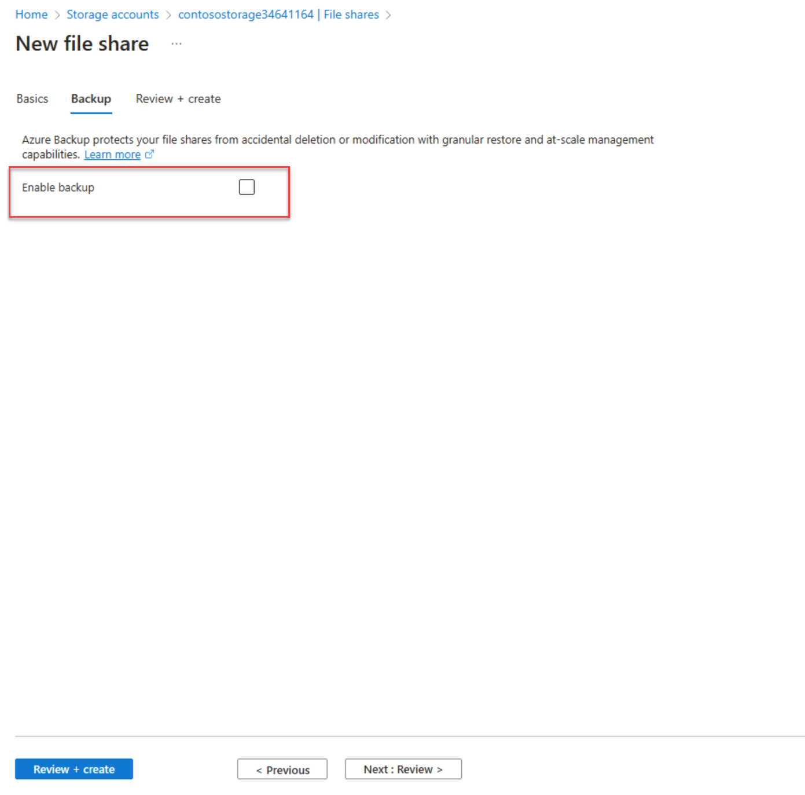

---
Exercise:
  title: "M07 – Lerneinheit\_5: Einschränken des Netzwerkzugriffs auf PaaS-Ressourcen mit VNET-Dienstendpunkten"
  module: Module 07 - Design and implement private access to Azure Services
---

# M07 – Lerneinheit 5: Einschränken des Netzwerkzugriffs auf PaaS-Ressourcen mit VNET-Dienstendpunkten

## Übungsszenario

VNET-Dienstendpunkte ermöglichen es Ihnen, den Netzwerkzugriff auf einige Azure-Dienstressourcen auf ein Subnetz eines virtuellen Netzwerks einzuschränken. Sie können auch den Internetzugriff auf die Ressourcen entfernen. Dienstendpunkte ermöglichen eine direkte Verbindung zwischen Ihrem virtuellen Netzwerk und unterstützten Azure-Diensten, sodass Sie mithilfe des privaten Adressraums Ihres virtuellen Netzwerks auf die Azure-Dienste zugreifen können. Datenverkehr, der über Dienstendpunkte für Azure-Ressourcen bestimmt ist, verbleibt immer im Microsoft Azure-Backbonenetzwerk.


In dieser Übung führen Sie die folgenden Schritte aus:

+ Aufgabe 1: Erstellen eines virtuellen Netzwerks
+ Aufgabe 2: Aktivieren eines Dienstendpunkts
+ Aufgabe 3: Einschränken des Netzwerkzugriffs für ein Subnetz
+ Aufgabe 4: Hinzufügen weiterer Ausgangsregeln
+ Aufgabe 5: Zulassen des Zugriffs für RDP-Verbindungen
+ Aufgabe 6: Einschränken des Netzwerkzugriffs auf eine Ressource
+ Aufgabe 7: Erstellen einer Dateifreigabe im Speicherkonto
+ Aufgabe 8: Einschränken des Netzwerkzugriffs auf ein Subnetz
+ Aufgabe 9: Erstellen von virtuellen Computern
+ Aufgabe 10: Bestätigen des Zugriffs auf das Speicherkonto
+ Aufgabe 11: Bereinigen der Ressourcen

**Hinweis:** Eine **[interaktive Labsimulation](https://mslabs.cloudguides.com/guides/AZ-700%20Lab%20Simulation%20-%20Restrict%20network%20access%20to%20PaaS%20resources%20with%20virtual%20network%20service%20endpoints)** ist verfügbar, mit der Sie dieses Lab in Ihrem eigenen Tempo durcharbeiten können. Möglicherweise liegen geringfügige Unterschiede zwischen der interaktiven Simulation und dem gehosteten Lab vor, aber die dargestellten Kernkonzepte und Ideen sind identisch.

### Geschätzte Dauer: 35 Minuten

## Aufgabe 1: Erstellen eines virtuellen Netzwerks

1. Melden Sie sich beim Azure-Portal an.

1. Suchen Sie auf der Startseite des Azure-Portals nach „virtuelles Netzwerk“, und wählen Sie dann **Virtuelles Netzwerk** aus den Ergebnissen.

1. Wählen Sie **+** **Erstellen** aus.

1. Geben Sie die folgenden Informationen ein, oder wählen Sie sie aus: 

   | **Einstellung**    | **Wert**                                     |
   | -------------- | --------------------------------------------- |
   | Abonnement   | Wählen Sie Ihr Abonnement aus.                      |
   | Resource group | (Neu) myResourceGroup                         |
   | Name           | CoreServicesVNet                              |
   | Standort       | Wählen Sie **USA, Osten** aus.                            |

1. Wählen Sie die Registerkarte **IP-Adressen** aus, und geben Sie die folgenden Werte ein (wählen Sie **Standard** aus, um den Subnetznamen zu ändern): 

   | **Einstellung**          | **Wert**   |
   | -------------------- | ----------- |
   | Adressraum        | 10.0.0.0/16 |
   | Subnetzname          | Öffentlich      |
   | Subnetzadressbereich | 10.0.0.0/24 |

1. Wählen Sie die Registerkarte **Sicherheit** aus, und geben Sie die folgenden Werte ein: 

   | **Einstellung**             | **Wert** |
   | ----------------------- | --------- |
   | BastionHost             | Disabled  |
   | DDoS-Netzwerkschutz | Deaktiviert  |
   | Firewall                | Disabled  |

1. Klicken Sie auf **Überprüfen + erstellen**. Nachdem die Ressource überprüft wurde, wählen Sie **Erstellen** aus.

## Aufgabe 2: Aktivieren eines Dienstendpunkts

Dienstendpunkte werden pro Dienst und pro Subnetz aktiviert. Erstellen Sie ein Subnetz, und fügen Sie einen Dienstendpunkt für das Subnetz hinzu.

1. Geben Sie oben im Portal im Feld **Ressourcen, Dienste und Dokumente suchen** den Suchbegriff „CoreServicesVNet“ ein. Wenn „CoreServicesVNet“ in den Suchergebnissen angezeigt wird, wählen Sie diesen Eintrag aus.

1. Hinzufügen eines Subnetzes zum virtuellen Netzwerk Wählen Sie unter **Einstellungen** die Option **Subnetze** und dann die Option **+ Subnetz** aus, wie in der folgenden Abbildung gezeigt: 

1. Wählen Sie unter **Subnetz hinzufügen** die folgenden Informationen aus, oder geben Sie sie ein:

   | **Einstellung**                 | **Wert**                    |
   | --------------------------- | ---------------------------- |
   | Name                        | Privat                      |
   | Adressbereich               | 10.0.1.0/24                  |
   | Dienstendpunkte: Dienste | Wählen Sie **Microsoft.Storage** aus. |

1. Wählen Sie **Speichern** aus.

Sie sollten jetzt zwei Subnetze konfiguriert haben:


## Aufgabe 3: Einschränken des Netzwerkzugriffs für ein Subnetz

Standardmäßig können alle virtuellen Computer in einem Subnetz mit allen Ressourcen kommunizieren. Sie können die Kommunikation von und mit allen Ressourcen in einem Subnetz einschränken, indem Sie eine Netzwerksicherheitsgruppe erstellen und dem Subnetz zuordnen.

1. Geben Sie oben im Portal im Feld **Ressourcen, Dienste und Dokumente suchen** den Suchbegriff **Sicherheitsgruppe** ein. Wenn **Netzwerksicherheitsgruppen** in den Suchergebnissen angezeigt werden, wählen Sie diesen Eintrag aus.

1. Wählen Sie unter „Netzwerksicherheitsgruppen“ die Option **+ Erstellen** aus.

1. Geben Sie die folgenden Informationen ein, oder wählen Sie sie aus:

   | **Einstellung**    | **Wert**                                                    |
   | -------------- | ------------------------------------------------------------ |
   | Abonnement   | Wählen Sie Ihr Abonnement aus.                                     |
   | Resource group | myResourceGroup                                              |
   | Name           | ContosoPrivateNSG                                            |
   | Standort       | Wählen Sie **USA, Osten** aus.                                           |

1. Wählen Sie **Überprüfen und erstellen** und dann **Erstellen** aus:

1. Nachdem die Netzwerksicherheitsgruppe „ContosoPrivateNSG“ erstellt wurde, wählen Sie **Zu Ressource wechseln** aus.

1. Wählen Sie unter **Einstellungen** die Option **Sicherheitsregeln für ausgehenden Datenverkehr** aus.

1. Wählen Sie **+ Hinzufügen**.

1. Erstellen Sie eine Regel, die ausgehende Kommunikation mit dem Azure Storage-Dienst zulässt. Geben Sie die folgenden Informationen ein, oder wählen Sie sie aus: 

   | **Einstellung**             | **Wert**                 |
   | ----------------------- | ------------------------- |
   | `Source`                  | Wählen Sie **Diensttag** aus.    |
   | Quelldiensttag      | Wählen Sie **VirtualNetwork** aus. |
   | Source port ranges      | *                         |
   | Destination             | Wählen Sie **Diensttag** aus.    |
   | Zieldiensttag | Wählen Sie **Storage** aus.        |
   | Dienst                 | Benutzerdefiniert                    |
   | Zielportbereiche | *                         |
   | Protocol                | Any                       |
   | Aktion                  | Allow                     |
   | Priorität                | 100                       |
   | Name                    | Allow-Storage-All         |

1. Wählen Sie **Hinzufügen** aus:

## Aufgabe 4: Hinzufügen weiterer Ausgangsregeln

Erstellen Sie eine weitere Ausgangssicherheitsregel, die Kommunikation mit dem Internet verweigert. Diese Regel überschreibt eine Standardregel in allen Netzwerksicherheitsgruppen, die ausgehende Internetkommunikation zulässt.

1. Wählen Sie unter **Sicherheitsregeln für ausgehenden Datenverkehr** die Option **+ Hinzufügen** aus.

1. Geben Sie die folgenden Informationen ein, oder wählen Sie sie aus: 

   | **Einstellung**             | **Wert**                 |
   | ----------------------- | ------------------------- |
   | `Source`                  | Wählen Sie **Diensttag** aus.    |
   | Quelldiensttag      | Wählen Sie **VirtualNetwork** aus. |
   | Source port ranges      | *                         |
   | Destination             | Wählen Sie **Diensttag** aus.    |
   | Zieldiensttag | Wählen Sie **Internet** aus.       |
   | Dienst                 | Benutzerdefiniert                    |
   | Zielportbereiche | *                         |
   | Protocol                | Any                       |
   | Aktion                  | Deny (Verweigern)                      |
   | Priority                | 110                       |
   | Name                    | Deny-Internet-All         |

1. Wählen Sie **Hinzufügen**.

## Aufgabe 5: Zulassen des Zugriffs für RDP-Verbindungen

Erstellen Sie eine Eingangssicherheitsregel, die RDP-Datenverkehr (Remote Desktop Protocol) an das Subnetz von überall erlaubt. Die Regel setzt eine Standardsicherheitsregel außer Kraft, die jeglichen eingehenden Verkehr aus dem Internet abweist. Remotedesktopverbindungen in das Subnetz sind zulässig, sodass die Konnektivität in einem späteren Schritt getestet werden kann.

1. Wählen Sie in „ContosoPrivateNSG/Sicherheitsregeln für ausgehenden Datenverkehr“ unter **Einstellungen** die Option **Sicherheitsregeln für eingehenden Datenverkehr** aus.

1. Klicken Sie auf **+ Hinzufügen**.

1. Geben Sie unter „Eingangssicherheitsregel hinzuzfügen“ die folgenden Werte ein: 

   | **Einstellung**             | **Wert**                 |
   | ----------------------- | ------------------------- |
   | Quelle                  | Beliebig                       |
   | Quellportbereiche      | *                         |
   | Destination             | Wählen Sie **VirtualNetwork** aus. |
   | Dienst                 | Benutzerdefiniert                    |
   | Zielportbereiche | 3389                      |
   | Protocol                | Any                       |
   | Aktion                  | Allow                     |
   | Priority                | 120                       |
   | Name                    | Allow-RDP-All             |

1. Wählen Sie dann **Hinzufügen** aus.

> **Warnung**: RDP-Port 3389 wird für das Internet verfügbar gemacht. Dies wird nur für Tests empfohlen. Für Produktionsumgebungen empfehlen wir die Verwendung eines VPN oder einen privaten Verbindung.

1. Wählen Sie unter **Einstellungen** die Option **Subnetze** aus.

1. Wählen Sie **+ Zuordnen** aus.

1. Wählen Sie unter **Subnetz zuordnen** die Option **Virtuelles Netzwerk** und dann unter **Virtuelles Netzwerk auswählen** die Option **CoreServicesVNet** aus.

1. Wählen Sie unter **Subnetz auswählen****Private** und dann **OK** aus.

## Aufgabe 6: Einschränken des Netzwerkzugriffs auf eine Ressource

Die Schritte, die erforderlich sind, um den Netzwerkzugriff auf Ressourcen einzuschränken, die durch Azure-Dienste erstellt und für Dienstendpunkte aktiviert wurden, sind je nach Dienst unterschiedlich. Informationen zu den Schritten für einzelne Dienste finden Sie in der Dokumentation des jeweiligen Diensts. Der Rest dieser Übung enthält als Beispiel die Schritte zum Einschränken des Netzwerkzugriffs für ein Azure Storage-Konto.

1. Wählen Sie im Azure-Portal „Speicherkonten“ aus.

1. Wählen Sie „+Erstellen“ aus.

1. Geben Sie die folgenden Informationen ein, oder wählen Sie sie aus, und übernehmen Sie die übrigen Standardeinstellungen:

   | **Einstellung**    | **Wert**                                                    |
   | -------------- | ------------------------------------------------------------ |
   | Abonnement   | Wählen Sie Ihr Abonnement aus.                                     |
   | Resource group | myResourceGroup                                              |
   | Name           | Geben Sie „contosostoragexx“ ein (wobei „xx“ Ihre Initialen sind, um den Namen eindeutig zu machen) |
   | Leistung    | Standard StorageV2 (universell, Version 2)                      |
   | Standort       | Wählen Sie USA, Osten aus.                                               |
   | Replikation    | Lokal redundanter Speicher (LRS)                              |

1. Wählen Sie **Überprüfen** und dann **Erstellen** aus.

## Aufgabe 7: Erstellen einer Dateifreigabe im Speicherkonto

1. Geben Sie nach dem Erstellen des Speicherkontos oben im Portal im Feld **Ressourcen, Dienste und Dokumente durchsuchen** den Namen des Speicherkontos ein. Wenn der Name Ihres Speicherkontos in den Suchergebnissen angezeigt wird, wählen Sie ihn aus.
1. Wählen Sie **Dateifreigaben** aus, wie in der folgenden Abbildung dargestellt: 
1. Klicken Sie auf **+ Dateifreigabe**.
1. Geben Sie „Marketing“ unter **Name** ein, und wählen Sie dann **Weiter: Sicherung** aus.
   
1. Deaktivieren Sie **Sicherung aktivieren** aus, wie in der folgenden Abbildung dargestellt: 
1. Klicken Sie auf **Überprüfen + erstellen**. Nachdem die Ressource überprüft wurde, wählen Sie **Erstellen** aus.

## Aufgabe 8: Einschränken des Netzwerkzugriffs auf ein Subnetz

Standardmäßig akzeptieren Speicherkonten Netzwerkverbindungen von Clients in allen Netzwerken, einschließlich des Internets. Verweigern Sie den Netzwerkzugriff aus dem Internet sowie aus allen anderen Subnetzen in allen virtuellen Netzwerken mit Ausnahme des privaten Subnetzes im virtuellen Netzwerk „CoreServicesVNet“.

1. Wählen Sie unter **Sicherheit + Netzwerk** für das Speicherkonto die Option **Netzwerk** aus.

1. Wählen Sie **Aktiviert von ausgewählten virtuellen Netzwerken und IP-Adressen** aus.

1. Klicken Sie auf **+Vorhandenes virtuelles Netzwerk hinzufügen**.

1. Wählen Sie unter **Netzwerke hinzufügen** die folgenden Werte aus: 

   | **Einstellung**      | **Wert**                    |
   | ---------------- | ---------------------------- |
   | Subscription     | Wählen Sie Ihr Abonnement aus.    |
   | Virtuelle Netzwerke | Wählen Sie **CoreServicesVnet.** aus. |
   | Subnetze          | Wählen Sie **Privat**.          |

1. Wählen Sie **Hinzufügen**.

1. Wählen Sie **Speichern** aus.

1. Wählen Sie unter **Sicherheit + Netzwerk** für das Speicherkonto die Option **Zugriffsschlüssel** aus.

1. Wählen Sie **Schlüssel anzeigen** aus. Notieren Sie den Wert des **Schlüssels**, da Sie ihn beim Zuordnen der Dateifreigabe zu einem Laufwerksbuchstaben in einer VM in einem späteren Schritt manuell eingeben müssen.

## Aufgabe 9: Erstellen von virtuellen Computern

Zum Testen des Netzwerkzugriffs auf ein Speicherkonto stellen Sie einen virtuellen Computer für jedes Subnetz bereit.

1. Wählen Sie im Azure-Portal das Cloud Shell-Symbol (oben rechts). Konfigurieren Sie die Shell bei Bedarf.  
    + Wählen Sie **PowerShell** aus.
    + Wählen Sie **Kein Speicherkonto erforderlich** und Ihr **Abonnement** aus und klicken Sie dann auf **Anwenden**.
    + Warten Sie, bis das Terminal erstellt wurde und eine Eingabeaufforderung angezeigt wird. 

1. Klicken Sie in der Symbolleiste des Cloud Shell-Bereichs auf das Symbol **Dateien verwalten**, wählen Sie im Dropdownmenü **Hochladen** aus, und laden Sie die Dateien **VMs.json** und **VMs.parameters.json** nacheinander aus dem Quellordner **F:\Allfiles\Exercises\M07** in das Cloud Shell-Basisverzeichnis hoch.

1. Stellen Sie die folgenden ARM-Vorlagen bereit, um die für diese Übung erforderlichen VMs zu erstellen:

   >**Hinweis**: Sie werden aufgefordert, ein Administratorkennwort anzugeben.

   ```powershell
   $RGName = "myResourceGroup"
   
   New-AzResourceGroupDeployment -ResourceGroupName $RGName -TemplateFile VMs.json -TemplateParameterFile VMs.parameters.json
   ```
  
1. Wenn die Bereitstellung abgeschlossen ist, wechseln Sie zur Startseite des Azure-Portals und wählen **Virtuelle Computer** aus.

## Aufgabe 10: Bestätigen des Zugriffs auf das Speicherkonto

1. Sobald die Erstellung des virtuellen Computers „ContosoPrivate“ abgeschlossen ist, öffnen Sie das Blatt für den virtuellen Computer, indem Sie „Zu Ressource wechseln“ auswählen. Wählen Sie die Schaltfläche „Verbinden“ und dann „RDP“ aus.
   
1. Nachdem Sie die Schaltfläche „Verbinden“ und „RDP“ ausgewählt haben, wählen Sie die Schaltfläche „RDP-Datei herunterladen“ aus. Eine RDP-Datei (Remotedesktopprotokoll) wird erstellt und auf Ihren Computer heruntergeladen.
1. Öffnen Sie die heruntergeladene RDP-Datei. Wenn Sie dazu aufgefordert werden, wählen Sie „Verbinden“ aus. Geben Sie den Benutzernamen und das Kennwort ein, die Sie beim Erstellen des virtuellen Computers festgelegt haben. Unter Umständen müssen Sie auf Weitere Optionen und anschließend auf Anderes Konto verwenden klicken, um die Anmeldeinformationen anzugeben, die Sie beim Erstellen des virtuellen Computers eingegeben haben.
1. Klickan Sie auf **OK**.
1. Während des Anmeldevorgangs wird unter Umständen eine Zertifikatwarnung angezeigt. Wenn eine Warnung angezeigt wird, wählen Sie „Ja“ bzw. „Weiter“ aus, um mit dem Herstellen der Verbindung fortzufahren.
1. Ordnen Sie auf dem virtuellen Computer „ContosoPrivate“ mithilfe von PowerShell die Azure-Dateifreigabe dem Laufwerk Z zu. Bevor Sie die folgenden Befehle ausführen, ersetzen Sie <storage-account-key>, <storage-account-name> (d. h. contosostoragexx) und my-file-share (d. h. marketing) durch Werte, die Sie angegeben und in der Aufgabe „Erstellen eines Speicherkontos“ abgerufen haben.

```azurecli
$acctKey = ConvertTo-SecureString -String "<storage-account-key>" -AsPlainText -Force

$credential = New-Object System.Management.Automation.PSCredential -ArgumentList "Azure\<storage-account-name>", $acctKey

New-PSDrive -Name Z -PSProvider FileSystem -Root "\\<storage-account-name>.file.core.windows.net\marketing" -Credential $credential

```

Die Azure-Dateifreigabe wurde dem Laufwerk Z erfolgreich zugeordnet.

1. Bestätigen Sie an einer Eingabeaufforderung, dass der virtuelle Computer über keine ausgehende Verbindung mit dem Internet verfügt:

 Pingen von bing.com

Sie erhalten keine Antworten, da die dem Subnetz „Private“ zugeordnete Netzwerksicherheitsgruppe keinen ausgehenden Zugriff auf das Internet zulässt.

1. Schließen Sie die Remotedesktopsitzung für den virtuellen Computer „ContosoPrivate“.

### Bestätigen, dass der Zugriff auf das Speicherkonto verweigert wird

1. Geben Sie oben im Portal im Feld **Ressourcen, Dienste und Dokumente durchsuchen** den Suchbegriff „ContosoPublic“ ein.

1. Wenn **ContosoPublic** in den Suchergebnissen angezeigt wird, wählen Sie den Eintrag aus.

1. Führen Sie für den virtuellen Computer „ContosoPublic“ die Schritte 1-6 in der Aufgabe „Bestätigen des Zugriffs auf das Speicherkonto“ aus.  

   ‎Nach einer kurzen Wartezeit erhalten Sie den Fehler „New-PSDrive: Zugriff verweigert“. Der Zugriff wird verweigert, da der virtuelle Computer „ContosoPublic“ im Subnetz „Public“ bereitgestellt ist. Das Subnetz Public verfügt nicht über einen Dienstendpunkt, der für Azure Storage aktiviert ist. Das Speicherkonto lässt Netzwerkzugriff nur über das Subnetz Private, nicht jedoch über das Subnetz Public zu.

1. Bestätigen Sie über eine Eingabeaufforderung, dass der virtuelle Computer über eine ausgehende Verbindung mit dem Internet verfügt:

 Pingen von bing.com

1. Schließen Sie die Remotedesktopsitzung für den virtuellen Computer „ContosoPublic“.

1. Navigieren Sie auf Ihrem Computer zum Azure-Portal.

1. Geben Sie den Namen des Speicherkontos ein, das Sie im Feld **Ressourcen, Dienste und Dokumente durchsuchen** erstellt haben. Wenn der Name Ihres Speicherkontos in den Suchergebnissen angezeigt wird, wählen Sie ihn aus.

1. Wählen Sie **Dateifreigaben** und anschließend die Dateifreigabe **marketing** aus.

1. Sie erhalten die in der folgenden Abbildung dargestellte Fehlermeldung:

    

 Der Zugriff wird verweigert, da sich Ihr Computer nicht im Subnetz „Private“ des Netzwerks „CoreServicesVNet“ befindet.

> **Warnung**: Bevor Sie fortfahren, sollten Sie alle Ressourcen entfernen, die Sie für dieses Lab verwendet haben. Wählen Sie dazu im Azure-Portal „Ressourcengruppen“ aus. Wählen Sie alle Ressourcengruppen aus, die Sie erstellt haben. Wählen Sie auf dem Blatt „Ressourcengruppe“ die Option „Ressourcengruppe löschen“ aus, geben Sie den Namen der Ressourcengruppe ein, und wählen Sie dann „Löschen“ aus. Wiederholen Sie den Vorgang für alle weiteren Ressourcengruppen, die Sie möglicherweise erstellt haben. Wenn Sie diese Aufgabe nicht ausführen, kann das zu Problemen mit anderen Labs führen.

Ergebnisse: Sie haben dieses Lab nun abgeschlossen.

## Aufgabe 11: Bereinigen der Ressourcen

   >**Hinweis**: Denken Sie daran, alle neu erstellten Azure-Ressourcen zu entfernen, die Sie nicht mehr verwenden. Durch das Entfernen nicht verwendeter Ressourcen wird sichergestellt, dass keine unerwarteten Gebühren anfallen.

1. Öffnen Sie im Azure-Portal im Bereich **Cloud Shell** die **PowerShell**-Sitzung.

1. Löschen Sie alle Ressourcengruppen, die Sie während der praktischen Übungen in diesem Modul erstellt haben, indem Sie den folgenden Befehl ausführen:

   ```powershell
   Remove-AzResourceGroup -Name 'myResourceGroup' -Force -AsJob
   ```

    >**Hinweis**: Der Befehl wird (wie über den Parameter „-AsJob“ festgelegt) asynchron ausgeführt. Dies bedeutet, dass Sie zwar direkt im Anschluss einen weiteren PowerShell-Befehl in derselben PowerShell-Sitzung ausführen können, es jedoch einige Minuten dauert, bis die Ressourcengruppen tatsächlich entfernt werden.
