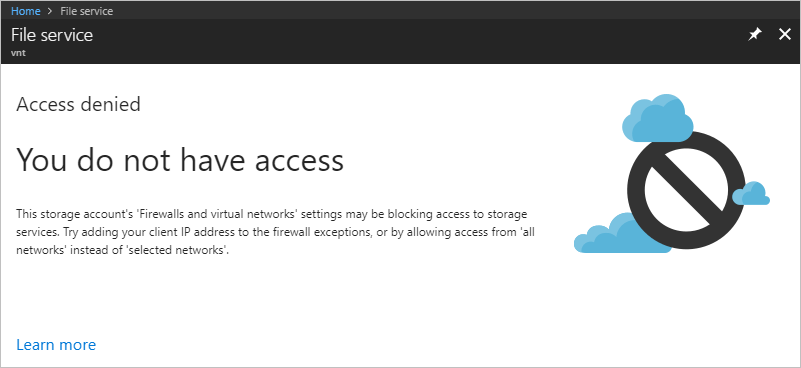

---
Exercise:
  title: "M07 – Lerneinheit\_5: Einschränken des Netzwerkzugriffs auf PaaS-Ressourcen mit VNET-Dienstendpunkten"
  module: Module 07 - Design and implement private access to Azure Services
---

# M07 – Lerneinheit 5: Einschränken des Netzwerkzugriffs auf PaaS-Ressourcen mit VNET-Dienstendpunkten

## Übungsszenario

VNET-Dienstendpunkte ermöglichen es Ihnen, den Netzwerkzugriff auf einige Azure-Dienstressourcen auf ein Subnetz eines virtuellen Netzwerks einzuschränken. Sie können auch den Internetzugriff auf die Ressourcen entfernen. Dienstendpunkte ermöglichen eine direkte Verbindung zwischen Ihrem virtuellen Netzwerk und unterstützten Azure-Diensten, sodass Sie mithilfe des privaten Adressraums Ihres virtuellen Netzwerks auf die Azure-Dienste zugreifen können. Datenverkehr, der über Dienstendpunkte für Azure-Ressourcen bestimmt ist, verbleibt immer im Microsoft Azure-Backbonenetzwerk.


### Stellenqualifikationen

In dieser Übung führen Sie die folgenden Schritte aus:

+ Aufgabe 1: Erstellen eines virtuellen Netzwerks
+ Aufgabe 2: Aktivieren eines Dienstendpunkts
+ Aufgabe 3: Einschränken des Netzwerkzugriffs für ein Subnetz
+ Aufgabe 4: Hinzufügen weiterer Ausgangsregeln
+ Aufgabe 5: Zulassen des Zugriffs für RDP-Verbindungen
+ Aufgabe 6: Einschränken des Netzwerkzugriffs auf eine Ressource
+ Aufgabe 7: Erstellen einer Dateifreigabe im Speicherkonto
+ Aufgabe 8: Einschränken des Netzwerkzugriffs auf ein Subnetz
+ Aufgabe 9: Erstellen von virtuellen Computern
+ Aufgabe 10: Bestätigen des Zugriffs auf das Speicherkonto


### Interaktive Labsimulationen

>**Hinweis**: Die zuvor bereitgestellten Laborsimulationen wurden eingestellt.

### Geschätzte Dauer: 35 Minuten

## Aufgabe 1: Erstellen eines virtuellen Netzwerks

1. Melden Sie sich beim Azure-Portal an.

1. Suchen Sie auf der Startseite des Azure-Portals nach `virtual network`, und wählen Sie dann in den Ergebnissen **Virtuelles Netzwerk** aus.

1. Wählen Sie **+** **Erstellen** aus.

1. Geben Sie die folgenden Informationen ein, oder wählen Sie sie aus: 

   | **Einstellung**    | **Wert**                                     |
   | -------------- | --------------------------------------------- |
   | Abonnement   | Wählen Sie Ihr Abonnement aus.                      |
   | Resource group | (Neu) myResourceGroup                         |
   | Name           | CoreServicesVNet                              |
   | Standort       | Wählen Sie **USA, Osten** aus.                            |

1. Wählen Sie die Registerkarte **Sicherheit** aus, und geben Sie die folgenden Werte ein: 

   | **Einstellung**             | **Wert** |
   | ----------------------- | --------- |
   | BastionHost             | Disabled  |
   | DDoS-Netzwerkschutz | Deaktiviert  |
   | Firewall                | Deaktiviert  |

1. Wählen Sie die Registerkarte **IP-Adressen** aus, und geben Sie die folgenden Werte ein (wählen Sie **Standard** aus, um den Subnetznamen zu ändern): 

   | **Einstellung**          | **Wert**   |
   | -------------------- | ----------- |
   | Adressraum        | 10.0.0.0/16 |
   | Subnetzname          | Öffentlich      |
   | Subnetzadressbereich | 10.0.0.0/24 |

1. Klicken Sie auf **Überprüfen + erstellen**. Nachdem die Ressource überprüft wurde, wählen Sie **Erstellen** aus.

## Aufgabe 2: Aktivieren eines Dienstendpunkts

Dienstendpunkte werden pro Dienst und pro Subnetz aktiviert. Erstellen Sie ein Subnetz, und fügen Sie einen Dienstendpunkt für das Subnetz hinzu.

1. Geben Sie oben im Portal im Feld **Ressourcen, Dienste und Dokumente suchen** den Suchbegriff „CoreServicesVNet“ ein. Wenn „CoreServicesVNet“ in den Suchergebnissen angezeigt wird, wählen Sie diesen Eintrag aus.

1. Hinzufügen eines Subnetzes zum virtuellen Netzwerk Wählen Sie unter **Einstellungen** die Option **Subnetze** und dann die Option **+ Subnetz** aus, wie in der folgenden Abbildung gezeigt: 

1. Wählen Sie unter **Subnetz hinzufügen** die folgenden Informationen aus, oder geben Sie sie ein:

   | **Einstellung**                 | **Wert**                    |
   | --------------------------- | ---------------------------- |
   | Name                        | Privat                      |
   | Adressbereich               | 10.0.1.0/24                  |
   | Dienstendpunkte: Dienste | Wählen Sie **Microsoft.Storage** aus. |

1. Wählen Sie **Hinzufügen**.

Sie sollten jetzt zwei Subnetze konfiguriert haben:


## Aufgabe 3: Einschränken des Netzwerkzugriffs für ein Subnetz

Standardmäßig können alle virtuellen Computer in einem Subnetz mit allen Ressourcen kommunizieren. Sie können die Kommunikation von und mit allen Ressourcen in einem Subnetz einschränken, indem Sie eine Netzwerksicherheitsgruppe erstellen und dem Subnetz zuordnen.

1. Geben Sie oben im Portal im Feld **Ressourcen, Dienste und Dokumente suchen** den Suchbegriff **Sicherheitsgruppe** ein. Wenn **Netzwerksicherheitsgruppen** in den Suchergebnissen angezeigt werden, wählen Sie diesen Eintrag aus.

1. Wählen Sie unter „Netzwerksicherheitsgruppen“ die Option **+ Erstellen** aus.

1. Geben Sie die folgenden Informationen ein, oder wählen Sie sie aus:

   | **Einstellung**    | **Wert**                                                    |
   | -------------- | ------------------------------------------------------------ |
   | Abonnement   | Wählen Sie Ihr Abonnement aus.                                     |
   | Resource group | myResourceGroup                                              |
   | Name           | ContosoPrivateNSG                                            |
   | Standort       | Wählen Sie **USA, Osten** aus.                                           |

1. Wählen Sie **Überprüfen und erstellen** und dann **Erstellen** aus:

1. Nachdem die Netzwerksicherheitsgruppe „ContosoPrivateNSG“ erstellt wurde, wählen Sie **Zu Ressource wechseln** aus.

1. Wählen Sie unter **Einstellungen** die Option **Sicherheitsregeln für ausgehenden Datenverkehr** aus.

1. Wählen Sie **+ Hinzufügen**.

1. Erstellen Sie eine Regel, die ausgehende Kommunikation mit dem Azure Storage-Dienst zulässt. Geben Sie die folgenden Informationen ein, oder wählen Sie sie aus: 

   | **Einstellung**             | **Wert**                 |
   | ----------------------- | ------------------------- |
   | `Source`                  | Wählen Sie **Diensttag** aus.    |
   | Quelldiensttag      | Wählen Sie **VirtualNetwork** aus. |
   | Source port ranges      | *                         |
   | Destination             | Wählen Sie **Diensttag** aus.    |
   | Zieldiensttag | Wählen Sie **Storage** aus.        |
   | Dienst                 | Benutzerdefiniert                    |
   | Zielportbereiche | *                         |
   | Protocol                | Alle                       |
   | Aktion                  | Allow                     |
   | Priorität                | 100                       |
   | Name                    | `Allow-Storage-All`         |

1. Wählen Sie **Hinzufügen** aus:

## Aufgabe 4: Hinzufügen weiterer Ausgangsregeln

Erstellen Sie eine weitere Ausgangssicherheitsregel, die Kommunikation mit dem Internet verweigert. Diese Regel überschreibt eine Standardregel in allen Netzwerksicherheitsgruppen, die ausgehende Internetkommunikation zulässt.

1. Wählen Sie unter **Sicherheitsregeln für ausgehenden Datenverkehr** die Option **+ Hinzufügen** aus.

1. Geben Sie die folgenden Informationen ein, oder wählen Sie sie aus: 

   | **Einstellung**             | **Wert**                 |
   | ----------------------- | ------------------------- |
   | `Source`                  | Wählen Sie **Diensttag** aus.    |
   | Quelldiensttag      | Wählen Sie **VirtualNetwork** aus. |
   | Source port ranges      | *                         |
   | Destination             | Wählen Sie **Diensttag** aus.    |
   | Zieldiensttag | Wählen Sie **Internet** aus.       |
   | Dienst                 | Benutzerdefiniert                    |
   | Zielportbereiche | *                         |
   | Protocol                | Alle                       |
   | Aktion                  | Deny (Verweigern)                      |
   | Priority                | 110                       |
   | Name                    | `Deny-Internet-All`         |

1. Wählen Sie **Hinzufügen**.

## Aufgabe 5: Zulassen des Zugriffs für RDP-Verbindungen

Erstellen Sie eine Eingangssicherheitsregel, die RDP-Datenverkehr (Remote Desktop Protocol) an das Subnetz von überall erlaubt. Die Regel setzt eine Standardsicherheitsregel außer Kraft, die jeglichen eingehenden Verkehr aus dem Internet abweist. Remotedesktopverbindungen in das Subnetz sind zulässig, sodass die Konnektivität in einem späteren Schritt getestet werden kann.

1. Wählen Sie in „ContosoPrivateNSG/Sicherheitsregeln für ausgehenden Datenverkehr“ unter **Einstellungen** die Option **Sicherheitsregeln für eingehenden Datenverkehr** aus.

1. Klicken Sie auf **+ Hinzufügen**.

1. Geben Sie unter „Eingangssicherheitsregel hinzuzfügen“ die folgenden Werte ein: 

   | **Einstellung**             | **Wert**                 |
   | ----------------------- | ------------------------- |
   | Quelle                  | Beliebig                       |
   | Quellportbereiche      | *                         |
   | Destination             | Any                       |
   | Dienst                 | Benutzerdefiniert                    |
   | Zielportbereiche | 3389                      |
   | Protocol                | Alle                       |
   | Aktion                  | Allow                     |
   | Priority                | 120                       |
   | Name                    | `Allow-RDP-All`            |

1. Wählen Sie dann **Hinzufügen** aus.

> **Warnung**: RDP-Port 3389 wird für das Internet verfügbar gemacht. Dies wird nur für Tests empfohlen. Für Produktionsumgebungen empfehlen wir die Verwendung eines VPN oder einen privaten Verbindung.

1. Wählen Sie unter **Einstellungen** die Option **Subnetze** aus.

1. Wählen Sie **+ Zuordnen** aus.

1. Wählen Sie unter **Subnetz zuordnen** die Option **Virtuelles Netzwerk** und dann unter **Virtuelles Netzwerk auswählen** die Option **CoreServicesVNet** aus.

1. Wählen Sie unter **Subnetz auswählen****Private** und dann **OK** aus.

## Aufgabe 6: Einschränken des Netzwerkzugriffs auf eine Ressource

Die Schritte, die erforderlich sind, um den Netzwerkzugriff auf Ressourcen einzuschränken, die durch Azure-Dienste erstellt und für Dienstendpunkte aktiviert wurden, sind je nach Dienst unterschiedlich. Informationen zu den Schritten für einzelne Dienste finden Sie in der Dokumentation des jeweiligen Diensts. Der Rest dieser Übung enthält als Beispiel die Schritte zum Einschränken des Netzwerkzugriffs für ein Azure Storage-Konto.

1. Suchen Sie im Azure-Portal nach `Storage accounts` und wählen Sie es aus.

1. Klicken Sie auf **Erstellen**.

1. Geben Sie die folgenden Informationen ein, oder wählen Sie sie aus, und übernehmen Sie die übrigen Standardeinstellungen:

   | **Einstellung**    | **Wert**                                                    |
   | -------------- | ------------------------------------------------------------ |
   | Abonnement   | Wählen Sie Ihr Abonnement aus.                                     |
   | Resource group | myResourceGroup                                              |
   | Name           | Geben Sie „contosostoragexx“ ein (wobei „xx“ Ihre Initialen sind, um den Namen eindeutig zu machen) |
   | Primärer Dienst | Azure Files                                                |
   | Leistung    | Standard StorageV2 (universell, Version 2)                      |
   | Standort       | Wählen Sie USA, Osten aus.                                               |
   | Replikation    | Lokal redundanter Speicher (LRS)                              |

1. Wählen Sie **Überprüfen** und dann **Erstellen** aus.

1. Nachdem das Speicherkonto erfolgreich bereitgestellt wurde, wählen Sie **Zu Ressource wechseln** aus. 

## Aufgabe 7: Erstellen einer Dateifreigabe im Speicherkonto

1. Wählen Sie im Speicherkonto auf dem Blatt **Datenspeicher** die Option **Dateifreigaben** aus.

1. Klicken Sie auf **+ Dateifreigabe**. 

1. Geben Sie **marketing** als **Name** ein, und wählen Sie dann **Weiter: Sicherung** aus.

1. Deaktivieren Sie wie in der folgenden Abbildung dargestellt die Option **Backup aktivieren**: 

1. Klicken Sie auf **Überprüfen + erstellen**. Nachdem die Ressource überprüft wurde, wählen Sie **Erstellen** aus.

## Aufgabe 8: Einschränken des Netzwerkzugriffs auf ein Subnetz

Standardmäßig akzeptieren Speicherkonten Netzwerkverbindungen von Clients in allen Netzwerken, einschließlich des Internets. Verweigern Sie den Netzwerkzugriff aus dem Internet sowie aus allen anderen Subnetzen in allen virtuellen Netzwerken mit Ausnahme des privaten Subnetzes im virtuellen Netzwerk „CoreServicesVNet“.

1. Wählen Sie unter **Sicherheit + Netzwerk** für das Speicherkonto die Option **Netzwerk** aus.

1. Wählen Sie im Abschnitt **Zugriff über öffentliche Netzwerke** die Option **Verwalten** aus.

Wählen Sie im Abschnitt **Öffentlicher Zugriffsbereich** die Option **Aktiviert von ausgewählten Netzwerken** aus.

1. Wählen Sie **+ Vorhandenes virtuelles Netzwerk hinzufügen** und dann **Vorhandenes Netzwerk hinzufügen** aus. 

   | **Einstellung**      | **Wert**                    |
   | ---------------- | ---------------------------- |
   | Subscription     | Wählen Sie Ihr Abonnement aus.    |
   | Virtuelle Netzwerke | **CoreServicesVNet** |
   | Subnetze          | **Private**.          |

1. Wählen Sie **Hinzufügen** und dann **Speichern** aus.

1. Wählen Sie unter **Sicherheit + Netzwerk** für das Speicherkonto die Option **Zugriffsschlüssel** aus.

1. Verwenden Sie **Anzeigen** für den Wert **Key1**. Kopieren Sie den Wert zur späteren Verwendung. 

## Aufgabe 9: Erstellen von virtuellen Computern

Zum Testen des Netzwerkzugriffs auf ein Speicherkonto stellen Sie einen virtuellen Computer für jedes Subnetz bereit.

1. Wählen Sie im Azure-Portal das Cloud Shell-Symbol (oben rechts). Konfigurieren Sie die Shell bei Bedarf.  
    + Wählen Sie **PowerShell** aus.
    + Wählen Sie **Kein Speicherkonto erforderlich** und Ihr **Abonnement** aus und klicken Sie dann auf **Anwenden**.
    + Warten Sie, bis das Terminal erstellt wurde und eine Eingabeaufforderung angezeigt wird. 

1. Wählen Sie in der Symbolleiste des Cloud Shell-Bereichs das Symbol **Dateien verwalten** aus. Wählen Sie dann im Dropdownmenü die Option **Hochladen** aus, und laden Sie die folgenden Dateien **VMs.json** und **VMs.parameters.json** in das Cloud Shell-Basisverzeichnis hoch. Dieses Modul 07, Übung 05. 

1. Stellen Sie die folgenden ARM-Vorlagen bereit, um die für diese Übung erforderlichen VMs zu erstellen:

   >**Hinweis**: Sie werden aufgefordert, ein Administratorkennwort anzugeben.

   ```powershell
   $RGName = "myResourceGroup"
   
   New-AzResourceGroupDeployment -ResourceGroupName $RGName -TemplateFile VMs.json -TemplateParameterFile VMs.parameters.json
   ```
  
1. Wenn die Bereitstellung abgeschlossen ist, wechseln Sie zur Startseite des Azure-Portals und wählen **Virtuelle Computer** aus.

## Aufgabe 10: Bestätigen des Zugriffs auf das Speicherkonto

1. Suchen Sie im Portal nach der VM **ContosoPrivate**, und wählen Sie sie aus.

1. Wählen Sie **Verbinden**, dann nochmals **Verbinden** und anschließend die Option **RDP-Datei herunterladen** aus. Bestätigen Sie den Download, wenn Sie dazu aufgefordert werden.

1. Öffnen Sie im Ordner **Downloads** die Datei „ContosoPrivate.rdp“.

1. Wählen Sie **Verbinden** aus, und geben Sie das Kennwort für die VM ein. Wählen Sie **OK** aus, und bestätigen Sie die Zertifikatwarnung mit **Ja**. 

1. Erstellen Sie mit PowerShell eine Dateifreigabe. Ersetzen Sie <storage-account-key1-value> und <storage-account-name> (d. h. „contosostoragexx“) durch die Werte, die Sie beim Erstellen des Speicherkontos verwendet haben. 
    ```powershell
    $acctKey = ConvertTo-SecureString -String "<storage-account-key1-value>" -AsPlainText -Force

    $credential = New-Object System.Management.Automation.PSCredential -ArgumentList "Azure\<storage-account-name>", $acctKey

    New-PSDrive -Name Z -PSProvider FileSystem -Root "\\<storage-account-name>.file.core.windows.net\marketing" -Credential $credential

    ```
1. Vergewissern Sie sich, dass die VM keine ausgehende Konnektivität hat. Sie erhalten keine Antworten, da die dem Subnetz „Private“ zugeordnete Netzwerksicherheitsgruppe keinen ausgehenden Zugriff auf das Internet zulässt.

    ```ping bing.com```

1. Schließen Sie die Remotedesktopsitzung für den virtuellen Computer „ContosoPrivate“.

### Bestätigen, dass der Zugriff auf das Speicherkonto verweigert wird

1. Kehren Sie zum Azure-Portal zurück.

1. Navigieren Sie zu Ihrem Speicherkonto, wählen Sie **Dateifreigaben** und dann die Dateifreigabe **marketing** aus. 

1. Wählen Sie **Durchsuchen** aus, und beachten Sie, dass ein Fehler vom Typ „Zugriff verweigert“ angezeigt wird. Der Fehler sieht bei Ihnen möglicherweise anders aus.  Der Zugriff wird verweigert, da sich Ihr Computer nicht im Subnetz „Private“ des Netzwerks „CoreServicesVNet“ befindet.

    

## Bereinigen von Ressourcen

>**Hinweis**: Denken Sie daran, alle neu erstellten Azure-Ressourcen zu entfernen, die Sie nicht mehr verwenden. Durch das Entfernen nicht verwendeter Ressourcen wird sichergestellt, dass keine unerwarteten Gebühren anfallen.

1. Öffnen Sie im Azure-Portal im Bereich **Cloud Shell** die **PowerShell**-Sitzung.

1. Löschen Sie alle Ressourcengruppen, die Sie während der praktischen Übungen in diesem Modul erstellt haben, indem Sie den folgenden Befehl ausführen:

   ```powershell
   Remove-AzResourceGroup -Name 'myResourceGroup' -Force -AsJob
   ```

   >**Hinweis**: Der Befehl wird (wie über den Parameter „-AsJob“ festgelegt) asynchron ausgeführt. Dies bedeutet, dass Sie zwar direkt im Anschluss einen weiteren PowerShell-Befehl in derselben PowerShell-Sitzung ausführen können, es jedoch einige Minuten dauert, bis die Ressourcengruppen tatsächlich entfernt werden.

## Erweitern Ihrer Lernerfahrung mit Copilot

Copilot kann Sie beim Erlernen der Verwendung von Azure-Skripttools unterstützen. Copilot kann Sie auch in Bereichen unterstützen, die nicht im Lab behandelt werden oder in denen Sie weitere Informationen benötigen. Öffnen Sie einen Edge-Browser, und wählen Sie „Copilot“ (rechts oben) aus, oder navigieren Sie zu *copilot.microsoft.com*. Nehmen Sie sich einige Minuten Zeit, um diese Prompts auszuprobieren.
+ Worin besteht der Unterschied zwischen Azure-Service-Endpunkten und privaten Endpunkten?
+ Welche Azure-Dienste können Service-Endpunkte verwenden?
+ Welche Schritte sind erforderlich, um den Zugriff auf Azure Storage mithilfe von Dienstendpunkten einzuschränken?

## Weiterlernen im eigenen Tempo

+ [Schützen und Isolieren des Zugriffs auf Azure-Ressourcen mithilfe von Netzwerksicherheitsgruppen und Dienstendpunkten.](https://learn.microsoft.com/training/modules/secure-and-isolate-with-nsg-and-service-endpoints/) In diesem Modul erfahren Sie, wie Sie virtuelle Netzwerkdienst-Endpunkte nutzen können, um den Netzwerkdatenverkehr zu und von Azure-Diensten zu steuern.

## Wichtige Erkenntnisse
+ Virtuelle Dienstendpunkte des Netzwerks erweitern Ihren privaten Adressraum in Azure, indem sie eine direkte Verbindung zu Ihren Azure-Diensten bereitstellen.
+ Mit Dienstendpunkten können Sie Ihre Azure-Ressourcen mit Ihrem virtuellen Netzwerk schützen. Der Dienstdatenverkehr verläuft weiterhin über den Azure-Backbone und nicht über das Internet.
+ Azure-Dienstendpunkte sind für viele Dienste verfügbar, wie z. B.: Azure Storage, Azure SQL Datenbank, und Azure Cosmos DB.
+ Virtuelle Dienstendpunkte im Netzwerk sind standardmäßig nicht von lokalen Netzwerken aus zugänglich. Sie müssen NAT-IP-Adressen verwenden, um über ein lokales Netzwerk auf Ressourcen zuzugreifen.
