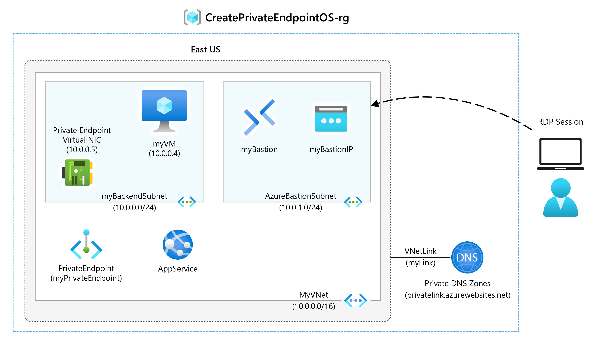

---
Exercise:
  title: "M07 – Lerneinheit\_6: Erstellen eines privaten Azure-Endpunkts mit Azure PowerShell"
  module: Module 07 - Design and implement private access to Azure Services
---

# M07 – Lerneinheit 6: Erstellen eines privaten Azure-Endpunkts mit Azure PowerShell

## Übungsszenario

Beginnen Sie mit Azure Private Link, indem Sie einen privaten Endpunkt verwenden, um eine Verbindung mit einer Azure-Web-App herzustellen. Es gibt viele Möglichkeiten zum Erstellen von Endpunkten, einschließlich Portal, CLI, PowerShell usw.




   >**Hinweis:** Eine **[interaktive Labsimulation](https://mslabs.cloudguides.com/guides/AZ-700%20Lab%20Simulation%20-%20Create%20an%20Azure%20private%20endpoint%20using%20Azure%20PowerShell)** ist verfügbar, mit der Sie dieses Lab in Ihrem eigenen Tempo durcharbeiten können. Möglicherweise liegen geringfügige Unterschiede zwischen der interaktiven Simulation und dem gehosteten Lab vor, aber die dargestellten Kernkonzepte und Ideen sind identisch.

### Geschätzte Dauer: 45 Minuten

Sie erstellen einen privaten Endpunkt für eine Azure-Web-App und stellen einen virtuellen Computer bereit, um die private Verbindung zu testen.

Private Endpunkte können für verschiedene Arten von Azure-Diensten (z. B. Azure SQL und Azure Storage) erstellt werden.

**Voraussetzungen**

- Eine Azure-Web-App mit einem App Service-Plan vom Typ PremiumV2-Tarif oder höher, die in Ihrem Azure-Abonnement bereitgestellt wird.

- Führen Sie die folgenden Schritte aus, um die erforderliche Ressourcengruppe und Web-App zu erstellen.

1. Suchen und öffnen Sie **parameters.json** im Ordner „M07“. Öffnen Sie die Datei im Editor, und suchen Sie die Zeile „Wert“: „GEN-UNIQUE“. Ersetzen Sie die Platzhalterzeichenfolge „GEN-UNIQUE“ durch einen eindeutigen Wert für den Namen Ihrer Web-App. Diese Änderung speichern.

1. Öffnen Sie im Azure-Portal im Bereich **Cloud Shell** die **PowerShell**-Sitzung.

1. Wählen Sie in der Symbolleiste des Cloud Shell-Fensters das Symbol **Dateien verwalten** aus, wählen Sie im Dropdown-Menü die Option **Hochladen** und laden Sie die folgenden Dateien **template.json** und **parameters.json** in das Cloud Shell-Home-Verzeichnis hoch.

    > **Hinweis:** Wenn Sie in Ihrem eigenen Abonnement arbeiten, sind die [Vorlagendateien](https://github.com/MicrosoftLearning/AZ-700-Designing-and-Implementing-Microsoft-Azure-Networking-Solutions/tree/master/Allfiles/Exercises) im GitHub-Lab-Repository verfügbar.

Wenn Sie sich dafür entscheiden, PowerShell lokal zu installieren und zu verwenden, ist für dieses Beispiel mindestens Version 5.4.1 des Azure PowerShell-Moduls erforderlich. Führen Sie ```Get-Module -ListAvailable Az``` aus, um die installierte Version zu ermitteln. Wenn Sie ein Upgrade ausführen müssen, finden Sie unter [Installieren des Azure PowerShell-Moduls](https://docs.microsoft.com/en-us/powershell/azure/install-az-ps) Informationen dazu. Wenn Sie PowerShell lokal ausführen, müssen Sie auch ```Connect-AzAccount``` ausführen, um eine Verbindung mit Azure herzustellen.

In dieser Übung führen Sie die folgenden Schritte aus:

- Aufgabe 1: Erstellen einer Ressourcengruppe
- Aufgabe 2: Erstellen eines virtuellen Netzwerks und eines Bastion-Hosts
- Aufgabe 3: Erstellen eines virtuellen Testcomputers
- Aufgabe 4: Erstellen eines privaten Endpunkts
- Aufgabe 5: Konfigurieren der privaten DNS-Zone
- Aufgabe 6: Testen der Konnektivität mit dem privaten Endpunkt

## Aufgabe 1: Erstellen einer Ressourcengruppe und Bereitstellen der erforderlichen Web-App

Eine Azure-Ressourcengruppe ist ein logischer Container, in dem Azure-Ressourcen bereitgestellt und verwaltet werden.

Erstellen Sie mit [New-AzResourceGroup](https://docs.microsoft.com/en-us/powershell/module/az.resources/new-azresourcegroup) eine Ressourcengruppe:

```PowerShell
New-AzResourceGroup -Name 'CreatePrivateEndpointQS-rg' -Location 'eastus'
```

Stellen Sie die folgenden ARM-Vorlagen bereit, um die für diese Übung benötigte Azure Web-App mit PremiumV2-Tarif zu erstellen:

   ```powershell
   $RGName = "CreatePrivateEndpointQS-rg"
   
   New-AzResourceGroupDeployment -ResourceGroupName $RGName -TemplateFile template.json -TemplateParameterFile parameters.json
   ```

Wenn Sie eine Fehlermeldung erhalten (z. B. beim Einsehen des Bereitstellungsstatus im Portal) wie „Eine Website mit dem angegebenen Namen GEN-UNIQUE ist bereits vorhanden“, beachten Sie bitte die oben genannten Voraussetzungen für die Bearbeitung der Vorlage.

## Aufgabe 2: Erstellen eines virtuellen Netzwerks und eines Bastion-Hosts

Sie erstellen ein virtuelles Netzwerk, ein Subnetz und einen Bastion-Host.

Der Bastion-Host wird für eine sichere Verbindung mit dem virtuellen Computer verwendet, um den privaten Endpunkt zu testen.

Erstellen Sie ein virtuelles Netzwerk und einen Bastion-Host mit:

- New-AzVirtualNetwork

- New-AzPublicIpAddress

- New-AzBastion

```PowerShell

## Create backend subnet config. ##

$subnetConfig = New-AzVirtualNetworkSubnetConfig -Name myBackendSubnet -AddressPrefix 10.0.0.0/24

## Create Azure Bastion subnet. ##

$bastsubnetConfig = New-AzVirtualNetworkSubnetConfig -Name AzureBastionSubnet -AddressPrefix 10.0.1.0/24

## Create the virtual network. ##

$parameters1 = @{

 Name = 'MyVNet'

 ResourceGroupName = 'CreatePrivateEndpointQS-rg'

 Location = 'eastus'

 AddressPrefix = '10.0.0.0/16'

 Subnet = $subnetConfig, $bastsubnetConfig

}

$vnet = New-AzVirtualNetwork @parameters1

## Create public IP address for bastion host. ##

$parameters2 = @{

 Name = 'myBastionIP'

 ResourceGroupName = 'CreatePrivateEndpointQS-rg'

 Location = 'eastus'

 Sku = 'Standard'

 AllocationMethod = 'Static'

}

$publicip = New-AzPublicIpAddress @parameters2

## Create bastion host ##

$parameters3 = @{

 ResourceGroupName = 'CreatePrivateEndpointQS-rg'

 Name = 'myBastion'

 PublicIpAddress = $publicip

 VirtualNetwork = $vnet

}

New-AzBastion @parameters3
```

## Aufgabe 3: Erstellen eines virtuellen Testcomputers

In diesem Abschnitt erstellen Sie einen virtuellen Computer, der zum Testen des privaten Endpunkts verwendet wird.

Erstellen Sie den virtuellen Computer mit den folgenden Befehlen:

- Get-Credential (Hinweis: Sie werden aufgefordert, ein Administratorkennwort anzugeben.)

- New-AzNetworkInterface

- New-AzVM

- New-AzVMConfig

- Set-AzVMOperatingSystem

- Set-AzVMSourceImage

- Add-AzVMNetworkInterface

```PowerShell
## Set credentials for server admin and password. ##

$cred = Get-Credential

## Command to get virtual network configuration. ##

$vnet = Get-AzVirtualNetwork -Name myVNet -ResourceGroupName CreatePrivateEndpointQS-rg

## Command to create network interface for VM ##

$parameters1 = @{

 Name = 'myNicVM'

 ResourceGroupName = 'CreatePrivateEndpointQS-rg'

 Location = 'eastus'

 Subnet = $vnet.Subnets[0]

}

$nicVM = New-AzNetworkInterface @parameters1

## Create a virtual machine configuration.##

$parameters2 = @{

 VMName = 'myVM'

 VMSize = 'Standard_DS1_v2'

}

$parameters3 = @{

 ComputerName = 'myVM'

 Credential = $cred

}

$parameters4 = @{

 PublisherName = 'MicrosoftWindowsServer'

 Offer = 'WindowsServer'

 Skus = '2019-Datacenter'

 Version = 'latest'

}

$vmConfig = New-AzVMConfig @parameters2 | Set-AzVMOperatingSystem -Windows @parameters3 | Set-AzVMSourceImage @parameters4 | Add-AzVMNetworkInterface -Id $nicVM.Id

## Create the virtual machine ##

New-AzVM -ResourceGroupName 'CreatePrivateEndpointQS-rg' -Location 'eastus' -VM $vmConfig 


```

Azure stellt eine kurzlebige IP-Adresse für Azure Virtual Machines-Instanzen bereit, denen keine öffentliche IP-Adresse zugewiesen ist oder die sich im Back-End-Pool einer Azure Load Balancer-Instanz vom Typ „Basic“ befinden. Der Mechanismus für kurzlebige IP-Adressen stellt eine ausgehende IP-Adresse bereit, die nicht konfigurierbar ist.

Die kurzlebige IP-Adresse wird deaktiviert, wenn dem virtuellen Computer eine öffentliche IP-Adresse zugewiesen wird oder wenn der virtuelle Computer im Back-End-Pool eines Load Balancer Standard-Instanz mit oder ohne Ausgangsregeln platziert wird. Wird dem Subnetz des virtuellen Computers eine Gatewayressource vom Typ Azure Virtual Network NAT zugewiesen, wird die kurzlebige IP-Adresse deaktiviert.

Weitere Informationen zu ausgehenden Verbindungen in Azure finden Sie unter Verwenden von SNAT für ausgehende Verbindungen.

## Aufgabe 4: Erstellen eines privaten Endpunkts

In diesem Abschnitt erstellen Sie den privaten Endpunkt und die Verbindung mithilfe von:

- New-AzPrivateLinkServiceConnection

- New-AzPrivateEndpoint

```PowerShell
## Place web app into variable. This assumes that only one web app exists in the resource group. ##

$webapp = Get-AzWebApp -ResourceGroupName CreatePrivateEndpointQS-rg

## Create Private Endpoint connection. ##

$parameters1 = @{

 Name = 'myConnection'

 PrivateLinkServiceId = $webapp.ID

 GroupID = 'sites'

}

$privateEndpointConnection = New-AzPrivateLinkServiceConnection @parameters1

## Place virtual network into variable. ##

$vnet = Get-AzVirtualNetwork -ResourceGroupName 'CreatePrivateEndpointQS-rg' -Name 'myVNet'

## Disable private endpoint network policy ##

$vnet.Subnets[0].PrivateEndpointNetworkPolicies = "Disabled"

$vnet | Set-AzVirtualNetwork

## Create private endpoint

$parameters2 = @{

 ResourceGroupName = 'CreatePrivateEndpointQS-rg'

 Name = 'myPrivateEndpoint'

 Location = 'eastus'

 Subnet = $vnet.Subnets[0]

 PrivateLinkServiceConnection = $privateEndpointConnection

}

New-AzPrivateEndpoint @parameters2 
```

## Aufgabe 5: Konfigurieren der privaten DNS-Zone

In diesem Abschnitt erstellen und konfigurieren Sie die private DNS-Zone mithilfe von:

- New-AzPrivateDnsZone

- New-AzPrivateDnsVirtualNetworkLink

- New-AzPrivateDnsZoneConfig

- New-AzPrivateDnsZoneGroup

```PowerShell
## Place virtual network into variable. ##

$vnet = Get-AzVirtualNetwork -ResourceGroupName 'CreatePrivateEndpointQS-rg' -Name 'myVNet'

## Create private dns zone. ##

$parameters1 = @{

 ResourceGroupName = 'CreatePrivateEndpointQS-rg'

 Name = 'privatelink.azurewebsites.net'

}

$zone = New-AzPrivateDnsZone @parameters1

## Create dns network link. ##

$parameters2 = @{

 ResourceGroupName = 'CreatePrivateEndpointQS-rg'

 ZoneName = 'privatelink.azurewebsites.net'

 Name = 'myLink'

 VirtualNetworkId = $vnet.Id

}

$link = New-AzPrivateDnsVirtualNetworkLink @parameters2

## Create DNS configuration ##

$parameters3 = @{

 Name = 'privatelink.azurewebsites.net'

 PrivateDnsZoneId = $zone.ResourceId

}

$config = New-AzPrivateDnsZoneConfig @parameters3

## Create DNS zone group. ##

$parameters4 = @{

 ResourceGroupName = 'CreatePrivateEndpointQS-rg'

 PrivateEndpointName = 'myPrivateEndpoint'

 Name = 'myZoneGroup'

 PrivateDnsZoneConfig = $config

}

New-AzPrivateDnsZoneGroup @parameters4 
```

## Aufgabe 6: Testen der Konnektivität mit dem privaten Endpunkt

In diesem Abschnitt verwenden Sie den virtuellen Computer, den Sie im vorherigen Schritt erstellt haben, um über den privaten Endpunkt eine Verbindung mit der Web-App herzustellen.

1. Melden Sie sich beim [Azure-Portal](https://portal.azure.com/)

1. Wählen Sie **Ressourcengruppen** im linken Navigationsbereich aus.

1. Wählen Sie **CreatePrivateEndpointQS-rg** aus.

1. Wählen Sie **myVM** aus.

1. Wählen Sie auf der Seite „Übersicht“ für **myVM** die Option **Verbinden** und dann **Bastion** aus.

1. Wählen Sie die blaue Schaltfläche **Bastion verwenden** aus.

1. Geben Sie Benutzernamen und Kennwort ein, die Sie beim Erstellen des virtuellen Computers festgelegt haben.

1. Öffnen Sie Windows PowerShell auf dem Server, nachdem Sie eine Verbindung hergestellt haben.

1. Geben Sie nslookup &lt;your-webapp-name&gt;.azurewebsites.net ein. Ersetzen Sie &lt;your-webapp-name&gt; durch den Namen der Web-App, die Sie in den vorherigen Schritten erstellt haben. Sie erhalten eine Meldung ähnlich der folgenden:

  ```
  Server: UnKnown
  
  Address: 168.63.129.16
  
  Non-authoritative answer:
  
  Name: mywebapp8675.privatelink.azurewebsites.net
  
  Address: 10.0.0.5
  
  Aliases: mywebapp8675.azurewebsites.net 
  ```  

Als Name der Web-App wird die private IP-Adresse **10.0.0.5** zurückgegeben. Diese Adresse befindet sich in dem Subnetz des virtuellen Netzwerks, das Sie zuvor erstellt haben.

1. Öffnen Sie in der Bastionhostverbindung mit **myVM** den Internet Explorer.
1. Geben Sie die URL Ihrer Web-App, **https://&lt;your-webapp-name&gt;.azurewebsites.net**, ein.
1. Sie erhalten die Standardseite für Web-Apps, wenn Ihre App noch nicht bereitgestellt wurde: 
1. Trennen Sie die Verbindung zu **myVM**.

## Bereinigen von Ressourcen

Wenn Sie die Verwendung des privaten Endpunkts und des virtuellen Computers beendet haben, verwenden Sie [Remove-AzResourceGroup](https://docs.microsoft.com/en-us/powershell/module/az.resources/remove-azresourcegroup), um die Ressourcengruppe und alle darin enthaltenen Ressourcen zu löschen:

```PowerShell
Remove-AzResourceGroup -Name CreatePrivateEndpointQS-rg -Force -AsJob
```

## Erweitern Ihrer Lernerfahrung mit Copilot

Copilot kann Sie beim Erlernen der Verwendung von Azure-Skripttools unterstützen. Copilot kann Sie auch in Bereichen unterstützen, die nicht im Lab behandelt werden oder in denen Sie weitere Informationen benötigen. Öffnen Sie einen Edge-Browser, und wählen Sie „Copilot“ (rechts oben) aus, oder navigieren Sie zu *copilot.microsoft.com*. Nehmen Sie sich einige Minuten Zeit, um diese Prompts auszuprobieren.
+ Stellen Sie ein Beispiel dafür bereit, wann ein privater Endpunkt anstelle eines Dienstendpunkts verwendet werden sollte.
+ Wie kann ich die Fehlerbehebung bei Verbindungsproblemen zwischen privaten Endpunkten durchführen?

## Weiterlernen im eigenen Tempo

+ [Einführung in Azure Private Link](https://learn.microsoft.com/training/modules/introduction-azure-private-link/). In diesem Modul lernen Sie, wie Azure Private Link die private Konnektivität zu Azure-Diensten aktiviert, einschließlich seiner Funktionen, seiner Funktionsweise und seiner Anwendungsfälle.
+ [Entwerfen und Implementieren des privaten Zugriffs auf Azure-Dienste](https://learn.microsoft.com/en-us/training/modules/design-implement-private-access-to-azure-services/): In diesem Modul lernen Sie, den privaten Zugang zu Azure-Diensten mit Azure Private Link und virtuellen Netzwerkdienst-Endpunkten zu entwerfen und zu implementieren.

## Wichtige Erkenntnisse

+ Mit Azure Private Link können Sie über einen privaten Endpunkt in Ihrem virtuellen Netzwerk auf Azure-PaaS-Dienste (beispielsweise Azure Storage und SQL-Datenbank) sowie auf in Azure gehostete kundeneigene Dienste/Partnerdienste zugreifen.
+ Ein privater Endpunkt ist eine Netzwerkschnittstelle, die eine private IP-Adresse aus Ihrem virtuellen Netzwerk verwendet. Diese Netzwerkschnittstelle bietet eine private und sichere Verbindung zwischen Ihnen und einem von Azure Private Link unterstützten Dienst. 
