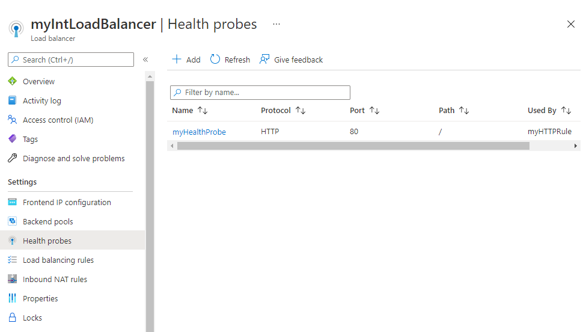
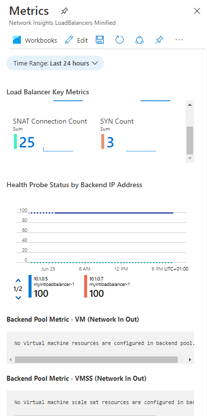
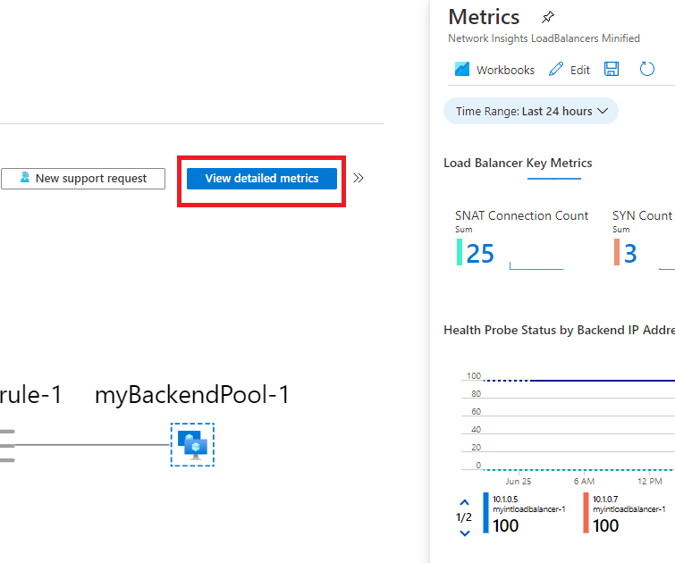
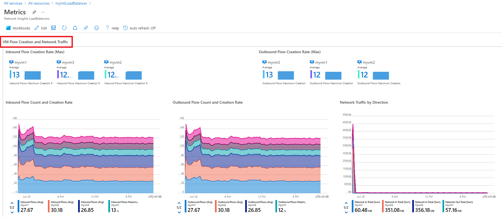
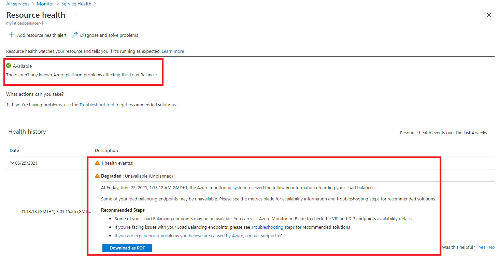
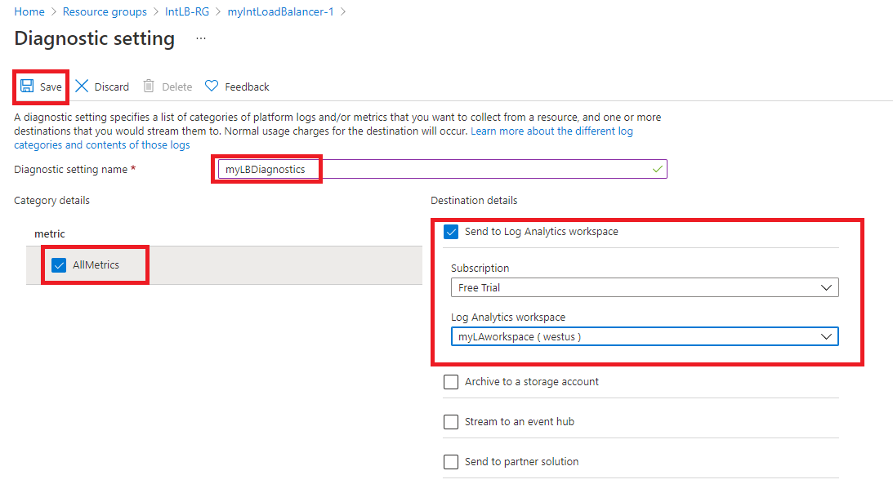

---
Exercise:
  title: "M08 – Lerneinheit\_3: Überwachen einer Lastenausgleichsressource mit Azure Monitor"
  module: Module 08 - Design and implement network monitoring
---

# M08 – Lerneinheit 3: Überwachen einer Lastenausgleichsressource mit Azure Monitor


In dieser Übung erstellen Sie einen internen Lastenausgleich für die fiktive Organisation Contoso Ltd. Anschließend erstellen Sie einen Log Analytics-Arbeitsbereich und zeigen mithilfe von Azure Monitor Insights Informationen zu dem internen Lastenausgleich an. Sie zeigen die Ansicht der funktionalen Abhängigkeiten und dann detaillierte Metriken für die Lastenausgleichsressource sowie Ressourcenintegritätsinformationen für den Lastenausgleich an. Abschließend konfigurieren Sie die Diagnoseeinstellungen des Lastenausgleichs, um Metriken an den von Ihnen erstellten Log Analytics-Arbeitsbereich zu senden. 

Das folgende Diagramm veranschaulicht die Umgebung, die Sie in dieser Übung bereitstellen.


 In dieser Übung führen Sie die folgenden Schritte aus:

+ Aufgabe 1: Erstellen des virtuellen Netzwerks
+ Aufgabe 2: Erstellen des Lastenausgleichs
+ Aufgabe 3: Erstellen eines Back-End-Pools
+ Aufgabe 4: Erstellen eines Integritätstests
+ Aufgabe 5: Erstellen einer Lastenausgleichsregel
+ Aufgabe 6: Erstellen von Back-End-Servern
+ Aufgabe 7: Hinzufügen von VMs zum Back-End-Pool
+ Aufgabe 8: Testen des Lastenausgleichs
+ Aufgabe 9: Erstellen eines Log Analytics-Arbeitsbereichs
+ Aufgabe 10: Verwenden der Ansicht der funktionalen Abhängigkeiten
+ Aufgabe 11: Anzeigen detaillierter Metriken
+ Aufgabe 12: Anzeigen der Ressourcenintegrität
+ Aufgabe 13: Konfigurieren von Diagnoseeinstellungen
+ Aufgabe 14: Bereinigen der Ressourcen


**Hinweis:** Eine **[interaktive Labsimulation](https://mslabs.cloudguides.com/guides/AZ-700%20Lab%20Simulation%20-%20Monitor%20a%20load%20balancer%20resource%20using%20Azure%20Monitor)** ist verfügbar, mit der Sie dieses Lab in Ihrem eigenen Tempo durcharbeiten können. Möglicherweise liegen geringfügige Unterschiede zwischen der interaktiven Simulation und dem gehosteten Lab vor, aber die dargestellten Kernkonzepte und Ideen sind identisch.


> [!Note]  
> Sie können geringfügige Unterschiede zwischen den Anweisungen und der Azure-Portal Schnittstelle feststellen, aber das Kernkonzept ist identisch. 

#### Geschätzte Dauer: 55 Minuten

## Aufgabe 1: Erstellen des virtuellen Netzwerks

In diesem Abschnitt erstellen Sie ein virtuelles Netzwerk und ein Subnetz.

1. Melden Sie sich beim Azure-Portal an.

1. Suchen Sie auf der Startseite des Azure-Portals nach **Virtuelles Netzwerk**, und wählen Sie unter „Dienste“ das virtuelle Netzwerk aus.

1. Wählen Sie **+ Erstellen** aus.

   

1. Verwenden Sie auf der Registerkarte **Grundlagen** die Informationen aus der folgenden Tabelle, um das virtuelle Netzwerk zu erstellen.

   | **Einstellung**    | **Wert**                                           |
   | -------------- | --------------------------------------------------- |
   | Abonnement   | Wählen Sie Ihr Abonnement aus.                            |
   | Resource group | Wählen Sie **Neu erstellen** aus.<br /><br />Name: **IntLB-RG** |
   | Name           | **IntLB-VNet**                                      |
   | Region         | **(USA) USA, Westen**                                    |

1. Wählen Sie **Weiter: IP-Adressen** aus.

1. Geben Sie auf der Registerkarte **IP-Adressen** in das Feld **IPv4-Adressraum** **10.1.0.0/16** ein.

1. Wählen Sie über **Subnetzname** die Option **+ Subnetz hinzufügen** aus.

1. Geben Sie im Bereich **Subnetz hinzufügen** den Subnetznamen **myBackendSubnet** und den Subnetzadressbereich **10.1.0.0/24** ein.

1. Wählen Sie **Hinzufügen** aus.

1. Klicken Sie auf **Weiter: Sicherheit**.

1. Wählen Sie unter **BastionHost** die Option **Aktivieren** aus, und geben Sie dann die Informationen aus der folgenden Tabelle ein.

    | **Einstellung**                       | **Wert**                                              |
    | --------------------------------- | ------------------------------------------------------ |
    | Bastion-Name                      | **myBastionHost**                                      |
    | AzureBastionSubnet-Adressraum  | **10.1.1.0/24**                                        |
    | Öffentliche IP-Adresse                 | Wählen Sie **Neu erstellen** aus.<br /><br />Name: **myBastionIP** |

1. Klicken Sie auf **Überprüfen + erstellen**.

1. Klicken Sie auf **Erstellen**.

## Aufgabe 2: Erstellen des Lastenausgleichs

In diesem Abschnitt erstellen Sie einen internen Lastenausgleich der Standard-SKU. Wir erstellen in der Übung anstelle eines Lastenausgleichs der Basic-SKU einen Lastenausgleich der Standard-SKU, weil für spätere Übungen eine Standard-SKU-Version des Lastenausgleichs erforderlich ist.

1.  Geben Sie auf der Azure-Homepage **Load Balancer** in das Suchfeld ein. 
1.  Wählen Sie **Load Balancer erstellen** aus.
1.  Verwenden Sie auf der Registerkarte **Grundlagen** die Informationen aus der folgenden Tabelle, um den Lastenausgleich zu erstellen.
    

   | **Einstellung**           | **Wert**                |
   | --------------------- | ------------------------ |
   | Registerkarte „Grundlagen“            |                          | 
   | Subscription          | Wählen Sie Ihr Abonnement aus. |
   | Resource group        | **IntLB-RG**             |
   | Name                  | **myIntLoadBalancer**    |
   | Region                | **(USA) USA, Westen**         |
   | SKU                   | **Standard**             |
   | Typ                  | **Intern**             |
   | Registerkarte „Front-End-IP-Konfiguration“ | + Front-End-IP-Konfiguration hinzufügen |
   | Name                  | **LoadBalancerFrontEnd** |
   | Virtuelles Netzwerk       | **IntLB-VNet**           |
   | Subnet                | **myBackendSubnet**      |
   | IP-Adresszuweisung | **Dynamisch**              |


1. Klicken Sie auf **Überprüfen + erstellen**.


1. Klicken Sie auf **Erstellen**.


## Aufgabe 3: Erstellen eines Back-End-Pools

Der Back-End-Adresspool enthält die IP-Adressen der virtuellen NICs, die mit dem Lastenausgleich verbunden sind.

1. Wählen Sie auf der Startseite des Azure-Portals **Alle Ressourcen** und dann **myIntLoadBalancer** aus der Ressourcenliste aus.

1. Wählen Sie unter **Einstellungen** die Option **Back-End-Pools** und dann **Hinzufügen** aus.

1. Geben Sie auf der Seite **Back-End-Pool hinzufügen** die Informationen aus der folgenden Tabelle ein.

   | **Einstellung**     | **Wert**            |
   | --------------- | -------------------- |
   | Name            | **myBackendPool**    |
   | Virtuelles Netzwerk | **IntLB-VNet**       |
   | Konfiguration des Back-End-Pools   | **NIC** |

1. Wählen Sie **Hinzufügen** aus.

   

   

## Aufgabe 4: Erstellen eines Integritätstests

Der Status Ihrer App wird vom Lastenausgleich mithilfe eines Integritätstests überwacht. Abhängig von der Reaktion auf Integritätsüberprüfungen werden der Load Balancer-Instanz durch den Integritätstest virtuelle Computer hinzugefügt oder daraus entfernt. Hier erstellen Sie wie folgt einen Integritätstest zur Überwachung der Integrität der virtuellen Computer.

1. Wählen Sie auf der Seite **Back-End-Pools** Ihres Lastenausgleichs unter **Einstellungen** die Option **Integritätstests** und dann **Hinzufügen**.

1. Geben Sie auf der Seite **Integritätstest hinzufügen** die Informationen aus der folgenden Tabelle ein.

   | **Einstellung**         | **Wert**         |
   | ------------------- | ----------------- |
   | Name                | **myHealthProbe** |
   | Protocol            | **HTTP**          |
   | Port                | **80**            |
   | Pfad                | **/**             |
   | Intervall            | **15**            |

1. Wählen Sie **Hinzufügen** aus.

   


## Aufgabe 5: Erstellen einer Lastenausgleichsregel

Mithilfe einer Load Balancer-Regel wird definiert, wie Datenverkehr auf die virtuellen Computer verteilt werden soll. Sie definieren die Front-End-IP-Konfiguration für den eingehenden Datenverkehr und den Back-End-IP-Pool für den Empfang des Datenverkehrs. Quell- und Zielport werden in der Regel definiert. Hier erstellen Sie eine Lastenausgleichsregel.

1. Wählen Sie auf der Seite **Back-End-Pools** Ihres Lastenausgleichs unter **Einstellungen** die Option **Lastausgleichsregeln** und wählen Sie dann **Hinzufügen** aus.

1. Geben Sie auf der Seite **Lastenausgleichsregel hinzufügen** die Informationen aus der folgenden Tabelle ein.

   | **Einstellung**            | **Wert**                |
   | ---------------------- | ------------------------ |
   | Name                   | **myHTTPRule**           |
   | IP-Version             | **IPv4**                 |
   | Front-End-IP-Adresse    | **LoadBalancerFrontEnd** |
   | Protokoll               | **TCP**                  |
   | Port                   | **80**                   |
   | Back-End-Port           | **80**                   |
   | Back-End-Pool           | **myBackendPool**        |
   | Integritätstest           | **myHealthProbe**        |
   | Sitzungspersistenz    | **None**                 |
   | Leerlaufzeitüberschreitung (Minuten) | **15**                   |
   | Unverankerte IP            | **Deaktiviert**             |

1. Wählen Sie **Hinzufügen** aus.

   

## Aufgabe 6: Erstellen von Back-End-Servern


In diesem Abschnitt erstellen Sie drei VMs für den Back-End-Pool des Lastenausgleichs, fügen die VMs dem Back-End-Pool hinzu und installieren dann IIS auf den drei VMs, um den Lastenausgleich zu testen.

1. Öffnen Sie im Azure-Portal im Bereich **Cloud Shell** die **PowerShell**-Sitzung.
 > **Hinweis:** Wenn Sie Cloud Shell zum ersten Mal öffnen, werden Sie möglicherweise aufgefordert, ein Speicherkonto zu erstellen. Klicken Sie auf **Speicher erstellen**.
1. Wählen Sie in der Symbolleiste des Cloud Shell-Bereichs das Symbol **Dateien hochladen/herunterladen**, wählen Sie im Dropdownmenü die Option **Hochladen** und laden Sie die folgenden Dateien **azuredeploy.json** und **azuredeploy.parameters.json** nacheinander aus dem Quellordner **F:\Allfiles\Exercises\M08** in das Cloud Shell-Basisverzeichnis hoch.

1. Stellen Sie die folgenden ARM-Vorlagen bereit, um das virtuelle Netzwerk, die Subnetze und die VMs zu erstellen, die für diese Übung erforderlich sind:

   >**Hinweis**: Sie werden aufgefordert, ein Administratorkennwort anzugeben.

   ```powershell
   $RGName = "IntLB-RG"

   New-AzResourceGroupDeployment -ResourceGroupName $RGName -TemplateFile azuredeploy.json -TemplateParameterFile azuredeploy.parameters.json
   ```
  
    > **Hinweis:** Dies wird einige Minuten in Anspruch nehmen. 

## Aufgabe 7: Hinzufügen von VMs zum Back-End-Pool

1. Wählen Sie auf der Startseite des Azure-Portals **Alle Ressourcen** und dann **myIntLoadBalancer** aus der Ressourcenliste aus.

1. Wählen Sie unter **Einstellungen** die Option **Back-End-Pools** und dann **myBackendPool** aus.

1. Wählen Sie im Feld **Zugeordnet zu** die Option **Virtuelle Computer** aus.

1. Wählen Sie unter **Virtuelle Computer** die Option **Hinzufügen** aus.

1. Aktivieren Sie die Kontrollkästchen für alle drei VMs (**myVM1**, **myVM2** und **myVM3**), und wählen Sie dann **Hinzufügen** aus.

1. Wählen Sie auf der Seite **myBackendPool** die Option **Speichern** aus.

   

 

## Aufgabe 8: Testen des Lastenausgleichs

In diesem Abschnitt erstellen Sie eine Test-VM und testen dann den Lastenausgleich.

### Erstellen einer Test-VM

> [!Note]  
> Sie können geringfügige Unterschiede zwischen den Anweisungen und der Azure-Portal Schnittstelle feststellen, aber das Kernkonzept ist identisch. 

1. Geben Sie auf Startseite des Azure-Portals bei der globalen Suche **Virtuelle Computer** ein, und wählen Sie unter „Dienste“ die Option „Virtuelle Computer“ aus. 

1. Wählen Sie **+ Erstellen; + Virtueller Computer** auf der Registerkarte **Grundlagen** aus, und verwenden Sie die Informationen in der Tabelle unten, um die erste VM zu erstellen.

   | **Einstellung**          | **Wert**                                    |
   | -------------------- | -------------------------------------------- |
   | Abonnement         | Wählen Sie Ihr Abonnement aus.                     |
   | Resource group       | **IntLB-RG**                                 |
   | Name des virtuellen Computers | **myTestVM**                                 |
   | Region               | **(USA) USA, Westen**                             |
   | Verfügbarkeitsoptionen | **Keine Infrastrukturredundanz erforderlich**    |
   | Image                | **Windows Server 2019 Datacenter, Gen1**   |
   | Size                 | **Standard_DS2_v3 – 2 vCPU, 8 GiB Arbeitsspeicher** |
   | Username             | **TestUser**                                 |
   | Kennwort             | **Bereitstellen eines sicheren Kennworts**                |
   | Kennwort bestätigen     | **Bereitstellen eines sicheren Kennworts**                |

1. Wählen Sie **Weiter: Datenträger** und dann **Weiter: Netzwerk** aus. 

1. Verwenden Sie auf der Registerkarte **Netzwerk** die Informationen aus der folgenden Tabelle, um Netzwerkeinstellungen zu konfigurieren.

   | **Einstellung**                                                  | **Wert**                     |
   | ------------------------------------------------------------ | ----------------------------- |
   | Virtuelles Netzwerk                                              | **IntLB-VNet**                |
   | Subnet                                                       | **myBackendSubnet**           |
   | Öffentliche IP-Adresse                                                    | Ändern Sie sie in **Keine**.            |
   | NIC-Netzwerksicherheitsgruppe                                   | **Erweitert**                  |
   | Konfigurieren von Netzwerksicherheitsgruppen                             | Wählen Sie die vorhandene Netzwerksicherheitsgruppe (**myNSG**) aus. |
   | Lastenausgleich                                               | **Keine** (oder deaktiviert)       |

1. Klicken Sie auf **Überprüfen + erstellen**.

1. Klicken Sie auf **Erstellen**.

1. Warten Sie, bis dieser letzte virtuelle Computer bereitgestellt wurde, bevor Sie mit der nächsten Aufgabe fortfahren.

### Verbinden mit der Test-VM zum Testen des Lastenausgleichs

1. Wählen Sie auf der Startseite des Azure-Portals **Alle Ressourcen** und dann **myIntLoadBalancer** aus der Ressourcenliste aus.

1. Notieren Sie sich auf der Seite **Übersicht** die **Private IP-Adresse**, oder kopieren Sie sie in die Zwischenablage. Hinweis: Sie müssen möglicherweise **Weitere Informationen anzeigen** auswählen, um die **private IP-Adresse** anzuzeigen.

1. Wählen Sie **Start** und dann auf der Startseite des Azure-Portals **Alle Ressourcen** aus, und wählen Sie dann auf dem virtuellen Computer, den Sie gerade erstellt haben, **myTestVM** aus.

1. Wählen Sie auf der Seite **Übersicht** die Option **Verbinden** und dann **Bastion** aus.

1. Klicken Sie auf **Bastion verwenden**.

1. Geben Sie in das Feld **Benutzername** **TestUser** und in das Feld **Kennwort** das Kennwort ein, das Sie bei der Bereitstellung angegeben haben, und wählen Sie dann **Verbinden** aus.

1. Das Fenster **myTestVM** wird auf einer anderen Browserregisterkarte geöffnet.

1. Wenn der Bereich **Netzwerke** angezeigt wird, wählen Sie **Ja** aus.

1. Wählen Sie in der Taskleiste das **Internet Explorer**-Symbol aus, um den Webbrowser zu öffnen.

1. Wählen Sie im Dialogfeld **Internet Explorer 11 einrichten** die Option **OK** aus.

1. Geben (oder fügen Sie) die **Private IP-Adresse** (z. B. 10.1.0.4) aus dem vorherigen Schritt in die Adressleiste des Browsers ein, und drücken Sie die EINGABETASTE.

1. Die Standard-Webstartseite des IIS-Webservers wird im Browserfenster angezeigt. Einer der drei virtuellen Computer im Back-End-Pool antwortet.
    

1. Wenn Sie im Browser mehrmals die Schaltfläche „Aktualisieren“ auswählen, stellen Sie fest, dass die Antwort nach dem Zufallsprinzip von den verschiedenen VMs im Back-End-Pool des internen Lastenausgleichs gesendet wird.

    

## Aufgabe 9: Erstellen eines Log Analytics-Arbeitsbereichs

1. Wählen Sie auf der Startseite des Azure-Portals **Alle Dienste** aus, geben Sie dann im Suchfeld oben auf der Seite **Log Analytics** ein, und wählen Sie **Log Analytics-Arbeitsbereiche** aus der gefilterten Liste aus.

   

1. Klicken Sie auf **Erstellen**. 

1. Verwenden Sie auf der Seite **Log Analytics-Arbeitsbereich erstellen** auf der Registerkarte **Grundlagen** die Informationen aus der folgenden Tabelle, um den Arbeitsbereich zu erstellen.

   | **Einstellung**    | **Wert**                |
   | -------------- | ------------------------ |
   | Abonnement   | Wählen Sie Ihr Abonnement aus. |
   | Resource group | **IntLB-RG**             |
   | Name           | **myLAworkspace**        |
   | Region         | **USA, Westen**              |

1. Wählen Sie **Überprüfen + erstellen** und dann **Erstellen** aus.

   


## Aufgabe 10: Verwenden der Ansicht der funktionalen Abhängigkeiten

1. Wählen Sie auf der Startseite des Azure-Portals **Alle Ressourcen** aus, und wählen Sie dann in der Ressourcenliste **myIntLoadBalancer** aus.

   

1. Wählen Sie unter **Überwachung** die Option **Erkenntnisse** aus.

1. Wählen Sie in der oberen rechten Ecke der Seite das **X** aus, um den Bereich **Metriken** vorerst zu schließen. Sie werden ihn in Kürze erneut öffnen.

1. Diese Seitenansicht wird als Ansicht der funktionalen Abhängigkeiten bezeichnet. Sie bietet ein nützliches interaktives Diagramm, das die Topologie der ausgewählten Netzwerkressource veranschaulicht – in diesem Fall die Topologie eines Lastenausgleichs. Für Load Balancer Standard werden Ihre Back-End-Pool-Ressourcen gemäß dem Integritätsteststatus farblich codiert, um die aktuelle Verfügbarkeit Ihres Back-End-Pools für den Datenverkehr anzuzeigen.

1. Verwenden Sie die Schaltflächen **Vergrößern (+)** und **Verkleinern (-)** in der rechten unteren Ecke der Seite, um das Topologiediagramm zu vergrößern bzw. zu verkleinern (alternativ können Sie das Mausrad verwenden, sofern vorhanden). Sie können auch das Topologiediagramm auf der Seite ziehen, um es zu verschieben.

1. Zeigen Sie im Diagramm auf die Komponente **LoadBalancerFrontEnd** und dann auf die Komponente **MyBackendPool**. 

1. Beachten Sie, dass Sie mithilfe der Links in den Popupfenstern Informationen zu diesen Lastenausgleichskomponenten anzeigen und die entsprechenden Blätter im Azure-Portal öffnen können.

1. Um eine Kopie des Topologiediagramms als SVG-Datei herunterzuladen, wählen Sie **Topologie herunterladen** aus, und speichern Sie die Datei im Ordner **Downloads**. 

1. Wählen Sie in der rechten oberen Ecke **Metriken anzeigen** aus, um den Bereich „Metriken“ auf der rechten Seite des Bildschirms erneut zu öffnen.
    

1. Der Bereich „Metriken“ bietet in Form von Balken- und Liniendiagrammen eine Übersicht über einige wichtige Metriken für die Lastenausgleichsressource.

    

 

## Aufgabe 11: Anzeigen detaillierter Metriken

1. Um umfassendere Metriken für diese Netzwerkressource anzuzeigen, wählen Sie **Detaillierte Metriken anzeigen** aus.
   

1. Dadurch wird die große Seite **Metriken** auf der Azure Network Insights-Plattform geöffnet. Die Registerkarte, die zunächst den Fokus hat, lautet **Übersicht**. Auf dieser werden der Verfügbarkeitsstatus des Lastenausgleichs, der gesamte Datendurchsatz sowie die Front-End- und Back-End-Verfügbarkeit für jede mit dem Lastenausgleich verknüpfte Front-End-IP-Adresse angezeigt. Diese Metriken geben an, ob die Front-End-IP-Adresse antwortet und ob die Compute-Instanzen in Ihrem Back-End-Pool einzeln auf eingehende Verbindungen reagieren.
   

1. Wählen Sie die Registerkarte **Front-End- &amp; Back-End-Verfügbarkeit ** aus, und scrollen Sie auf der Seite nach unten, um die Diagramme zum Integritätsteststatus anzuzeigen. Wenn für diese Elemente **Werte, die niedriger als 100 sind**, angezeigt werden, deutet dies auf einen Ausfall dieser Ressourcen hin.
   

1. Wählen Sie die Registerkarte **Datendurchsatz** aus, und scrollen Sie auf der Seite nach unten, um die anderen Diagramme zum Datendurchsatz anzuzeigen.

1. Wenn Sie auf einige der Datenpunkte in den Diagrammen klicken, ändern sich die angezeigten Werte in den genauen Wert zu diesem Zeitpunkt.
   

1. Wählen Sie die Registerkarte **Flowverteilung** aus, und scrollen Sie auf der Seite nach unten, um die Diagramme im Abschnitt **VM-Datenflusserstellung und -Netzwerkdatenverkehr** anzuzeigen. 

   

 

## Aufgabe 12: Anzeigen der Ressourcenintegrität

1. Um die Integrität der Lastenausgleichsressourcen anzuzeigen, wählen Sie auf der Startseite des Azure-Portals **Alle Dienste** und dann **Überwachen** aus.

1. Wählen Sie auf der Seite **Überwachen&gt;Übersicht** im linken Menü die Option **Dienstintegrität** aus.

1. Wählen Sie auf der Seite **Dienstintegrität &gt;Dienstprobleme** im linken Menü die Option **Ressourcenintegrität** aus.

1. Scrollen Sie auf der Seite **Dienstintegrität &gt; Ressourcenintegrität** in der Dropdownliste **Ressourcentyp** nach unten in der Liste, und wählen Sie **Lastenausgleich** aus.

   

1. Wählen Sie dann den Namen Ihres Lastenausgleichs aus der Liste aus.

1. Auf der Seite **Ressourcenintegrität** werden alle größeren Verfügbarkeitsprobleme bei Ihrer Lastenausgleichsressource angegeben. Wenn im Abschnitt **Integritätsverlauf** Ereignisse vorhanden sind, können Sie das Integritätsereignis erweitern, um weitere Details zum Ereignis anzuzeigen. Sie können die Details des Ereignisses sogar zur späteren Überprüfung und Berichterstellung als PDF-Datei speichern.

   

 

## Aufgabe 13: Konfigurieren von Diagnoseeinstellungen

1. Wählen Sie auf der Startseite des Azure-Portals **Ressourcengruppen**aus, und wählen Sie dann die Ressourcengruppe **IntLB-RG** aus der Liste aus.

1. Wählen Sie auf der Seite **IntLB-RG** in der Ressourcenliste den Namen der Lastenausgleichsressource **myIntLoadBalancer** aus.

1. Wählen Sie unter **Überwachung** die Option **Diagnoseeinstellung** und dann **Diagnoseeinstellung hinzufügen** aus:

   

1. Geben Sie auf der Seite **Diagnoseeinstellung** im Feld „Name“ den Namen **myLBDiagnostics** ein.

1. Aktivieren Sie das Kontrollkästchen **AllMetrics** und dann das Kontrollkästchen **An Log Analytics-Arbeitsbereich senden**.

1. Wählen Sie Ihr Abonnement aus der Liste aus, und wählen Sie dann **myLAworkspace (westus)** aus der Arbeitsbereich-Dropdownliste aus.

1. Wählen Sie **Speichern**.

   

 

## Aufgabe 14: Bereinigen der Ressourcen

   >**Hinweis**: Denken Sie daran, alle neu erstellten Azure-Ressourcen zu entfernen, die Sie nicht mehr verwenden. Durch das Entfernen nicht verwendeter Ressourcen wird sichergestellt, dass keine unerwarteten Gebühren anfallen.

1. Öffnen Sie im Azure-Portal im Bereich **Cloud Shell** die **PowerShell**-Sitzung.

1. Löschen Sie alle Ressourcengruppen, die Sie während der praktischen Übungen in diesem Modul erstellt haben, indem Sie den folgenden Befehl ausführen:

   ```powershell
   Remove-AzResourceGroup -Name 'IntLB-RG' -Force -AsJob
   ```

    >**Hinweis**: Der Befehl wird (wie über den Parameter „-AsJob“ festgelegt) asynchron ausgeführt. Dies bedeutet, dass Sie zwar direkt im Anschluss einen weiteren PowerShell-Befehl in derselben PowerShell-Sitzung ausführen können, es jedoch einige Minuten dauert, bis die Ressourcengruppen tatsächlich entfernt werden.
