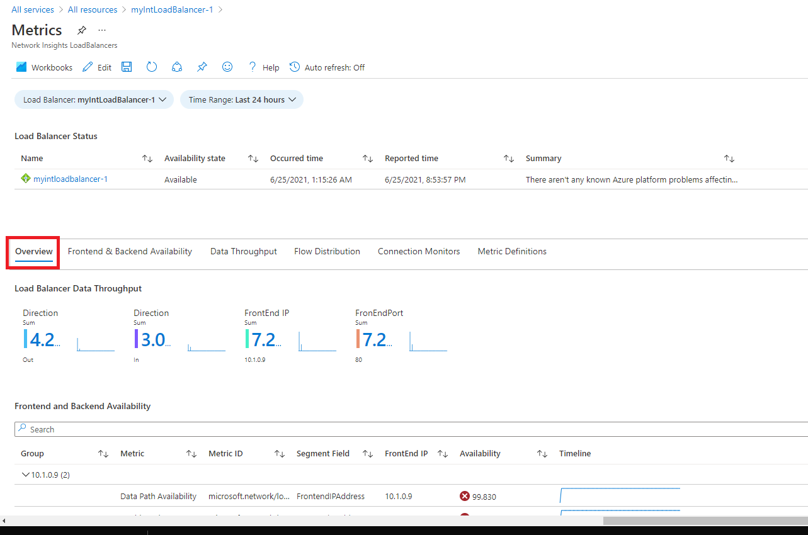

---
Exercise:
  title: "M08 – Lerneinheit\_3: Überwachen einer Lastenausgleichsressource mit Azure Monitor"
  module: Module 08 - Design and implement network monitoring
---

# M08 – Lerneinheit 3: Überwachen einer Lastenausgleichsressource mit Azure Monitor

## Übungsszenario

In dieser Übung erstellen Sie einen internen Lastenausgleich für die fiktive Organisation Contoso Ltd. Anschließend erstellen Sie einen Log Analytics-Arbeitsbereich und zeigen mithilfe von Azure Monitor Insights Informationen zu dem internen Lastenausgleich an. Sie zeigen die Ansicht der funktionalen Abhängigkeiten und dann detaillierte Metriken für die Lastenausgleichsressource sowie Ressourcenintegritätsinformationen für den Lastenausgleich an. Abschließend konfigurieren Sie die Diagnoseeinstellungen des Lastenausgleichs, um Metriken an den von Ihnen erstellten Log Analytics-Arbeitsbereich zu senden.

Das folgende Diagramm veranschaulicht die Umgebung, die Sie in dieser Übung bereitstellen.


### Stellenqualifikationen

 In dieser Übung führen Sie die folgenden Schritte aus:

+ Aufgabe 1: Erstellen des virtuellen Netzwerks
+ Aufgabe 2: Erstellen des Lastenausgleichs
+ Aufgabe 3: Erstellen eines Back-End-Pools
+ Aufgabe 4: Erstellen eines Integritätstests
+ Aufgabe 5: Erstellen einer Lastenausgleichsregel
+ Aufgabe 6: Erstellen von Back-End-Servern
+ Aufgabe 7: Hinzufügen von VMs zum Back-End-Pool
+ Aufgabe 8: Testen des Lastenausgleichs
+ Aufgabe 9: Erstellen eines Log Analytics-Arbeitsbereichs
+ Aufgabe 10: Verwenden der Ansicht der funktionalen Abhängigkeiten
+ Aufgabe 11: Anzeigen detaillierter Metriken
+ Aufgabe 12: Anzeigen der Ressourcenintegrität
+ Aufgabe 13: Konfigurieren von Diagnoseeinstellungen

### Geschätzte Dauer: 55 Minuten

## Aufgabe 1: Erstellen des virtuellen Netzwerks

In diesem Abschnitt erstellen Sie ein virtuelles Netzwerk und ein Subnetz.

1. Melden Sie sich beim Azure-Portal an.

1. Suchen Sie im Azure-Portal nach der Option **Virtuelle Netzwerke**, und wählen Sie sie aus.

1. Wählen Sie **+ Erstellen** aus.

   

1. Verwenden Sie auf der Registerkarte **Grundlagen** die Informationen aus der folgenden Tabelle, um das virtuelle Netzwerk zu erstellen.

   | **Einstellung**    | **Wert**                                           |
   | -------------- | --------------------------------------------------- |
   | Abonnement   | Wählen Sie Ihr Abonnement aus.                            |
   | Resource group | Wählen Sie **Neu erstellen** aus.<br /><br />Name: **IntLB-RG** |
   | Name           | **IntLB-VNet**                                      |
   | Region         | **(USA) USA, Westen**                                    |

1. Klicken Sie auf **Weiter: Sicherheit**.

1. Wählen Sie unter **BastionHost** die Option **Aktivieren** aus, und geben Sie dann die Informationen aus der folgenden Tabelle ein.

    | **Einstellung**                       | **Wert**                                              |
    | --------------------------------- | ------------------------------------------------------ |
    | Bastion-Name                      | **myBastionHost**                                      |
    | Öffentliche IP-Adresse                 | Wählen Sie **Neu erstellen** aus.<br /><br />Name: **myBastionIP** |

1. Wählen Sie **Weiter: IP-Adressen** aus.

1. **Löschen Sie die IP-Adresse** und dann den **IPv4-Adressraum**. Geben Sie **10.1.0.0/16** ein.

1. Bearbeiten Sie das Subnetz **AzureBastionSubnet**, und ändern Sie die **Startadresse** in **10.1.1.0**. **Speichern** Sie die Änderung. 

1. Wählen Sie **+ Subnetz hinzufügen** aus. Der Subnetzname lautet `myBackendSubnet`, und der Subnetzadressbereich ist `10.1.0.0/24`. Wählen Sie **Hinzufügen**.

1. Sie sollten jetzt ein virtuelles Netzwerk mit zwei Subnetzen haben. 

1. Klicken Sie auf **Überprüfen + erstellen**.

1. Klicken Sie auf **Erstellen**.

## Aufgabe 2: Erstellen des Lastenausgleichs

In diesem Abschnitt erstellen Sie einen internen Lastenausgleich der Standard-SKU. Wir erstellen in der Übung anstelle eines Lastenausgleichs der Basic-SKU einen Lastenausgleich der Standard-SKU, weil für spätere Übungen eine Standard-SKU-Version des Lastenausgleichs erforderlich ist.

1. Suchen Sie im Azure-Portal nach der Option **Lastenausgleichsmodule**, und wählen Sie sie aus.

1. Wählen Sie **Erstellen** und dann **Load Balancer Standard** aus.

1. Verwenden Sie auf der Registerkarte **Grundlagen** die Informationen aus der folgenden Tabelle, um den Lastenausgleich zu erstellen.

   | **Einstellung**           | **Wert**                |
   | --------------------- | ------------------------ |
   | Registerkarte „Grundlagen“            |                          |
   | Subscription          | Wählen Sie Ihr Abonnement aus. |
   | Resource group        | **IntLB-RG**             |
   | Name                  | **myIntLoadBalancer**    |
   | Region                | **(USA) USA, Westen**         |
   | SKU                   | **Standard**             |
   | Typ                  | **Intern**             |

1. Wechseln Sie zur Registerkarte **Front-End-IP-Konfiguration**, und wählen Sie **+ Front-End-IP-Konfiguration hinzufügen** aus.

   | **Einstellung**            | **Wert**            |
   | Name                  | `LoadBalancerFrontEnd` |
   | Virtuelles Netzwerk       | **IntLB-VNet**           |
   | Subnetz                | **myBackendSubnet**      |
   | IP-Adresszuweisung | **Dynamisch**              |

1. **Speichern** Sie Ihre Änderungen, und wählen Sie dann **Überprüfen + erstellen** aus.

1. Wählen Sie nach erfolgreicher Überprüfung **Erstellen** aus.

## Aufgabe 3: Erstellen eines Back-End-Pools

Der Back-End-Adresspool enthält die IP-Adressen der virtuellen NICs, die mit dem Lastenausgleich verbunden sind.

1. Suchen Sie im Azure-Portal nach der Ressource **myIntLoadBalancer**, und wählen Sie sie aus.

1. Wählen Sie unter **Einstellungen** die Option **Back-End-Pools** und dann **Hinzufügen** aus.

1. Geben Sie auf der Seite **Back-End-Pool hinzufügen** die Informationen aus der folgenden Tabelle ein.

   | **Einstellung**     | **Wert**            |
   | --------------- | -------------------- |
   | Name            | **myBackendPool**    |
   | Virtuelles Netzwerk | IntLB-VNet    |
   | Konfiguration des Back-End-Pools   | **NIC** |

1. Wählen Sie **Speichern**.

   

## Aufgabe 4: Erstellen eines Integritätstests

Der Status Ihrer App wird vom Lastenausgleich mithilfe eines Integritätstests überwacht. Abhängig von der Reaktion auf Integritätsüberprüfungen werden der Load Balancer-Instanz durch den Integritätstest virtuelle Computer hinzugefügt oder daraus entfernt. Hier erstellen Sie wie folgt einen Integritätstest zur Überwachung der Integrität der virtuellen Computer.

1. Wählen Sie für die Lastenausgleichsressource die Option **Einstellungen**, dann **Integritätstests** und anschließend **Hinzufügen** aus.

1. Geben Sie auf der Seite **Integritätstest hinzufügen** die Informationen aus der folgenden Tabelle ein.

   | **Einstellung**         | **Wert**         |
   | ------------------- | ----------------- |
   | Name                | `myHealthProbe` |
   | Protokoll            | **HTTP**          |
   | Port                | **80**            |
   | Pfad                | **/**             |
   | Intervall            | **15**            |

1. Wählen Sie **Speichern**.

   

## Aufgabe 5: Erstellen einer Lastenausgleichsregel

Mithilfe einer Load Balancer-Regel wird definiert, wie Datenverkehr auf die virtuellen Computer verteilt werden soll. Sie definieren die Front-End-IP-Konfiguration für den eingehenden Datenverkehr und den Back-End-IP-Pool für den Empfang des Datenverkehrs. Quell- und Zielport werden in der Regel definiert. Hier erstellen Sie eine Lastenausgleichsregel.

1. Wählen Sie für die Lastenausgleichsressource die Option **Einstellungen**, dann **Lastenausgleichsregeln** und anschließend **Hinzufügen** aus.

   | **Einstellung**            | **Wert**                |
   | ---------------------- | ------------------------ |
   | Name                   | **myHTTPRule**           |
   | IP-Version             | **IPv4**                 |
   | Front-End-IP-Adresse    | **LoadBalancerFrontEnd** |
   | Back-End-Pool           | **myBackendPool**        |
   | Protokoll               | **TCP**                  |
   | Port                   | **80**                   |
   | Back-End-Port           | **80**                   |
   | Integritätstest           | **myHealthProbe**        |
   | Sitzungspersistenz    | **None**                 |
   | Leerlaufzeitüberschreitung (Minuten) | **15**                   |
   | Unverankerte IP            | **Deaktiviert**             |

   

## Aufgabe 6: Erstellen von Back-End-Servern

In diesem Abschnitt erstellen Sie drei VMs für den Back-End-Pool des Lastenausgleichs, fügen die VMs dem Back-End-Pool hinzu und installieren dann IIS auf den drei VMs, um den Lastenausgleich zu testen.

1. Wählen Sie im Azure-Portal das Cloud Shell-Symbol (oben rechts). Konfigurieren Sie die Shell bei Bedarf.  
    + Wählen Sie **PowerShell** aus.
    + Wählen Sie **Kein Speicherkonto erforderlich** und Ihr **Abonnement** aus und klicken Sie dann auf **Anwenden**.
    + Warten Sie, bis das Terminal erstellt wurde und eine Eingabeaufforderung angezeigt wird. 

1. Wählen Sie in der Symbolleiste des Cloud Shell-Fensters das Symbol **Dateien verwalten** aus, wählen Sie im Dropdownmenü die Option **Hochladen** und laden Sie die folgenden Dateien **azuredeploy.json** und **azuredeploy.parameters.json** in das Basisverzeichnis von Cloud Shell hoch.

    > **Hinweis:** Wenn Sie in Ihrem eigenen Abonnement arbeiten, sind die [Vorlagendateien](https://github.com/MicrosoftLearning/AZ-700-Designing-and-Implementing-Microsoft-Azure-Networking-Solutions/tree/master/Allfiles/Exercises) im GitHub-Lab-Repository verfügbar.

1. Stellen Sie die folgenden Azure Resource Manager (ARM)-Vorlagen bereit, um das virtuelle Netzwerk, die Subnetze und die VMs zu erstellen, die Sie für diese Übung benötigen. **Hinweis**: Sie werden aufgefordert, ein Admin-Kennwort anzugeben.

   ```powershell
   $RGName = "IntLB-RG"
   New-AzResourceGroupDeployment -ResourceGroupName $RGName -TemplateFile azuredeploy.json -TemplateParameterFile azuredeploy.parameters.json
   ```
1. Die Bereitstellung kann einige Minuten dauern. Sie können den Status im Portal überprüfen, indem Sie die Ressourcenseite der VM aktualisieren.   

## Aufgabe 7: Hinzufügen von VMs zum Back-End-Pool

1. Suchen Sie im Azure-Portal nach der Ressource **myIntLoadBalancer**, und wählen Sie sie aus.

1. Wählen Sie unter **Einstellungen** die Option **Back-End-Pools** und dann **myBackendPool** aus.

1. Wählen Sie im Abschnitt **IP-Konfigurationen** die Option **Hinzufügen** aus.

1. Wählen Sie alle angezeigten VMs und dann **Hinzufügen** aus.

1. Aktivieren Sie die Kontrollkästchen für **myVM1** und **myVM2**, und wählen Sie dann **Hinzufügen** aus.

1. Wählen Sie auf der Seite **myBackendPool** die Option **Speichern** aus.

## Aufgabe 8: Testen des Lastenausgleichs

In diesem Abschnitt erstellen Sie eine Test-VM und testen dann den Lastenausgleich.

### Herstellen einer Verbindung mit der Test-VM (VM3) zum Testen des Lastenausgleichs

1. Suchen Sie im Azure-Portal nach der Ressource **myIntLoadBalancer**, und wählen Sie sie aus.

1. Notieren Sie sich auf der Seite **Übersicht** die **Private IP-Adresse**, oder kopieren Sie sie in die Zwischenablage. Hinweis: Sie müssen möglicherweise **Weitere Informationen anzeigen** auswählen, um die **private IP-Adresse** anzuzeigen.

1. Suchen Sie nach der VM **myVM3**, und wählen Sie sie aus. 

1. Wählen Sie **Verbinden** und dann **Verbindung über Bastion herstellen** aus.

1. Geben Sie in das Feld **Benutzername** **TestUser** und in das Feld **Kennwort** das Kennwort ein, das Sie bei der Bereitstellung angegeben haben, und wählen Sie dann **Verbinden** aus.

1. Das Fenster **myTestVM** wird auf einer anderen Browserregisterkarte geöffnet.

1. Wenn der Bereich **Netzwerke** angezeigt wird, wählen Sie **Ja** aus.

1. Wählen Sie in der Taskleiste das **Internet Explorer**-Symbol aus, um den Webbrowser zu öffnen.

1. Wählen Sie im Dialogfeld **Internet Explorer 11 einrichten** die Option **OK** aus.

1. Geben oder fügen Sie die IP-Adresse des Lastenausgleichs ein (z. B. 10.1.0.4).

1. Eine der beiden Back-End-Server-VMs (myVM1 oder myVM2) antwortet. Aktualisieren Sie die Seite weiter, und beachten Sie, dass die Antwort nach dem Zufallsprinzip von den Back-End-Servern gesendet wird. 

## Aufgabe 9: Erstellen eines Log Analytics-Arbeitsbereichs

1. Suchen Sie im Azure-Portal nach der Ressource **Log Analytics-Arbeitsbereiche**, und wählen Sie sie aus.
   
1. Klicken Sie auf **Erstellen**.

1. Verwenden Sie auf der Seite **Log Analytics-Arbeitsbereich erstellen** auf der Registerkarte **Grundlagen** die Informationen aus der folgenden Tabelle, um den Arbeitsbereich zu erstellen.

   | **Einstellung**    | **Wert**                |
   | -------------- | ------------------------ |
   | Abonnement   | Wählen Sie Ihr Abonnement aus. |
   | Resource group | **IntLB-RG**             |
   | Name           | **myLAworkspace**        |
   | Region         | **USA, Westen**              |

1. Wählen Sie **Überprüfen + erstellen** und dann **Erstellen** aus.

## Aufgabe 10: Verwenden der Ansicht der funktionalen Abhängigkeiten

1. Suchen Sie im Azure-Portal nach der Ressource **myIntLoadBalancer**, und wählen Sie sie aus. 

   

1. Wählen Sie unter **Überwachung** die Option **Erkenntnisse** aus.

1. Der Bereich „Metriken“ bietet in Form von Balken- und Liniendiagrammen eine Übersicht über einige wichtige Metriken für die Lastenausgleichsressource.

    

## Aufgabe 11: Anzeigen detaillierter Metriken

1. Um umfassendere Metriken für diese Netzwerkressource anzuzeigen, wählen Sie **Detaillierte Metriken anzeigen** aus.
   

1. Dadurch wird die große Seite **Metriken** auf der Azure Network Insights-Plattform geöffnet. Die Registerkarte, die zunächst den Fokus hat, lautet **Übersicht**. Auf dieser werden der Verfügbarkeitsstatus des Lastenausgleichs, der gesamte Datendurchsatz sowie die Front-End- und Back-End-Verfügbarkeit für jede mit dem Lastenausgleich verknüpfte Front-End-IP-Adresse angezeigt. Diese Metriken geben an, ob die Front-End-IP-Adresse antwortet und ob die Compute-Instanzen in Ihrem Back-End-Pool einzeln auf eingehende Verbindungen reagieren.
   

1. Wählen Sie die Registerkarte **Front-End- &amp; Back-End-Verfügbarkeit ** aus, und scrollen Sie auf der Seite nach unten, um die Diagramme zum Integritätsteststatus anzuzeigen. Wenn für diese Elemente **Werte, die niedriger als 100 sind**, angezeigt werden, deutet dies auf einen Ausfall dieser Ressourcen hin.
   

1. Wählen Sie die Registerkarte **Datendurchsatz** aus, und scrollen Sie auf der Seite nach unten, um die anderen Diagramme zum Datendurchsatz anzuzeigen.

1. Wenn Sie auf einige der Datenpunkte in den Diagrammen klicken, ändern sich die angezeigten Werte in den genauen Wert zu diesem Zeitpunkt.
   

1. Wählen Sie die Registerkarte **Flowverteilung** aus, und scrollen Sie auf der Seite nach unten, um die Diagramme im Abschnitt **VM-Datenflusserstellung und -Netzwerkdatenverkehr** anzuzeigen.

   

## Aufgabe 12: Anzeigen der Ressourcenintegrität

1. Um die Integrität der Lastenausgleichsressourcen anzuzeigen, wählen Sie auf der Startseite des Azure-Portals **Alle Dienste** und dann **Überwachen** aus.

1. Wählen Sie auf der Seite **Überwachen&gt;Übersicht** im linken Menü die Option **Dienstintegrität** aus.

1. Wählen Sie auf der Seite **Dienstintegrität &gt;Dienstprobleme** im linken Menü die Option **Ressourcenintegrität** aus.

1. Scrollen Sie auf der Seite **Dienstintegrität &gt; Ressourcenintegrität** in der Dropdownliste **Ressourcentyp** nach unten in der Liste, und wählen Sie **Lastenausgleich** aus.

   

1. Wählen Sie dann den Namen Ihres Lastenausgleichs aus der Liste aus.

1. Auf der Seite **Ressourcenintegrität** werden alle größeren Verfügbarkeitsprobleme bei Ihrer Lastenausgleichsressource angegeben. Wenn im Abschnitt **Integritätsverlauf** Ereignisse vorhanden sind, können Sie das Integritätsereignis erweitern, um weitere Details zum Ereignis anzuzeigen. Sie können die Details des Ereignisses sogar zur späteren Überprüfung und Berichterstellung als PDF-Datei speichern.

   

## Aufgabe 13: Konfigurieren von Diagnoseeinstellungen

1. Wählen Sie auf der Startseite des Azure-Portals **Ressourcengruppen**aus, und wählen Sie dann die Ressourcengruppe **IntLB-RG** aus der Liste aus.

1. Wählen Sie auf der Seite **IntLB-RG** in der Ressourcenliste den Namen der Lastenausgleichsressource **myIntLoadBalancer** aus.

1. Wählen Sie unter **Überwachung** die Option **Diagnoseeinstellung** und dann **Diagnoseeinstellung hinzufügen** aus:

   

1. Geben Sie auf der Seite **Diagnoseeinstellung** im Feld „Name“ den Namen **myLBDiagnostics** ein.

1. Aktivieren Sie das Kontrollkästchen **AllMetrics** und dann das Kontrollkästchen **An Log Analytics-Arbeitsbereich senden**.

1. Wählen Sie Ihr Abonnement aus der Liste aus, und wählen Sie dann **myLAworkspace (westus)** aus der Arbeitsbereich-Dropdownliste aus.

1. Wählen Sie **Speichern**.

   

## Bereinigen von Ressourcen

>**Hinweis**: Denken Sie daran, alle neu erstellten Azure-Ressourcen zu entfernen, die Sie nicht mehr verwenden. Durch das Entfernen nicht verwendeter Ressourcen wird sichergestellt, dass keine unerwarteten Gebühren anfallen.

1. Öffnen Sie im Azure-Portal im Bereich **Cloud Shell** die **PowerShell**-Sitzung.

1. Löschen Sie alle Ressourcengruppen, die Sie während der praktischen Übungen in diesem Modul erstellt haben, indem Sie den folgenden Befehl ausführen:

   ```powershell
   Remove-AzResourceGroup -Name 'IntLB-RG' -Force -AsJob
   ```

>**Hinweis**: Der Befehl wird (wie über den Parameter „-AsJob“ festgelegt) asynchron ausgeführt. Dies bedeutet, dass Sie zwar direkt im Anschluss einen weiteren PowerShell-Befehl in derselben PowerShell-Sitzung ausführen können, es jedoch einige Minuten dauert, bis die Ressourcengruppen tatsächlich entfernt werden.
    
## Erweitern Ihrer Lernerfahrung mit Copilot

Copilot kann Sie beim Erlernen der Verwendung von Azure-Skripttools unterstützen. Copilot kann Sie auch in Bereichen unterstützen, die nicht im Lab behandelt werden oder in denen Sie weitere Informationen benötigen. Öffnen Sie einen Edge-Browser, und wählen Sie „Copilot“ (rechts oben) aus, oder navigieren Sie zu *copilot.microsoft.com*. Nehmen Sie sich einige Minuten Zeit, um diese Prompts auszuprobieren.
+ Fassen Sie die Azure-Tools zusammen, die für die Überwachung virtueller Netzwerke zur Verfügung stehen.
+ Welche Überwachungstools für Azure Network Watcher gibt es?

## Weiterlernen im eigenen Tempo

+ [Einführung in Azure Monitor](https://learn.microsoft.com/training/modules/intro-to-azure-monitor/). In diesem Modul erfahren Sie, wie Sie Azure Monitor verwenden, um Einblicke in die Leistung und den Betrieb Ihrer Azure-Ressourcen bereitzustellen.
+ [Verwenden von Netzwerküberwachungstools zum Überwachen der gesamten Azure-Netzwerkinfrastruktur und zur Problembehandlung](https://learn.microsoft.com/training/modules/troubleshoot-azure-network-infrastructure/). In diesem Modul erfahren Sie, wie Sie mithilfe von Tools, Diagnosen und Protokollen von Azure Network Watcher Netzwerkprobleme in Ihrer Azure-Infrastruktur finden und beheben können.

## Wichtige Erkenntnisse

Herzlichen Glückwunsch zum erfolgreichen Abschluss des Labs. Hier sind die wichtigsten Erkenntnisse für dieses Lab. 

+ Azure Monitor bietet Features und Tools zum Erfassen, Verwalten und Analysieren von IT-Daten aus all Ihren Azure-, anderen Cloud- und lokalen Ressourcen.
+ Metriken sind quantitative Messungen, die Momentaufnahmen der Anwendungs- oder Ressourcenleistung zeigen. Metriken sind in der Regel numerische Werte, die im Zeitverlauf gemessen werden können.
+ Protokolle sind Textdatensätze von Ereignissen, Aktionen und Nachrichten, die in einer Ressource oder Anwendung auftreten. 
+ Azure Monitor Insights, Visualisierungen und Dashboards können Überwachungsinformationen über Ihre Anwendungen abrufen und übertragen.
+ Warnungen informieren Sie über kritische Zustände und können Korrekturmaßnahmen einleiten. Die Regeln für Warnungen können auf Metrik- oder Protokolldaten basieren. 
    
